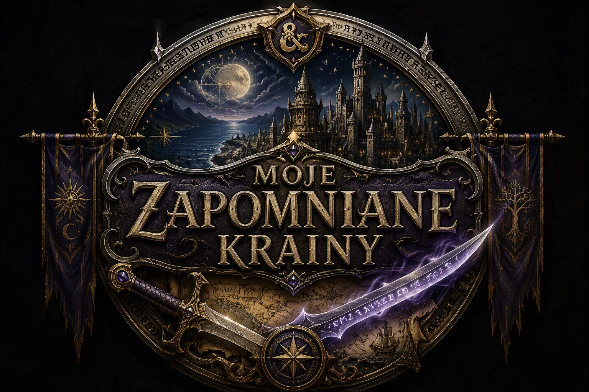

#

 
Pierwszy raz zagrałem w Baldur's Gate mniej więcej po trzydziestce. Do dziś pamiętam nieprzespane noce i próby bezpiecznego dojechania do pracy po  kolejnych przygodach na Wybrzeżu Mieczy. Później przyszła kolej na Icewind Dale i Neverwinter Nights, ale życie nabrało tempa i na wiele lat praktycznie przestałem grać, a jeśli już wracałem do komputerowych światów, to zwykle tylko na kilka tygodni spędzonych po nocach przy Diablo lub innych hack'n'slashach.

Przez długi czas wydawało mi się, że gry nie odgrywają w moim życiu większej roli. Dzisiaj jednak, już grubo po pięćdziesiątce, coraz częściej łapię się na tym, że wraca do mnie chęć ponownego zagrania w Baldura, szczególnie w różnych modowych konfiguracjach. Po ukończeniu Baldur's Gate 3 uświadomiłem sobie coś jeszcze: nigdy tak naprawdę nie przeszedłem całej historii jego protoplasty. Moja przygoda zakończyła się gdzieś na początku Baldur's Gate II.

Stąd narodził się pomysł, aby zwykłą rozgrywkę zamienić w niewielki projekt. Postanowiłem przejść ogromnego megamoda, a przy okazji udokumentować całą podróż. Wbrew wielu opiniom zamierzam podążać ścieżką wyznaczoną przez Sandrah i nie obawiam się ani trudnych walk, ani setek lokacji rozrzuconych po całym Faerûnie.

Chcę opowiedzieć tę historię własnymi oczami. Nie zamierzam być politycznie poprawny, przesadnie ugodowy ani wygładzać wszystkiego pod oczekiwania współczesnych odbiorców. Jeśli sytuacja będzie tego wymagała, pojawią się również bardziej dosadne komentarze. Czasami po prostu trzeba nazwać rzeczy po imieniu.

Tworząc ten zestaw starałem się wybierać przede wszystkim mody, które w sensowny sposób rozwijają historię świata i dodają nowe przygody. W dużej mierze unikałem natomiast kolejnych NPC-ów do drużyny. Sandrah, o której wspomniałem wcześniej, wymusza stałe podróżowanie w określonym składzie, co samo w sobie znacząco spowalnia normalne tempo rozgrywki. Konieczność ciągłej wymiany członków drużyny tylko po to, aby domknąć quest przypisany konkretnemu bohaterowi, szybko stałaby się męcząca.

Poza tym zarówno duże mody, jak i samo Enhanced Edition oferują już ogromną ilość dodatkowej zawartości związanej z istniejącymi postaciami. Kolejne obowiązkowe powroty do tych samych miejsc często bardziej nużą, niż wzbogacają przygodę.

Dlatego celem tego projektu nie jest zebranie wszystkich możliwych NPC-ów, lecz przeżycie możliwie kompletnej i spójnej wersji historii. Od Candlekeep, przez Wybrzeże Mieczy, Athkatlę i Waterdeep, po miejsca, do których pierwotnie nigdy nie mieliśmy dotrzeć.

To będzie długa podróż. I właśnie o tę podróż tutaj chodzi.