|Nazwa|Opis|Wygląd|
|-------------|-------------------------------------------|-----------------------|
|Bełkotek|Chory bełkotek (zwany także gibberlingiem) to szkaradna, zniekształcona odmiana i tak już przerażającego stworzenia stanowi jedno z najbardziej odpychających zagrożeń w głębi podziemi i mrocznych kniei. Dotknięty toczącą go zarazą, chory bełkotek jest jeszcze bardziej nieprzewidywalny i agresywny niż jego zdrowi pobratymcy. Z jego owrzodzonej skóry sączy się jadowita mazi, a z pyska – obok charakterystycznego, szaleńczego bełkotu – dobiega głuchy, męczeński skowyt. W walce stanowi podwójne niebezpieczeństwo: choć sam w sobie jest fizycznie wątły i łatwy do pokonania, bezpośredni kontakt z nim grozi zarażeniem ciężką chorobą. Każdy cios zadany temu stworzeniu lub ukąszenie z jego strony może przenieść na poszukiwacza przygód wyniszczającą infekcję, co czyni starcie z całymi chmarami tych potworów wyścigiem z czasem.|[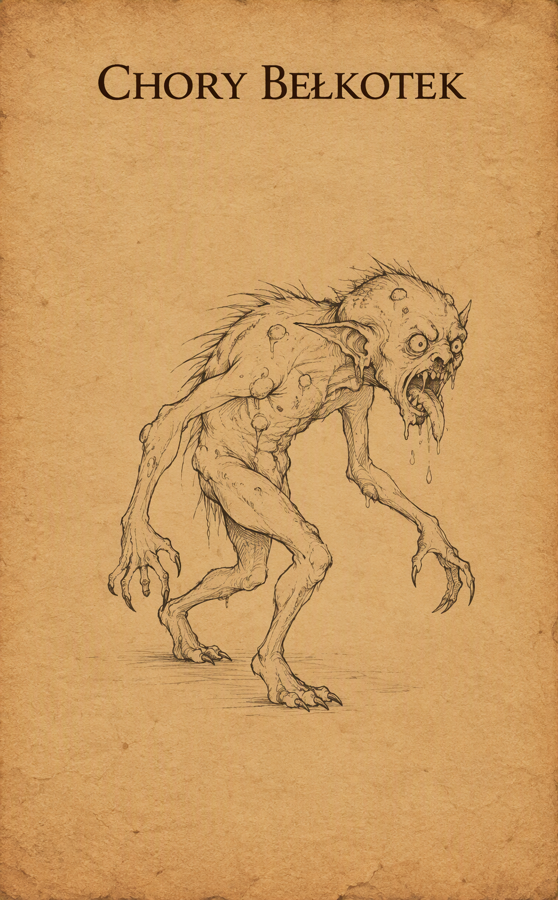{ .center-img width="30%" }](../images/belkotek.webp)|
|Dzik|To niezwykle agresywny i terytorialny drapieżnik, na którego łatwo natknąć się w gęstych lasach Wybrzeża Mieczy. Dzik nie czeka na ruch przeciwnika – wyczuwszy zagrożenie, natychmiast prze do przodu pełną szarżą, starając się nadziać wroga na ostre jak brzytwa kły. Ze względu na swoją ślepą furię potrafi z łatwością powalić poturbowanego lub nieostrożnego poszukiwacza przygód.|[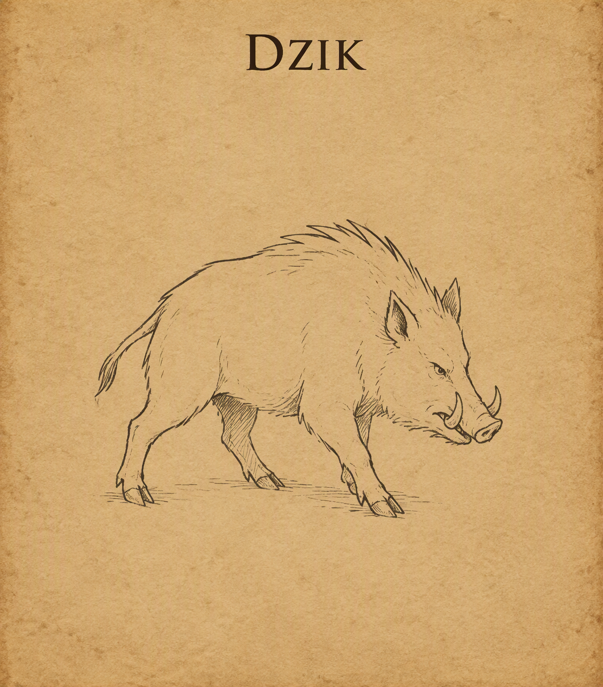{ .center-img width="30%" }](../images/dzik.webp)|
|Hobgoblin|Dyscyplina, bezwzględność i wojenny kunszt – hobgobliny to sprytni, mierzący ponad metr osiemdziesiąt wzrostu kuzyni goblinów, tworzący wysoce zorganizowane militarne społeczności. Odziani w ciężkie zbroje i wyszkoleni w walce w zwartej formacji, traktują wojnę jak rzemiosło, a bezdyskusyjne posłuszeństwo rozkazom stawiają ponad własne życie. Przydzielani bezpośrednio do oddziałów bojowych magowie hobgoblinów traktują magię jak kolejną broń masowego rażenia. Wyszkoleni w szkole odwoływania (evocation), ciskają w szeregi wrogów potężne kule ognia czy błyskawice z przerażającą precyzją, dbając o to, by ich obszarowe zaklęcia omijały sojuszniczych żołnierzy. Duchowy filar legionu, służący krwawym bóstwom wojny, takim jak Maglubiyet. Szamani podtrzymują fanatyczne morale wojsk, natchnionymi modlitwami wzmacniając siłę ataku swoich braci, a także leczą rannych dowódców na polu bitwy i wzywają mroczne błogosławieństwa, by złamać wolę walki przeciwnika.|[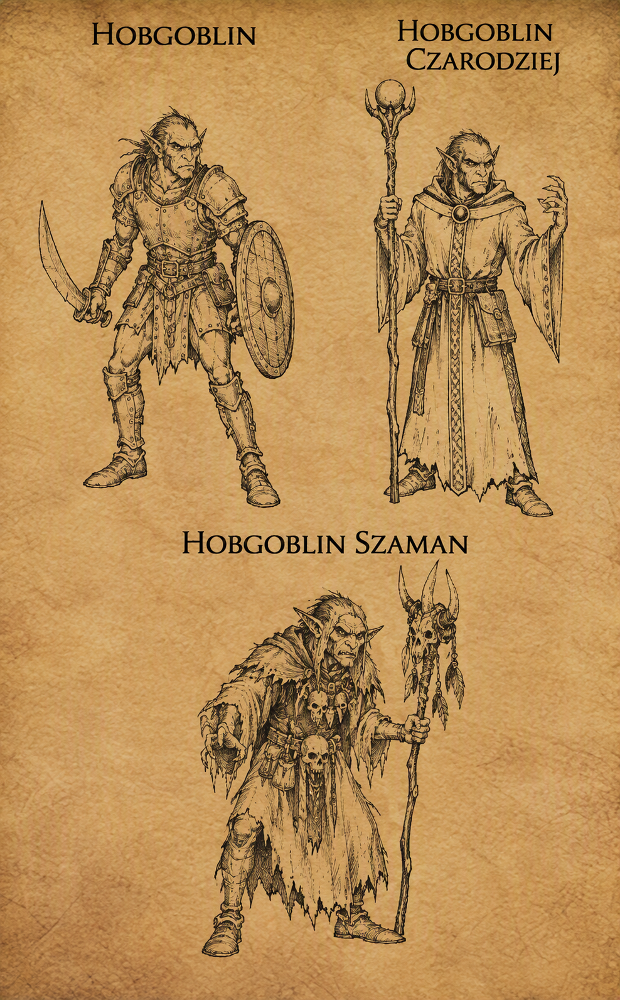{ .center-img width="30%" }](../images/hobgoblin.webp)|
|Mały pająk|Mimo iż z nazwy „mały”, ten obrzydliwy stawonóg rozmiarem dorównuje wyrośniętemu psu i stanowi śmiertelne zagrożenie dla samotnych wędrowców. Poruszając się na długich, owłosionych odnóżach z zaskakującą prędkością, zamieszkuje zarośnięte knieje, mroczne jaskinie oraz zapomniane krypty. Zamiast czekać w sieci, często aktywnie tropi swoje ofiary, by powalić je ciężarem własnego ciała i zatopić w nich wielkie kły. Jego jad wywołuje natychmiastowe odtwienie i paraliż mięśni, co pozwala stworzeniu sprawnie owinąć obezwładniony łup w szczelny kokon z pajęczyny.|[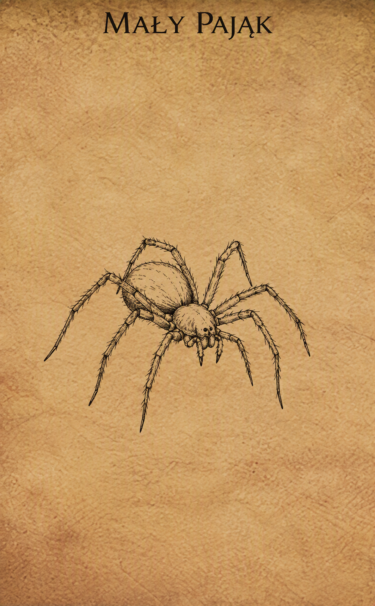{ .center-img width="30%" }](../images/maly_pajak.webp)|
|Niedźwiedziożuk|Najwięksi, najsilniejsi i najbardziej skryci pośród wszystkich istot goblinoidalnych. Mierzący ponad dwa metry wzrostu, porośnięci gęstym futrem bugbearzy łączą brutalną siłę fizyczną z zaskakującą naturalną zręcznością. W przeciwieństwie do głośnych i zdyscyplinowanych hobgoblinów, bugbearzy preferują samotne łowy lub działanie w małych grupach, specjalizując się w cichym skradaniu się i organizowaniu krwawych zasadzek. W walce wykorzystują swoją ogromną masę oraz broń obuchową i sieczną, atakując z zaskoczenia z siłą zdolną zdruzgotać pancerz wojownika w pierwszym uderzeniu.|[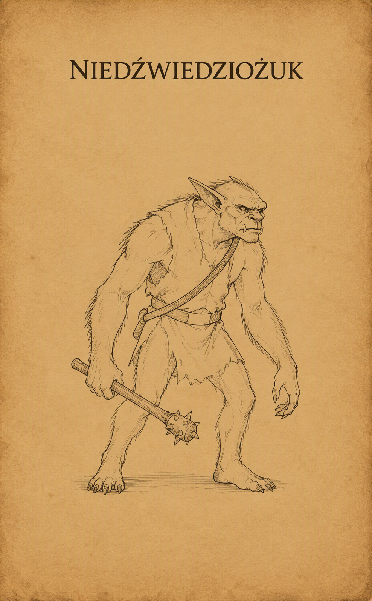{ .center-img width="30%" }](../images//niedzwiedziozuk.webp)|
|Niedźwiedź|Dziki niedźwiedź - ten powszechnie spotykany na leśnych traktach i w dzikich ostępach drapieżnik to jedno z podstawowych zagrożeń dla początkujących wędrowców. Jest porywczy, wysoce terytorialny i w pełni polega na brutalnej sile. W walce natychmiast szarżuje na ofiarę, starając się przygnieść ją masą swojego cielska i zadać głębokie rany potężnymi uderzeniami pazurów, co czyni go niebezpiecznym przeciwnikiem. Niedźwiedź czarny - najmniejszy i najsłabszy przedstawiciel rodziny niedźwiedzi, zamieszkujący obrzeża lasów, jaskinie i górskie przełęcze. Z natury jest znacznie mniej agresywny od swoich większych krewniaków – często zachowuje neutralność i po prostu ignoruje wędrowców, dopóki nie zostanie bezpośrednio zaatakowany. |[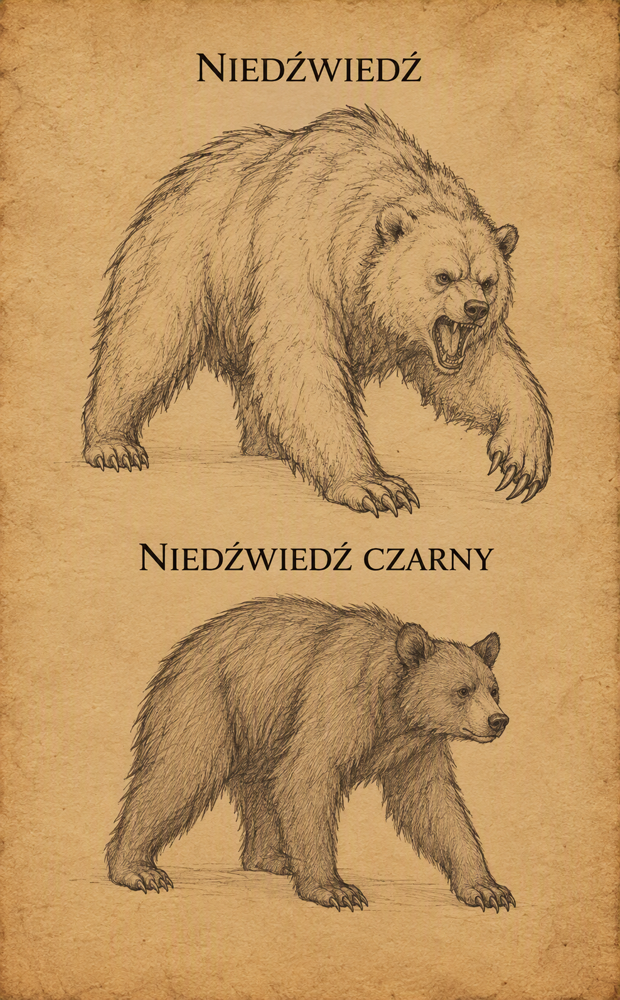{ .center-img width="30%" }](../images/niedzwiedz.webp)|
|Ogr|To ogromny, brutalny i wyjątkowo tępy stwór, stanowiący stałe zagrożenie na leśnych szlakach, w górskich przełęczach oraz opuszczonych ruinach Wybrzeża Mieczy. Mierzący ponad trzy metry wzrostu drapieżnik kieruje się wyłącznie wiecznym głodem i pierwotną agresją, rzadko dając się przekonać jakimkolwiek argumentom. W walce całkowicie ignoruje taktykę, polegając na niszczycielskiej sile swoich potężnych ramion i ciężkiej maczugi lub pnia drzewa. Choć jest powolny i łatwy do wyminęcia przez zwinnego wojownika, pojedyncze trafienie jego bronią potrafi zdruzgotać pancerz i powalić nawet doświadczonego poszukiwacza przygód.|[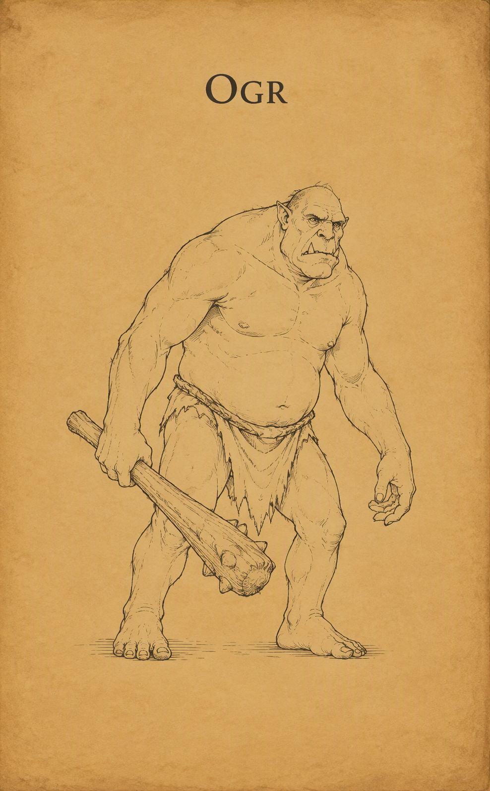{ .center-img width="30%" }](../images/ogr.webp)|
Pełzacz ścierwojad|Głęboko w podziemnych korytarzach, tam gdzie zapach wilgoci miesza się z odorem rozkładu, po ścianach i sufitach bezszelestnie mknie Pełzacz Ścierwojad. Ten gigantyczny, obrzydliwy stawonóg jest wiecznie głodną czystką podziemi – zwabiony zapachem krwi i śmierci, poluje z zaskoczenia, spadając na niczego niespodziewających wędrowców wprost z ciemności. Wokół jego szczczęk wije się pęk obrzydliwych macek ociekających paraliżującym śluzem; wystarczy jedno muśnięcie, by śmiałek zastygł w bezruchu, bezradnie patrząc, jak stwór powoli wciąga go do swojego leża, by pożreć go żywcem.|[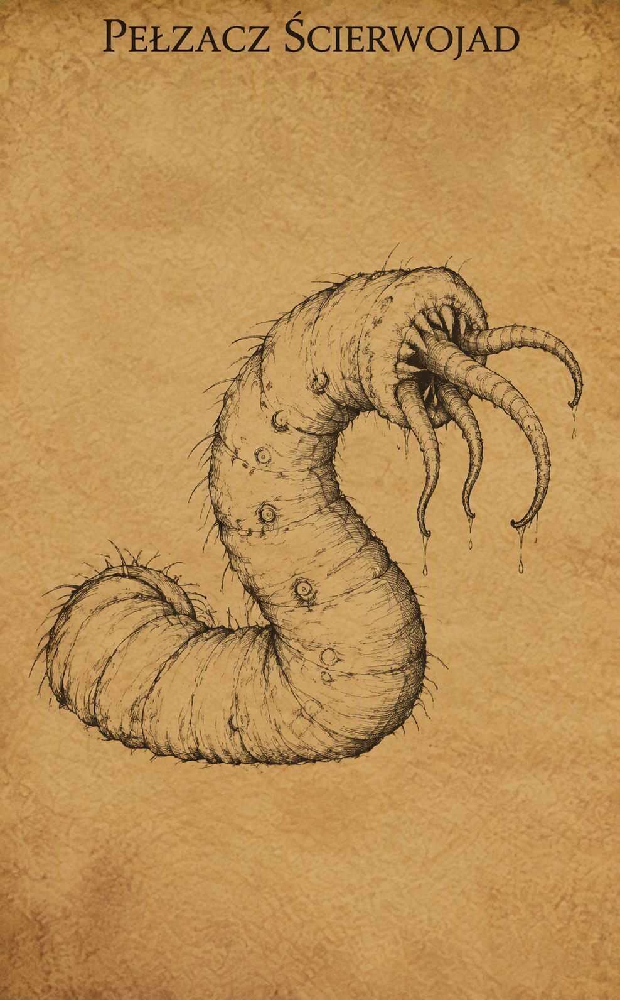{ .center-img width="30%" }](../images/pelzacz_scierwojad.webp)|
|Rozbójnik|**Rozbójnik** - zwykły oprych, zbój lub dezerter, który porzucił prawo na rzecz łatwego zysku na szlakach handlowych Wybrzeża Mieczy. Odziany w skórzaną zbroję i uzbrojony w miecz, topór lub krótki łuk, rzadko działa w samotności, preferując zasadzki w rejonach leśnych i na mało uczęszczanych traktach. Choć pojedynczo nie stanowi wielkiego wyzwania dla doświadczonych wędrowców, w grupie bywa śmiertelnie niebezpieczny – zwłaszcza gdy zasypuje swoją ofiarę gradem strzał z ukrycia. **Rozbójnik karawanowy** - wyspecjalizowany zbir, należący do dobrze zorganizowanych grup przestępczych, które polują bezpośrednio na bogate transporty kupieckie. W przeciwieństwie do zwykłego oprycha, charakteryzuje się większą dyscypliną, lepszym wyekwipowaniem oraz brakiem skrupułów. Doskonale zna słabe punkty chroniących strażników i metody szybkiego paraliżowania wozów, przez co starcie z nim wymaga od drużyny znacznie większej ostrożności i szybkiej eliminacji celów na odległość.|[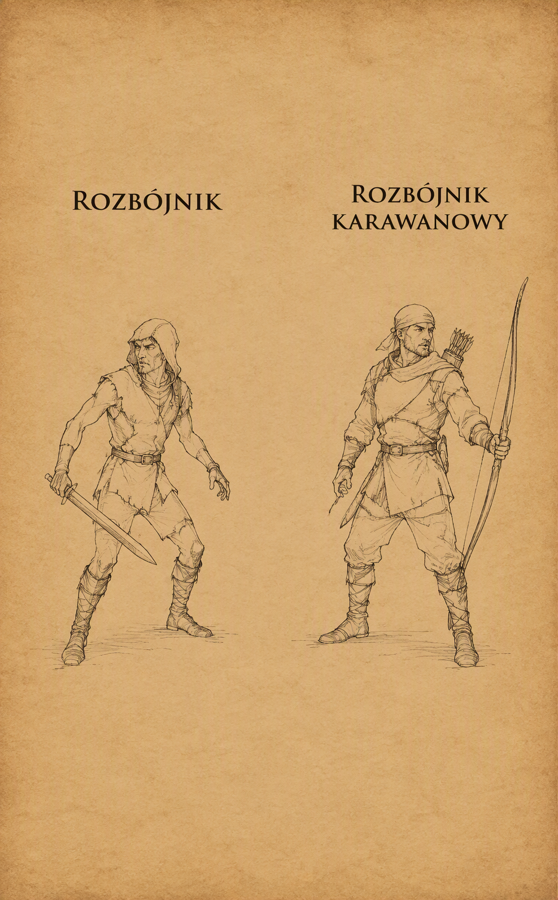{ .center-img width="30%" }](../images/bandyta.webp)|
|Szaroskóry|Szaroskóry (zwany też duergarem lub krasnoludem szarym) to ponura, wypaczona wiekami niewoli u łupieżców umysłów rasa krasnoludów zamieszkująca głębiny Podmroku. Od swoich powierzchniowych kuzynów różnią się aszowatą skórą, pozbawionymi źrenic oczami i bezwzględnym, wyzbytym radości podejściem do życia. Zamiast tradycyjnego rzemiosła przedkładają ciężką niewolniczą pracę i podboje, a dzięki przebytej ewolucji i magii potrafią stawać się całkowicie niewidzialni oraz magicznie powiększać swoje rozmiary podczas walki.|[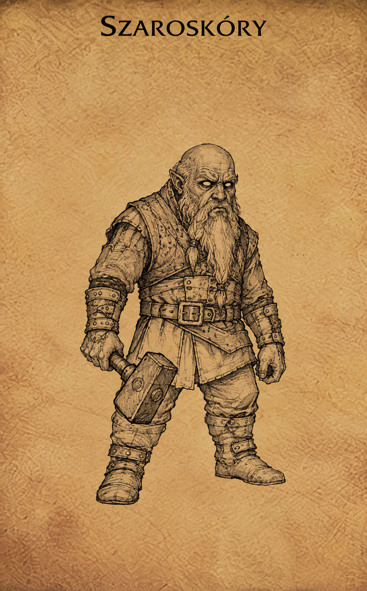{ .center-img width="30%" }](../images/szaroskory.webp)|
|Szczur|Szczur jaki jest każdy widzi. A jak nie widział to jego szczęście. Olbrzymi szczur jest wiekszy, chyba to jasne?|[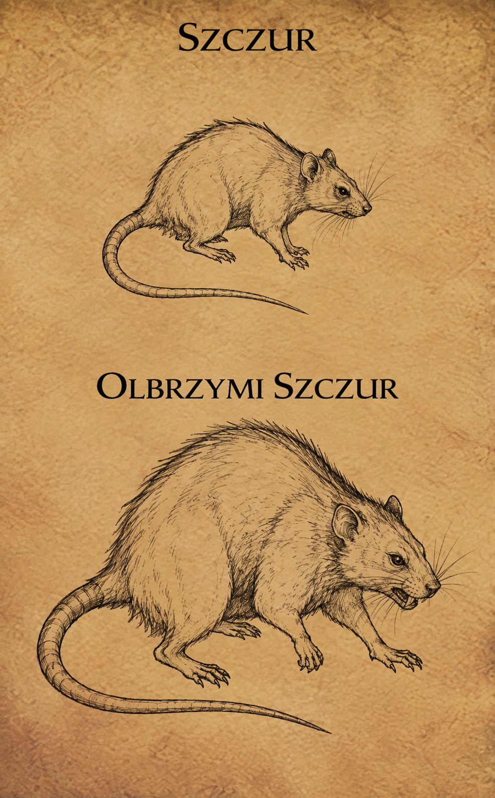{ .center-img width="30%" }](../images/szczur.webp)|
|Szkielet wojownik|Szkielet wojownik to ożywiona magią nekromancji pozostałość po poległym żołnierzu, ślepo wykonująca rozkazy swojego twórcy. Pozbawiony tkanki, lęku i własnej woli, prze naprzód z mechaniczną nieustępliwością, dzierżąc spękaną tarczę oraz wyszczerbiony miecz lub włócznię. Choć sam w sobie jest kruchy i podatny na obuchowe uderzenia, stanowi poważne zagrożenie w grupie, walcząc bezczelnie aż do całkowitego rozsypania się w pył.|[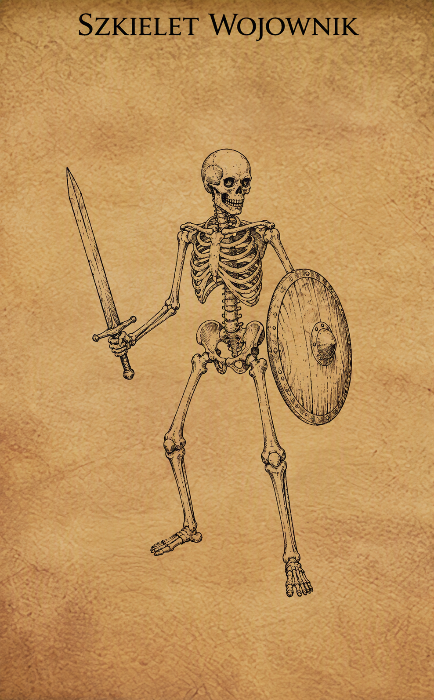{ .center-img width="30%" }](../images/szkielet_wojownik.webp)|
|Wąż|Olbrzymi wąż to groźny, kilkunastometrowy drapieżnik zamieszkujący gęste dżungle, bagna oraz mroczne zalane podziemia. Porusza się bezszelestnie w gęstwinie lub pod powierzchnią wody, atakując z zaskoczenia z szybkością uderzenia pioruna. W zależności od gatunku, zabija błyskawicznym ukąszeniem wstrzykującym śmiercionośny jad lub oplata ofiarę potężnym, umięśnionym ciałem, dławiąc ją i miażdżąc kości przed połknięciem w całości.|[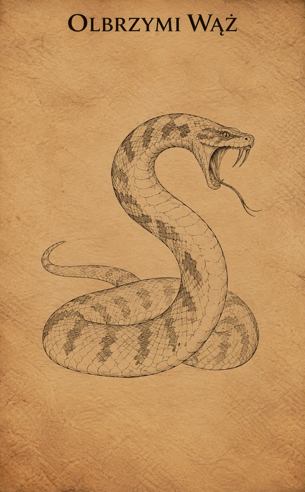{ .center-img width="30%" }](../images/waz.webp)|
|Wilk|To jedno z najczęstszych zagrożeń czyhających na leśnych traktach i dzikich obszarach Wybrzeża Mieczy. Drapieżnik ten rzadko atakuje w pojedynkę – zazwyczaj przemierza knieje w watahach, błyskawicznie okrążając swoją ofiarę. Choć pojedynczy osobnik ma niewiele punktów życia i bez trudu pada od ciosów miecza, w grupie potrafi szybko nadwerężyć siły początkującej drużyny, nękając bohaterów szybkimi atakami z zaskoczenia.|[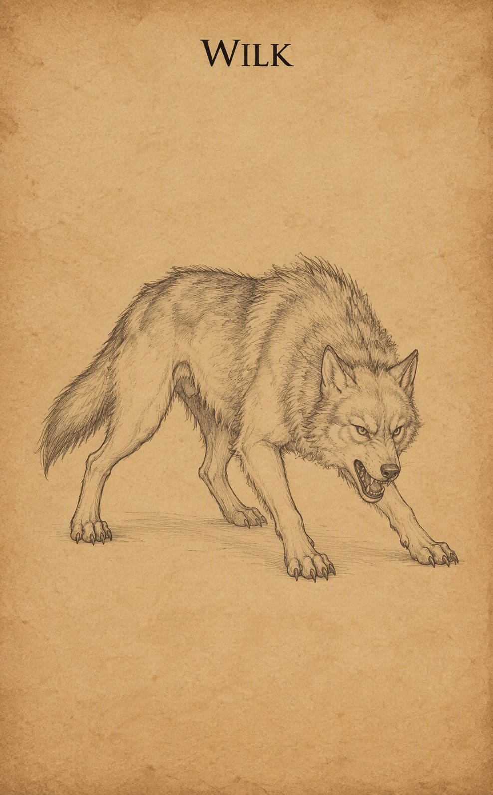{ .center-img width="30%" }](../images/wilk.webp)|
|Xvart|Te niewielkie, niebieskoskóre i krzykliwe stworzenia stanowią jedno z najbardziej uciążliwych zagrożeń na dzikich obszarach Wybrzeża Mieczy. Znane ze swojej niespotykanej tchórzliwości, xvarty rzadko atakują w pojedynkę – szukają przewagi w przytłaczającej liczebności, nękając podróżnych głośnym wrzaskiem i atakując chmarami z ukrycia. Uzbrojeni w prymitywne sztylety, krótkie miecze lub proce, w walce bezczelnie wykorzystują swoją zwinność, jednak wystarczy powalić kilku z nich lub ich przywódcę, by reszta uciekła w popłochu w gęstwiny.|[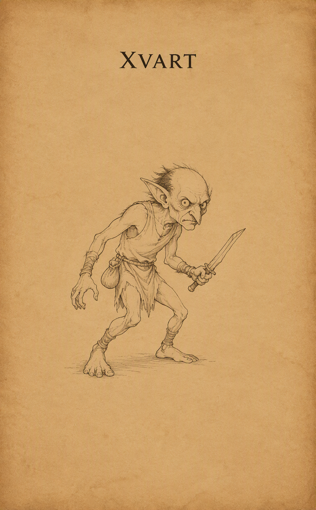{ .center-img width="30%" }](../images/xvart.webp)|

#|Szczur|Szczur jaki jest każdy widzi. A jak nie widział to jego szczęście. Olbrzymi szczur jest wiekszy, chyba top jasne?|[{ .center-img width="30%" }](../images/szczur.webp)|