|Nazwa|Opis|Wygląd|
|-------------|-------------------------------------------|-----------------------|
|Bełkotek|Chory bełkotek (zwany także gibberlingiem) to szkaradna, zniekształcona odmiana i tak już przerażającego stworzenia stanowi jedno z najbardziej odpychających zagrożeń w głębi podziemi i mrocznych kniei. Dotknięty toczącą go zarazą, chory bełkotek jest jeszcze bardziej nieprzewidywalny i agresywny niż jego zdrowi pobratymcy. Z jego owrzodzonej skóry sączy się jadowita mazi, a z pyska – obok charakterystycznego, szaleńczego bełkotu – dobiega głuchy, męczeński skowyt. W walce stanowi podwójne niebezpieczeństwo: choć sam w sobie jest fizycznie wątły i łatwy do pokonania, bezpośredni kontakt z nim grozi zarażeniem ciężką chorobą. Każdy cios zadany temu stworzeniu lub ukąszenie z jego strony może przenieść na poszukiwacza przygód wyniszczającą infekcję, co czyni starcie z całymi chmarami tych potworów wyścigiem z czasem.|[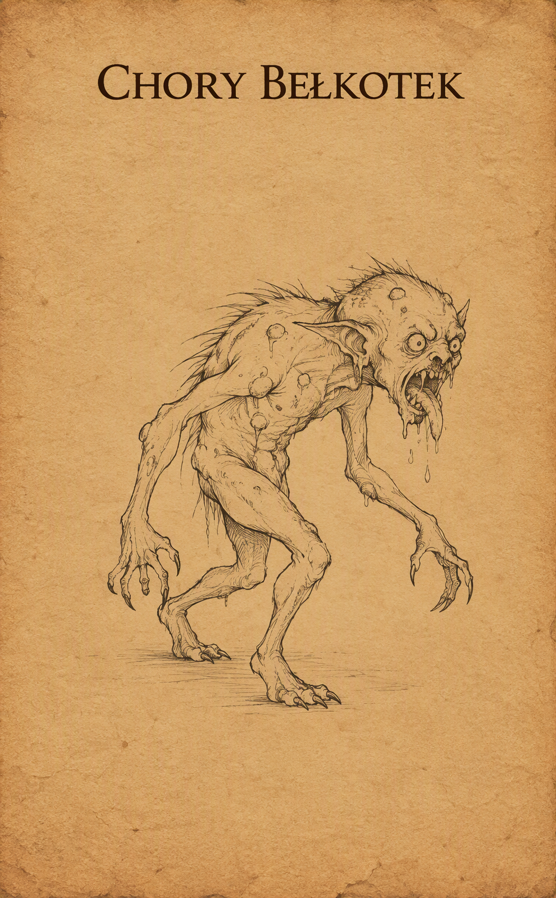{ .center-img width="30%" }](../images/belkotek.webp)|
|Czerwony Mag|**Czarodziej** - potężny czarodziej wywodzący się z magokratycznego królestwa Thay, łatwo rozpoznawalny po całkowicie ogolonej głowie, skomplikowanych magicznych tatuażach pokrywających twarz oraz pysznych, purpurowo-czerwonych szatach. Jako mistrz wybranej szkoły magii (często Nekromancji lub Wywoływania) traktuje sztuki tajemne wyłącznie jako narzędzie dominacji i zdobywania władzy, bezwzględnie eliminując rywali i wykorzystując potężne zaklęcia obszarowe oraz arcanum do realizacji celów politycznych swojej nacji. **Strażnik** - Wyszkolony do bezwzględnego posłuszeństwa elitarny strażnik przydzielany do ochrony Czerwonych Magów, ubrany w ciężką, czernioną lub zdobioną czerwienią zbroję płytową. Zamiast operować magią, polega na brutalnej sile, dyscyplinie bojowej oraz atutach kontroli pola walki (takich jak Sentinel czy styl Protection), stanowiąc żywy, nieustępliwy mur odgradzający czarującego pryncypała od ataków w zwarciu i przyjmujący na siebie ciosy wymierzone w maga.|[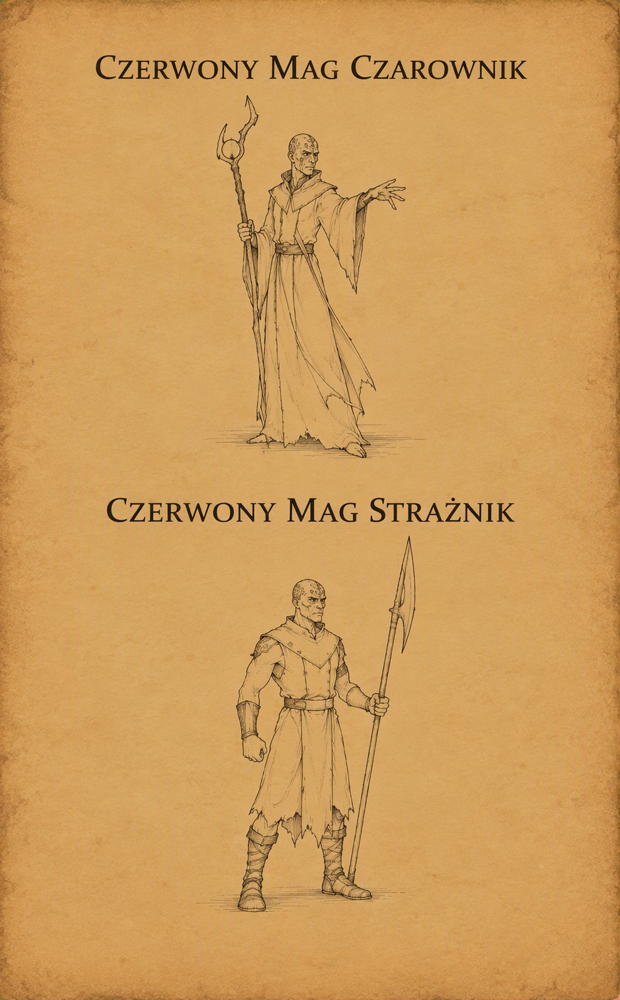{ .center-img width="30%" }](../images/czerwony_mag.webp)|
|Dzik|To niezwykle agresywny i terytorialny drapieżnik, na którego łatwo natknąć się w gęstych lasach Wybrzeża Mieczy. Dzik nie czeka na ruch przeciwnika – wyczuwszy zagrożenie, natychmiast prze do przodu pełną szarżą, starając się nadziać wroga na ostre jak brzytwa kły. Ze względu na swoją ślepą furię potrafi z łatwością powalić poturbowanego lub nieostrożnego poszukiwacza przygód.|[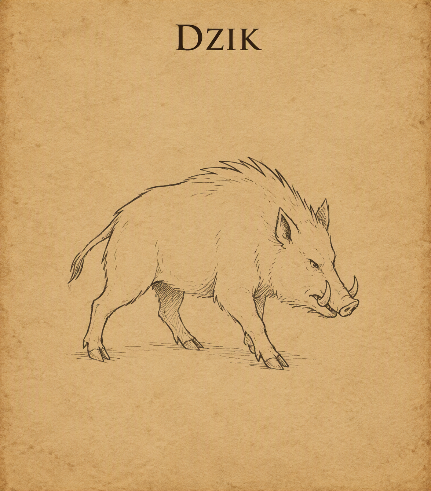{ .center-img width="30%" }](../images/dzik.webp)|
|Ettin|Monstrualny, dwugłowy gigant o wyjątkowo obmierzłej aparycji i znikomej inteligencji, żyjący w dzikich ostępach oraz w głębi górskich jaskiń. Obydwie głowy posiadają własne, odrębne osobowości i nieustannie sprzeczają się ze sobą o jedzenie, kierunek marszu czy dominację, lecz na polu bitwy działają w idealnej synergii. Dzięki dwóm parom oczu i uszu niezwykle trudno go zaskoczyć, a nieprzerwany czujnik zmysłów sprawia, że stale wypatruje potencjalnego zagrożenia lub łatwego łupu. W walce posługuje się dwiema potężnymi, ciężkimi broniami oburącz, tłukąc wroga z niszczycielską siłą.|[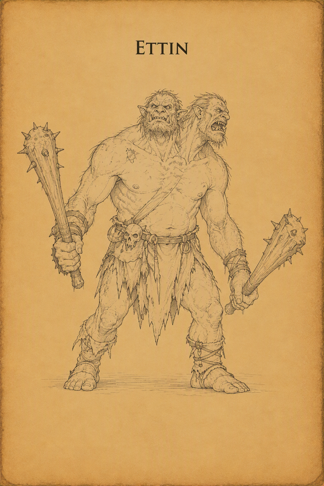{ .center-img width="30%" }](../images/ettin.webp)|
|Galaterowiec|**Ochrowy galaretowiec** - Bezkształtna, półprzezroczysta masa żrącego, ochrowo-żółtego śluzu, pełzająca bezszelestnie wzdłuż wilgotnych ścian, stropów i dna podziemnych korytarzy. Ten pozbawiony mózgu drapieżnik kieruje się wyłącznie prymitywnym instynktem pochłaniania materii organicznej. Ciało stwora wydziela gęsty, silnie żrący kwas zdolny w kilka chwil strawić skórę, mięśnie oraz drewno. Podczas ataku spływa bezpośrednio na ofiarę, wciągając ją do swojego wnętrza, by rozpuścić ją żywcem. Wszelkie próby rozcięcia go bronią sieczną lub porażenia piorunem powodują rozdzielenie masy na dwa w pełni funkcjonalne, mniejsze organizmy. |[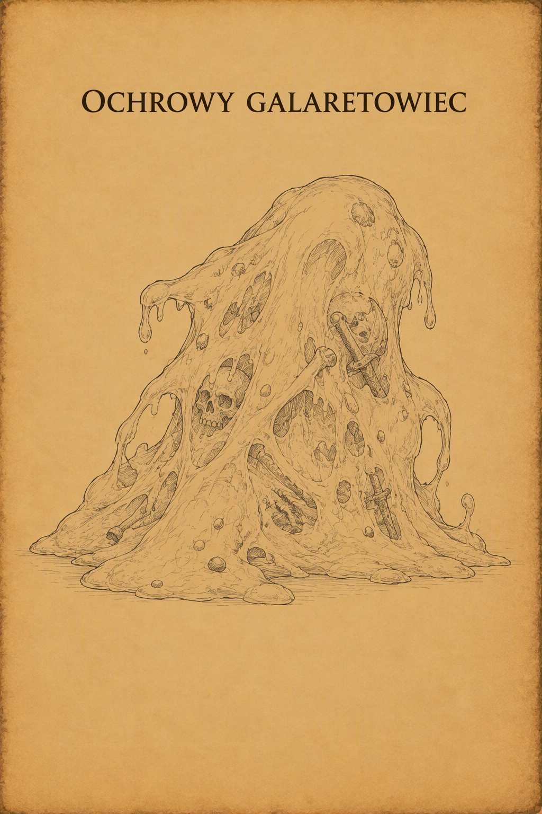{ .center-img width="30%" }](../images/galareta.webp)|
|Ghast|Wyższa, bardziej pojętna odmiana ghula, zrodzona z czystego nekrotycznego zepsucia i niepohamowanego głodu żywego mięsa. Działa jako przewodnik pożądliwych, padlinożernych hord w mrocznych kryptach oraz na starodawnych cmentarzyskach. Emanuje z niego potworny, trupi odór tak intensywny, że paraliżuje zmysły i wywołuje gwałtowne nudności u każdego, kto znajdzie się w jego pobliżu. W walce wykazuje się przebiegłością – potrafi zastawiać zasadzki i atakować w najsłabszym momencie, by szponami zatrutymi pośmiertną skazą doprowadzić ofiarę do pełnego paraliżu.|[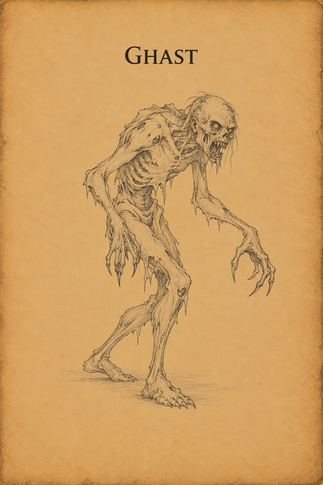{ .center-img width="30%" }](../images/ghast.webp)|
|Ghul|Mroczny, czmychający nieumarły średniego rozmiaru, zrodzony z patologicznego, kanibalistycznego głodu za życia lub pożarty przez martwiczą magię Podmroku i cmentarzy. Przypomina wypaczone, wychudzone ludzkie zwłoki o matowej, sinej skórze, wydłużonych pazurach i ostrych, powiększonych zębach ułatwiających rozrywanie mięsa. W walce polega na ataku z zaskoczenia w grupach (stadach) – jego najgroźniejszą bronią jest paraliżujący dotyk pazurów (Paralyzing Touch), który natychmiast unieruchamia żywe ofiary, pozwalając ghulowi oraz jego pobratymcom na swobodne pożeranie celu na oczach bezsilnej reszty drużyny.|[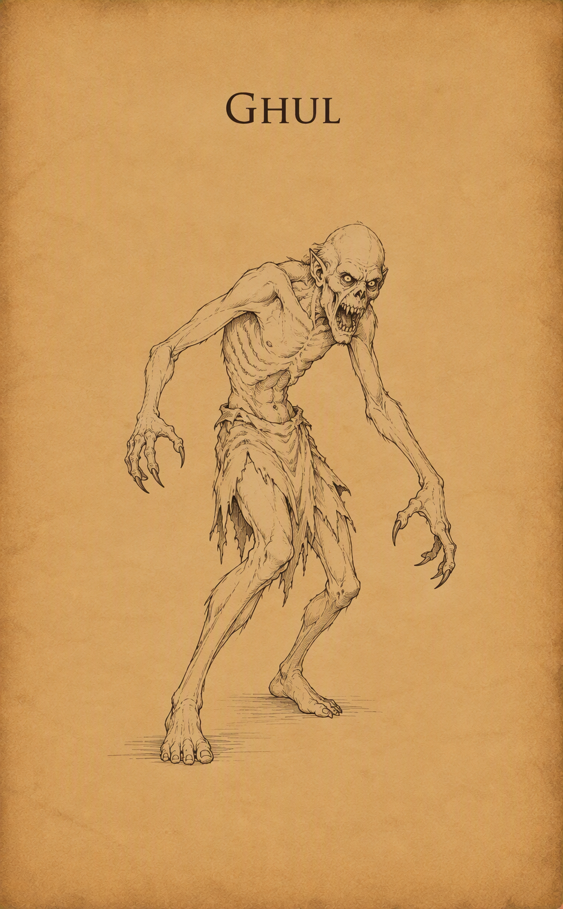{ .center-img width="30%" }](../images/ghul.webp)|
|Gnoll|**Gnoll** - hybrydalny, drapieżny humanoid o posturze łączącej cechy spadzistoplecej hieny i wychudzonego człowieka. Porusza się na lekko ugiętych, żylastych kończynach, emitując ciągły, piskliwy śmiech przeplatany warczeniem. Jako czciciel demonicznego władcy Yeenoghu, nie zna litości ani dyplomacji – kieruje nim wyłączny, nienasycony głód świeżego mięsa. W walce używa prymitywnych toporów, włóczni lub ciężkich łuków, nadrabiając brak taktyki furiacką przewagą liczebną. **Gnoll-rozpruwacz** - większy, bardziej bezwzględny przedstawiciel rasy, pchnięty w szał przez bezpośrednie błogosławieństwo mrocznych sił lub czystą żądzę krwi. W opowieściach jawi się jako żywy taran – nie kryje się w cieniu, lecz wpada w szyki wroga niczym rozjuszona bestia. Posługuje się długa rohatyną, wyszczerbionym ostrzem, którym wykonuje obszerne, głębokie cięcia mające doprowadzić cel do natychmiastowego wykrwawienia i otwarcia drogi dla reszty stada. **Gnoll-weteran** - przywódca watahy lub doświadczony w dziesiątkach potyczek samiec alfa, który przetrwał dzięki siłowej dominacji i rzadko spotykanemu u gnolli zmysłowi taktycznemu. Zamiast bezmyślnego szału prezentuje zimne, brutalne opanowanie – potrafi utrzymać w rygorze podległe mu bestie i kierować ich atakiem na wrażliwe punkty karawany czy strażnicy. Nosi cięższe, pordzewiałe płaty zbroi zdarte z poległych wrogów i włada ciężkim orężem dwuręcznym.|[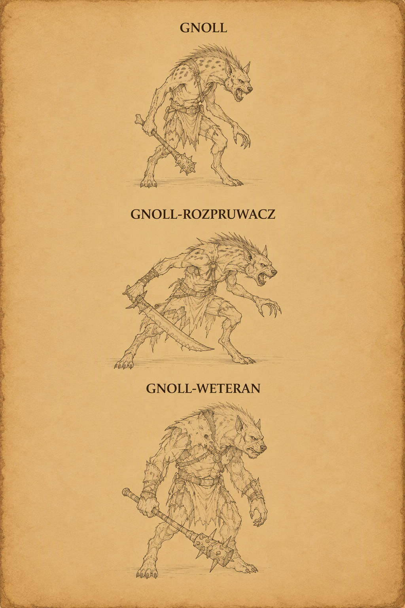{ .center-img width="30%" }](../images/gnoll.webp)|
|Golem|**Golem z ciała** - makabryczna, bezduszna konstrukcja zszyta z fragmentów ludzkich i potwornych zwłok, wprawiona w ruch poprzez potężną, zakazaną magię oraz uderzenie pioruna. Nie odczuwa bólu, strachu ani zmęczenia, a w walce prze bezmyślnie naprzód, wykonując bezwzględne rozkazy swojego stwórcy. Jego skóra ma trupią, sinoszarą barwę, a miejsca łączenia tkanek znaczą grube, pękające szwy oraz rdzawe, metalowe klamry. Choć jest powolny i pozbawiony jakiejkolwiek gracjonalności, dysponuje potężną, miażdżącą siłą fizyczną. Ogień budzi w nim niekontrolowany, zwierzęcy lęk, natomiast wyładowania elektryczne nie wyrządzają mu szkody – przeciwnie, zamykają jego martwe rany i napędzają go do dalszej walki.|[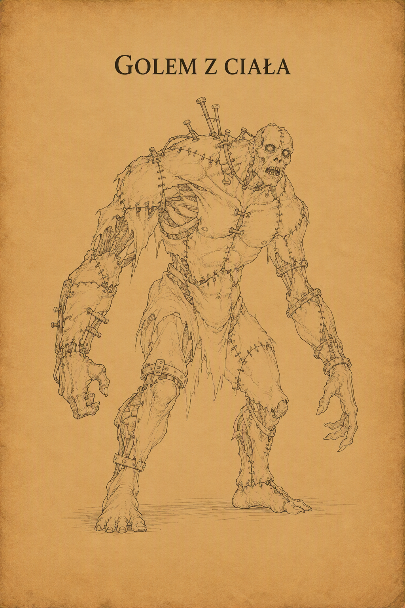{ .center-img width="30%" }](../images/golem.webp)|
|Hobgoblin|**Hobgoblin** - zdyscyplinowany, bezwzględny wojownik i urodzony taktyk. W przeciwieństwie do swoich chaotycznych, mniejszych krewnych – goblinów – hobgoblin przedkłada żelazną dyscyplinę, porządek i wyszkolenie bojowe nad bezmyślne okrucieństwo. Żyje w wysoce zmilitaryzowanym społeczeństwie, gdzie wartość jednostki mierzy się jej przydatnością na polu bitwy. W walce używa dobrze utrzymanego oręża i pancerza, doskonale współdziałając w zwartej formacji z resztą swojego oddziału. **Hobgoblin czarodziej** - Cienisty adept magii bojowej, stanowiący żywą artylerię w szeregach hobgoblińskiego legionu. Odrzuca czysto teoretyczne aspekty arkana na rzecz czarów o wysokim potencjale niszczycielskim – głównie władania ogniem, błyskawicami i energią kinetyczną. Podczas potyczki staje tuż za pierwszą linią piechoty, chłodno kalkulując trajektorie zaklęć tak, by dziesiątkować wroga, nie narażając przy tym własnych oddziałów. **Hobgoblin szaman** - mroczny duchowy przywódca i mistyk legionu, łączący wojskową dyscyplinę swojej rasy z pierwotną, złowrogą magią religijną. Szaman czerpie moc z kultu wojennych bóstw (takich jak Maglubiyet) lub z paktów z potężnymi duchami wojny i krwi. Na polu bitwy nie tylko wspiera żołnierzy błogosławieństwami i uzdrawiającą magią, ale też wywołuje u wrogów paraliżujący strach, osłabia ich morale i ciska klątwami rozrywającymi ciało od wewnątrz. **Hobgoblin elita** - doświadczony dowódca i weteran setek potyczek, reprezentujący szczyt militarnej hierarchii rasy. To nie tylko wybitny fechmistrz, ale przede wszystkim genialny taktyk potrafiący w ułamku sekundy dostrzec wyrwę w szyku wroga i wydać precyzyjne rozkazy swojemu pododdziałowi. Nosi ciężką, wyśmienicie dopasowaną zbroję płytową, a jego obecność na polu bitwy podnosi morale żołnierzy i wymusza bezwzględne posłuszeństwo.|[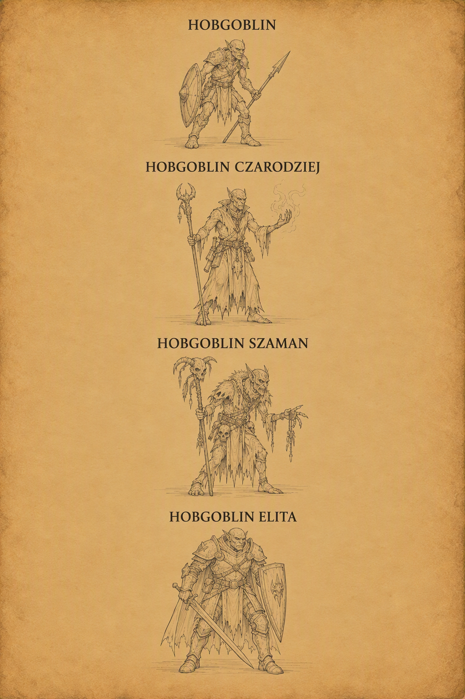{ .center-img width="30%" }](../images/hobgoblin.webp)|
|Niedźwiedziożuk|Najwięksi, najsilniejsi i najbardziej skryci pośród wszystkich istot goblinoidalnych. Mierzący ponad dwa metry wzrostu, porośnięci gęstym futrem bugbearzy łączą brutalną siłę fizyczną z zaskakującą naturalną zręcznością. W przeciwieństwie do głośnych i zdyscyplinowanych hobgoblinów, bugbearzy preferują samotne łowy lub działanie w małych grupach, specjalizując się w cichym skradaniu się i organizowaniu krwawych zasadzek. W walce wykorzystują swoją ogromną masę oraz broń obuchową i sieczną, atakując z zaskoczenia z siłą zdolną zdruzgotać pancerz wojownika w pierwszym uderzeniu.|[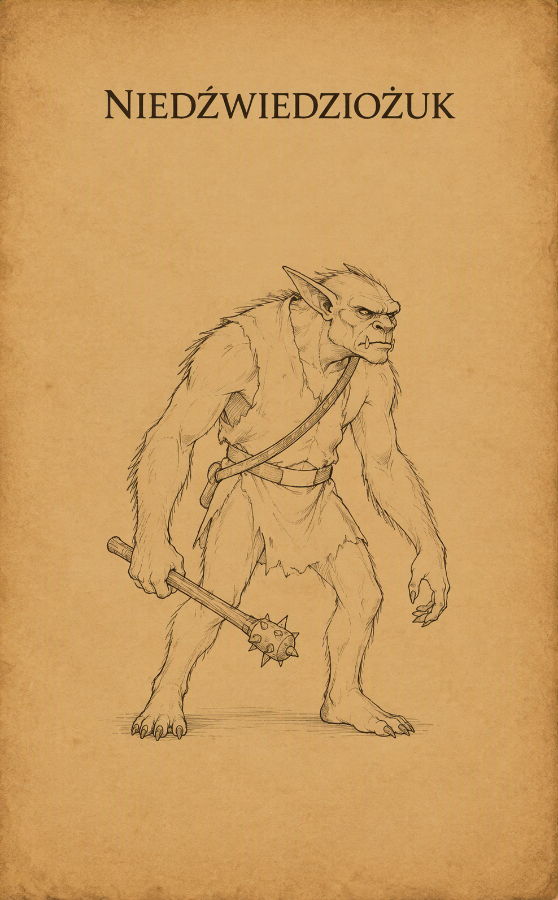{ .center-img width="30%" }](../images//niedzwiedziozuk.webp)|
|Niedźwiedź|**Dziki niedźwiedź** - ten powszechnie spotykany na leśnych traktach i w dzikich ostępach drapieżnik to jedno z podstawowych zagrożeń dla początkujących wędrowców. Jest porywczy, wysoce terytorialny i w pełni polega na brutalnej sile. W walce natychmiast szarżuje na ofiarę, starając się przygnieść ją masą swojego cielska i zadać głębokie rany potężnymi uderzeniami pazurów, co czyni go niebezpiecznym przeciwnikiem. Niedźwiedź czarny - najmniejszy i najsłabszy przedstawiciel rodziny niedźwiedzi, zamieszkujący obrzeża lasów, jaskinie i górskie przełęcze. Z natury jest znacznie mniej agresywny od swoich większych krewniaków – często zachowuje neutralność i po prostu ignoruje wędrowców, dopóki nie zostanie bezpośrednio zaatakowany. |[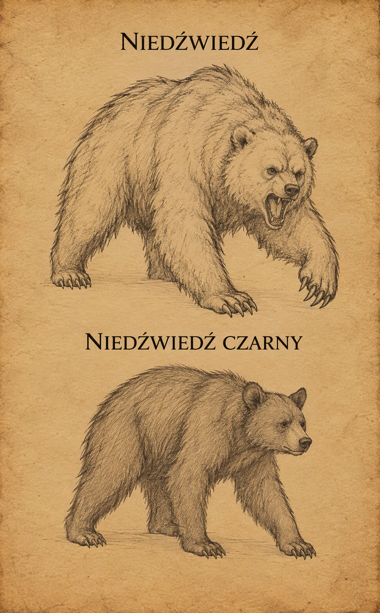{ .center-img width="30%" }](../images/niedzwiedz.webp)|
|Ogr|To ogromny, brutalny i wyjątkowo tępy stwór, stanowiący stałe zagrożenie na leśnych szlakach, w górskich przełęczach oraz opuszczonych ruinach Wybrzeża Mieczy. Mierzący ponad trzy metry wzrostu drapieżnik kieruje się wyłącznie wiecznym głodem i pierwotną agresją, rzadko dając się przekonać jakimkolwiek argumentom. W walce całkowicie ignoruje taktykę, polegając na niszczycielskiej sile swoich potężnych ramion i ciężkiej maczugi lub pnia drzewa. Choć jest powolny i łatwy do wyminęcia przez zwinnego wojownika, pojedyncze trafienie jego bronią potrafi zdruzgotać pancerz i powalić nawet doświadczonego poszukiwacza przygód.|[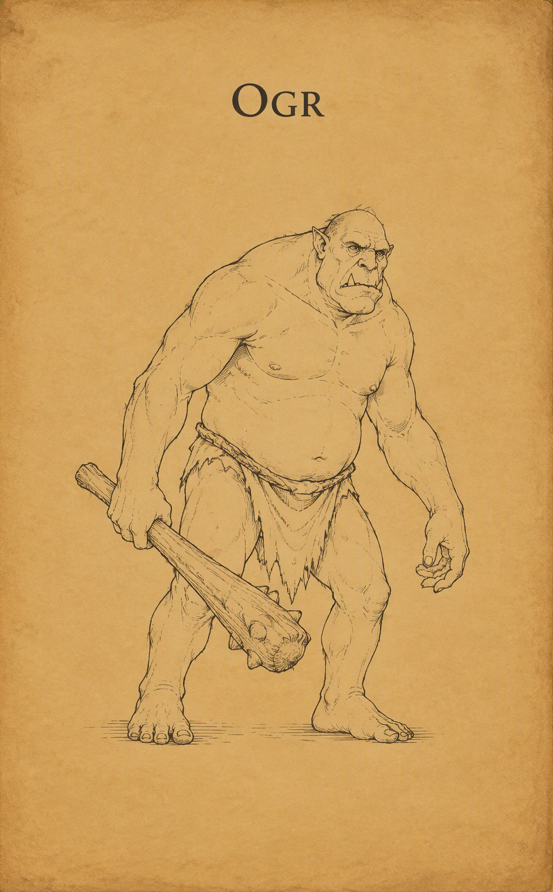{ .center-img width="30%" }](../images/ogr.webp)|
|Pająk|**Pająk** - miewielki, zwrotny drapieżnik o drobnej, zwartej budowie i wyciągniętych, cienkich odnóżach. Jego chitynowy pancerz jest gładki i stosunkowo miękki, co pozwala mu sprawnie wciskać się w ciasne szczeliny skalne, pod korę drzew czy w załomki mury. W walce nie polega na sile fizycznej, lecz na zaskoczeniu – przemyka bezszelestnie, zadając błyskawiczne, drobne ukąszenia i wstrzykując sączącą się z niewielkich szczękoczułków toksynę, która powoduje drętwienie kończyn oraz martwicę tkanek wokół rany. **Wielki pająk** - masywny pajęczak o budowie dorosłego drapieżnika, cechujący się krępym odwłokiem oraz odnóżami gęsto pokrytymi sztywnymi, czuciowymi szczecinkami. Posiada grubszy, matowy pancerz w barwach brunatno-czarnych oraz wypukłe, nieruchome ślepia skupione nad potężnymi szczękoczułkami. To klasyczny budowniczy sieci – przesiaduje w centrum lepkich, skomplikowanych konstrukcji jedwabnych, reagując na najmniejsze drgania nici, by dopaść pochwyconą ofiarę, unieruchomić ją jadem paraliżującym i ciasno opleść w kokon. **Olbrzymi pająk** - monstrualna bestia o potężnym, segmentowanym pancerzu, przypominającym spękaną skałę lub porośniętą korytnicę. Jego odnóża są masywne, o grubych stawach zdolnych utrzymać ogromny ciężar na pionowych ścianach jaskiń. Szczękoczułki tej bestii rozmiarem przypominają kościane sztylety, a z ich ujść stale kapie gęsty, żrący jad. Olbrzymi pająk rzadko polega na subtelnych sieciach – najczęściej poluje z zasadzki, taranując ofiary ciężarem własnego ciała, miażdżąc je i wstrzykując toksynę rozpuszczającą tkanki wewnętrzne jeszcze przed konsumpcją. **Pająk miecznik** - przerażający, wysoce agresywny pajęczak o chitynowym pancerzu gęsto naszpikowanym ostrymi jak brzytwa wyrostkami i kolcami. Jego odnóża zakończone są wydłużonymi, twardymi kościanymi ostrzami, którymi sprawnie szlachtuje i patroszy swoje ofiary. Zamiast tkania klasycznych sieci preferuje bezpośrednią, brutalną szarżę – dopada cel furiackim skokiem, zamieniając impet uderzenia w krwawą siekankę. **Pająk-upiór** - ciemny, nieumarły pajęczak zrodzony z nekrotycznej energii oraz cieni, którego półmaterialne ciało wydaje się spowite kłębiącym się dymem. Posiada matowy, obmierzły pancerz przerosły mrokiem oraz świecące zimnym blaskiem ślepia. Z łatwością przenika przez lite ściany i przeszkody, a jego ataki omijają pancerz fizyczny, uderzając bezpośrednio w siły witalne i trwale osłabiając ciało ofiary. **Astralny pająk fazowy** - głębinowy drapieżnik sferyczny o pancerzu mieniącym się srebrzysto-fioletową łuną kosmicznej energii. Wykorzystuje nagięcia w strukturze rzeczywistości do natychmiastowego przenikania między Planem Materialnym a Astralnym. Materializuje się tuż za plecami niczego niespodziewającego się celu, zadaje błyskawiczne ugryzienie nasycone niszczycielską magią oraz jadem, po czym natychmiast znika w krainie sfer, uniemożliwiając wyprowadzenie kontry.|[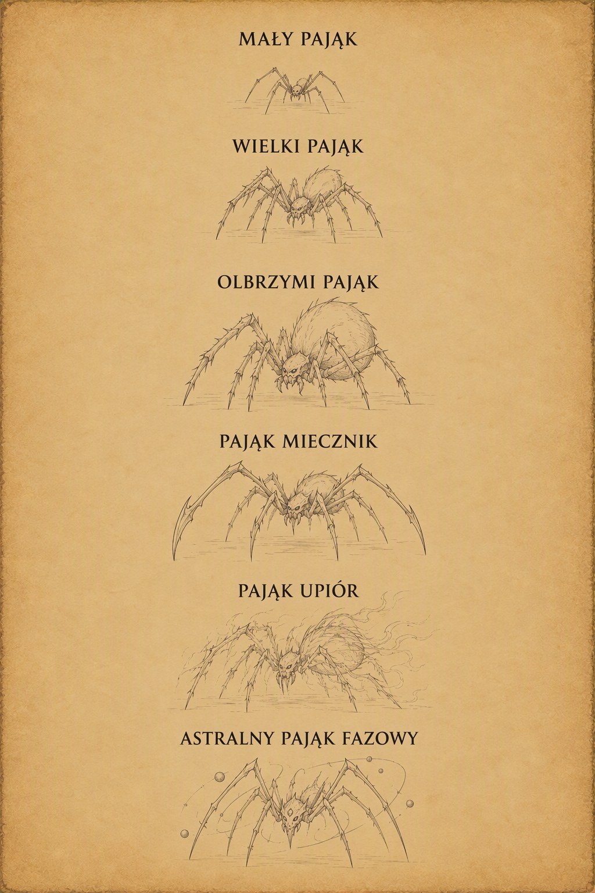{ .center-img width="30%" }](../images/pajak.webp)|
Pełzacz ścierwojad|Głęboko w podziemnych korytarzach, tam gdzie zapach wilgoci miesza się z odorem rozkładu, po ścianach i sufitach bezszelestnie mknie Pełzacz Ścierwojad. Ten gigantyczny, obrzydliwy stawonóg jest wiecznie głodną czystką podziemi – zwabiony zapachem krwi i śmierci, poluje z zaskoczenia, spadając na niczego niespodziewających wędrowców wprost z ciemności. Wokół jego szczczęk wije się pęk obrzydliwych macek ociekających paraliżującym śluzem; wystarczy jedno muśnięcie, by śmiałek zastygł w bezruchu, bezradnie patrząc, jak stwór powoli wciąga go do swojego leża, by pożreć go żywcem.|[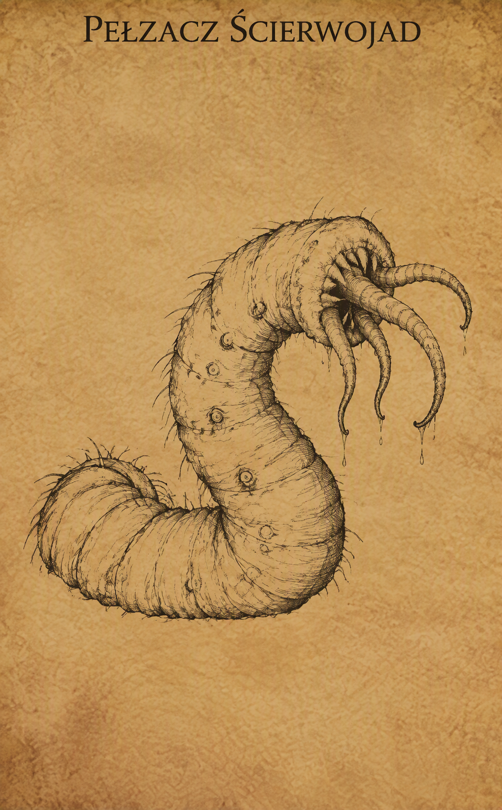{ .center-img width="30%" }](../images/pelzacz_scierwojad.webp)|
|Pies|**Pies bojowy** - treningowo przygotowany, udomowiony ogar, wyhodowany do walki u boku żołnierzy, strażników lub poszukiwaczy przygód. Wyróżnia się czujnością, wysoką Karnością oraz odpornością na strach. W walce polega na pędzie i powaleniu celu za pomocą potężnego uścisku szczęk, ułatwiając swemu panu zadanie wykończającego ciosu. **Dziki pies** - wychudzony, żyjący w stadach drapieżnik, zamieszkujący obrzeża miast, pustkowia oraz ruiny. Samotnie nie stanowi większego zagrożenia i jest płochliwy, jednak w grupie wykorzystuje taktykę sfory, zyskując przewagę w atakach, gdy w pobliżu ofiary znajduje się przynajmniej jeden z jego pobratymców.|[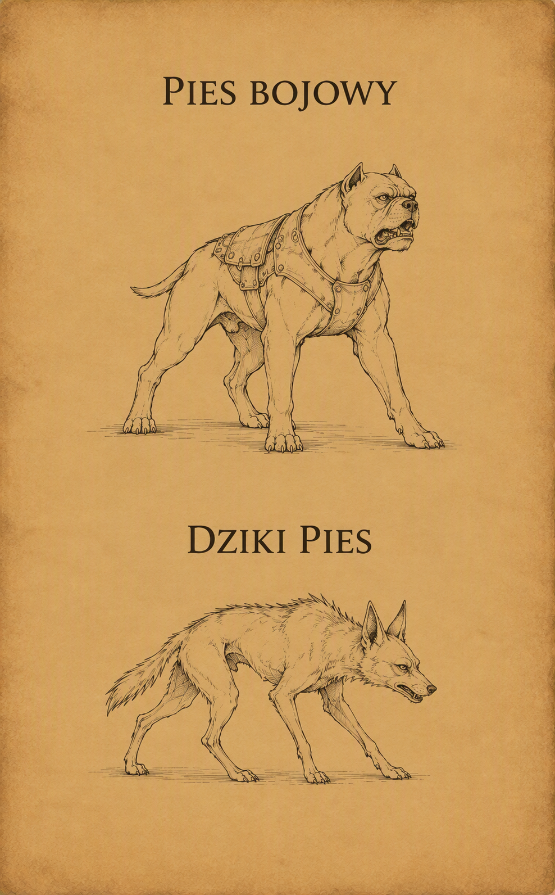{ .center-img width="30%" }](../images/pies.webp)|
|Rozbójnik|**Rozbójnik** - zwykły oprych, zbój lub dezerter, który porzucił prawo na rzecz łatwego zysku na szlakach handlowych Wybrzeża Mieczy. Odziany w skórzaną zbroję i uzbrojony w miecz, topór lub krótki łuk, rzadko działa w samotności, preferując zasadzki w rejonach leśnych i na mało uczęszczanych traktach. Choć pojedynczo nie stanowi wielkiego wyzwania dla doświadczonych wędrowców, w grupie bywa śmiertelnie niebezpieczny – zwłaszcza gdy zasypuje swoją ofiarę gradem strzał z ukrycia. **Rozbójnik karawanowy** - wyspecjalizowany zbir, należący do dobrze zorganizowanych grup przestępczych, które polują bezpośrednio na bogate transporty kupieckie. W przeciwieństwie do zwykłego oprycha, charakteryzuje się większą dyscypliną, lepszym wyekwipowaniem oraz brakiem skrupułów. Doskonale zna słabe punkty chroniących strażników i metody szybkiego paraliżowania wozów, przez co starcie z nim wymaga od drużyny znacznie większej ostrożności i szybkiej eliminacji celów na odległość.|[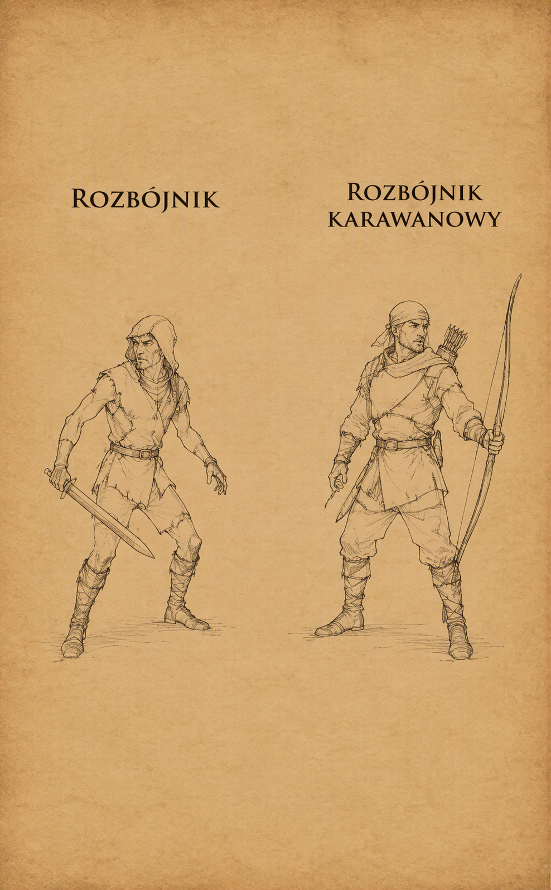{ .center-img width="30%" }](../images/bandyta.webp)|
|Szaroskóry|Szaroskóry (zwany też duergarem lub krasnoludem szarym) to ponura, wypaczona wiekami niewoli u łupieżców umysłów rasa krasnoludów zamieszkująca głębiny Podmroku. Od swoich powierzchniowych kuzynów różnią się aszowatą skórą, pozbawionymi źrenic oczami i bezwzględnym, wyzbytym radości podejściem do życia. Zamiast tradycyjnego rzemiosła przedkładają ciężką niewolniczą pracę i podboje, a dzięki przebytej ewolucji i magii potrafią stawać się całkowicie niewidzialni oraz magicznie powiększać swoje rozmiary podczas walki.|[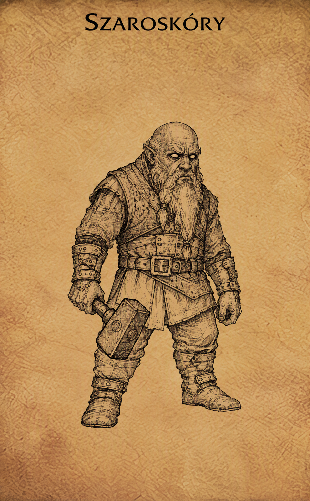{ .center-img width="30%" }](../images/szaroskory.webp)|
|Szczur|Szczur jaki jest każdy widzi. A jak nie widział to jego szczęście. Olbrzymi szczur jest wiekszy, chyba to jasne?|[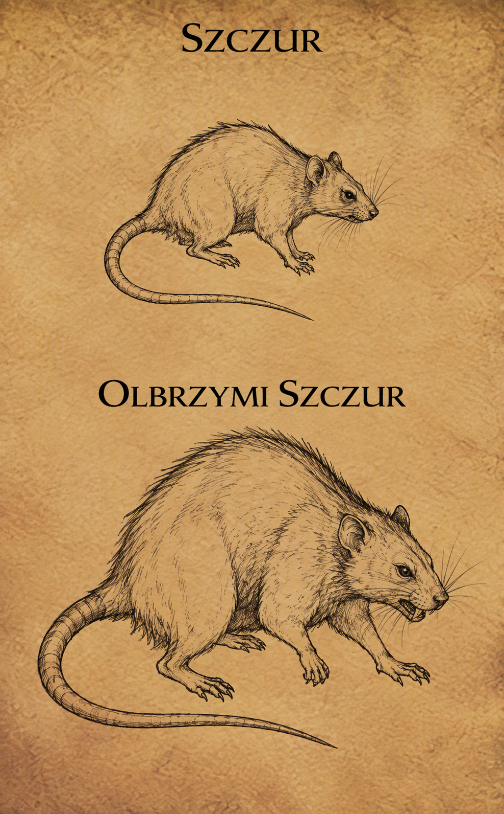{ .center-img width="30%" }](../images/szczur.webp)|
|Szkielet wojownik|Szkielet wojownik to ożywiona magią nekromancji pozostałość po poległym żołnierzu, ślepo wykonująca rozkazy swojego twórcy. Pozbawiony tkanki, lęku i własnej woli, prze naprzód z mechaniczną nieustępliwością, dzierżąc spękaną tarczę oraz wyszczerbiony miecz lub włócznię. Choć sam w sobie jest kruchy i podatny na obuchowe uderzenia, stanowi poważne zagrożenie w grupie, walcząc bezczelnie aż do całkowitego rozsypania się w pył.|[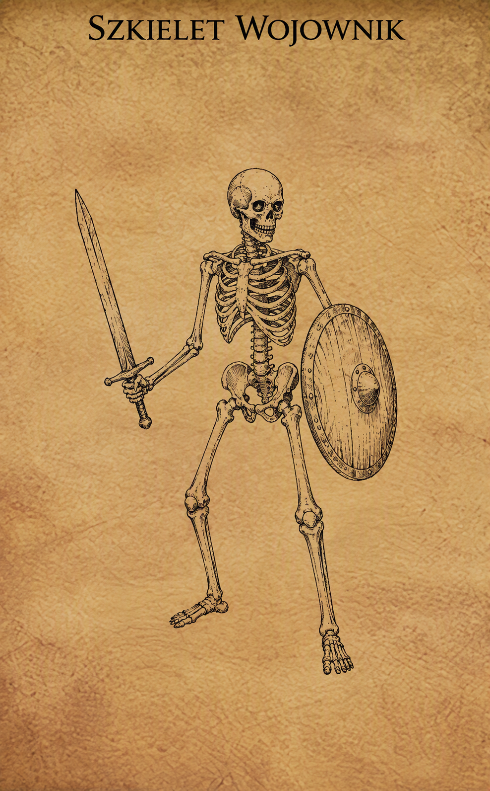{ .center-img width="30%" }](../images/szkielet_wojownik.webp)|
|Wąż|Olbrzymi wąż to groźny, kilkunastometrowy drapieżnik zamieszkujący gęste dżungle, bagna oraz mroczne zalane podziemia. Porusza się bezszelestnie w gęstwinie lub pod powierzchnią wody, atakując z zaskoczenia z szybkością uderzenia pioruna. W zależności od gatunku, zabija błyskawicznym ukąszeniem wstrzykującym śmiercionośny jad lub oplata ofiarę potężnym, umięśnionym ciałem, dławiąc ją i miażdżąc kości przed połknięciem w całości.|[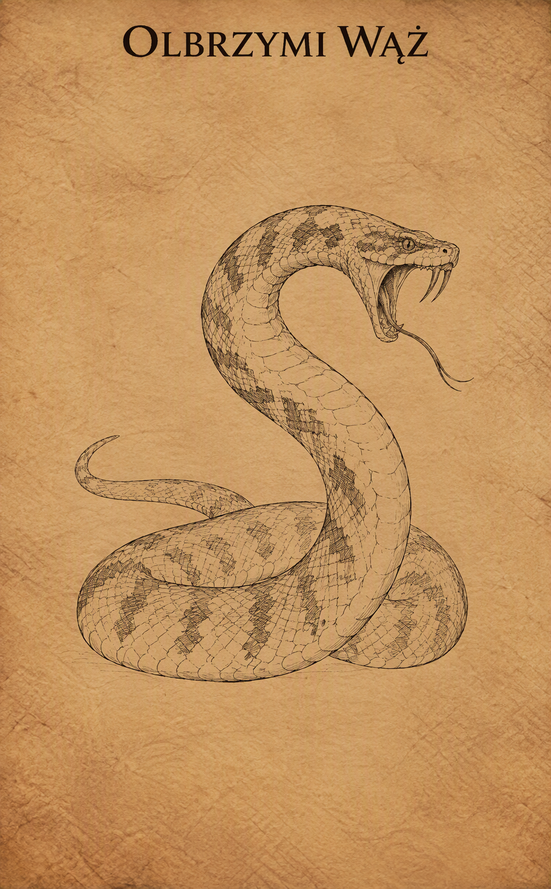{ .center-img width="30%" }](../images/waz.webp)|
|Wilk|**Wilk** - Klasyczny drapieżnik o smukłej, wydłużonej sylwetce i gęstej, chroniącej przed mrozem sierści. Długie, dryblasowate kończyny zapewniają mu niezwykłą wydolność podczas wyczerpujących pościgów, a precyzyjny uścisk mocnych szczęk i wyostrzony węch czynią z niego bezszelestnego łowcę przemierzającego dzikie knieje w zwartej watasze. **Straszliwy wilk** - Monstrualna bestia o potężnym kośćcu, głębokiej klatce piersiowej i masywnym karku zwieńczonym sztywną, jeżącą się grzywą. Posiada szeroką czaszkę z gigantycznymi kłami zdolnymi do kruszenia pancerzy oraz siłę mięśniową pozwalającą na taranowanie przeszkód i powalanie dorosłego jelenia lub jeźdźca jednym impetem. **Worg** - Złośliwy, wysoce agresywny drapieżnik o spadzistym zadzie, nieproporcjonalnie szerokich barkach i szorstkiej, poszarpanej sierści. Cechuje go krótsza, masywna pyskoczaszka z stale odsłoniętymi zębami oraz pałające inteligencją, okrutne spojrzenie żółtych lub czerwonawych ślepi. **Wampiryczny wilk** - Skażona mroczną energią bestia o smołowo czarnym futrze i szkarłatnie płonących oczach. Jego ciało pozbawione jest tętna oraz oddechu, a w trupio bladym pysku wyróżniają się nadnaturalnie wydłużone, ostre jak igły kły, służące do przebijania tętnic i łczyczego wyssania sił witalnych ze swych ofiar.|[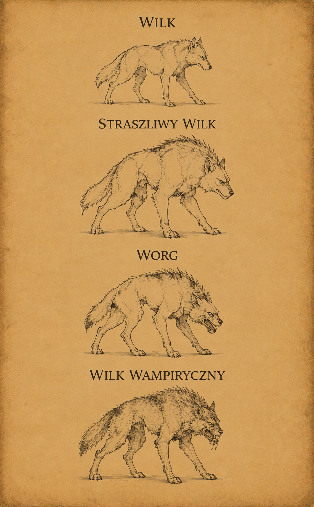{ .center-img width="30%" }](../images/wilk.webp)|
|Xvart|Te niewielkie, niebieskoskóre i krzykliwe stworzenia stanowią jedno z najbardziej uciążliwych zagrożeń na dzikich obszarach Wybrzeża Mieczy. Znane ze swojej niespotykanej tchórzliwości, xvarty rzadko atakują w pojedynkę – szukają przewagi w przytłaczającej liczebności, nękając podróżnych głośnym wrzaskiem i atakując chmarami z ukrycia. Uzbrojeni w prymitywne sztylety, krótkie miecze lub proce, w walce bezczelnie wykorzystują swoją zwinność, jednak wystarczy powalić kilku z nich lub ich przywódcę, by reszta uciekła w popłochu w gęstwiny.|[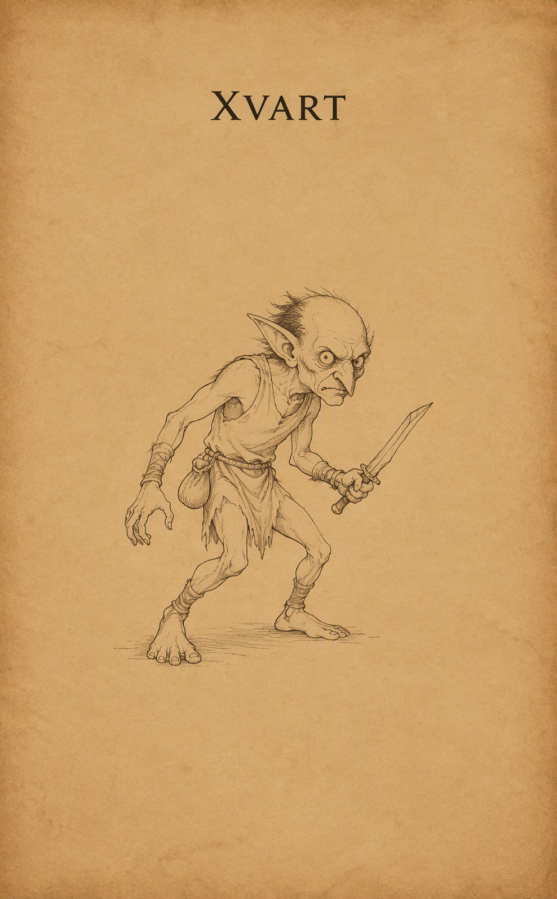{ .center-img width="30%" }](../images/xvart.webp)|
|Zombie|Powolny, nieposiadający własnej woli nieumarły, powołany do życia przez mroczną nekromancję lub skażony pośmiertnym plagiatorstwem. Jego ciało znajduje się w różnym stadium rozkładu – od świeżo pochowanych zwłok ze stężałą, trupią skórą, po gnijące, otwarte rany odsłaniające mięśnie i kości. Zombie nie odczuwa bólu, strachu ani zmęczenia; porusza się ciężkim, nierównym krokiem, powoli lecz nieuchronnie prąc naprzód. W walce prze do przodu bez względu na odniesione obrażenia, atakując miażdżącym ciężarem własnego ciała, kłami oraz powiązanymi siłą woli pazurami, by rozszarpać żywe tkanki.|[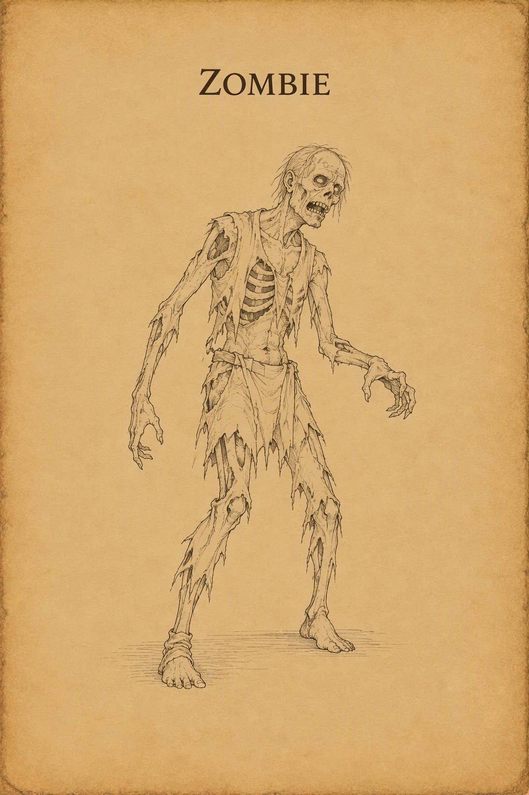{ .center-img width="30%" }](../images/zombie.webp)|

<!-- 

#|Szczur|Szczur jaki jest każdy widzi. A jak nie widział to jego szczęście. Olbrzymi szczur jest wiekszy, chyba top jasne?|[{ .center-img width="30%" }](../images/szczur.webp)|

 -->
