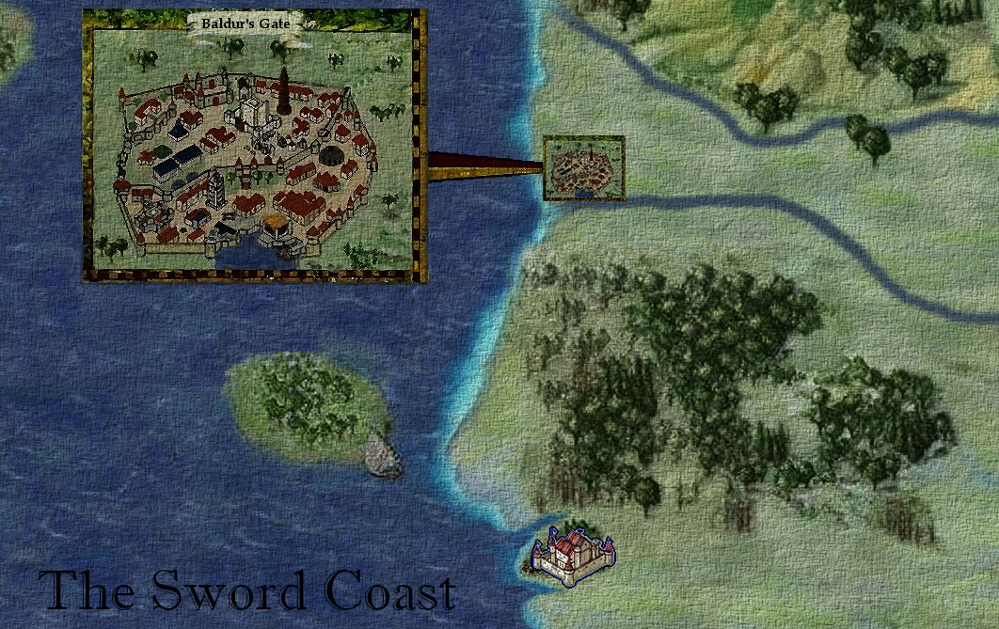
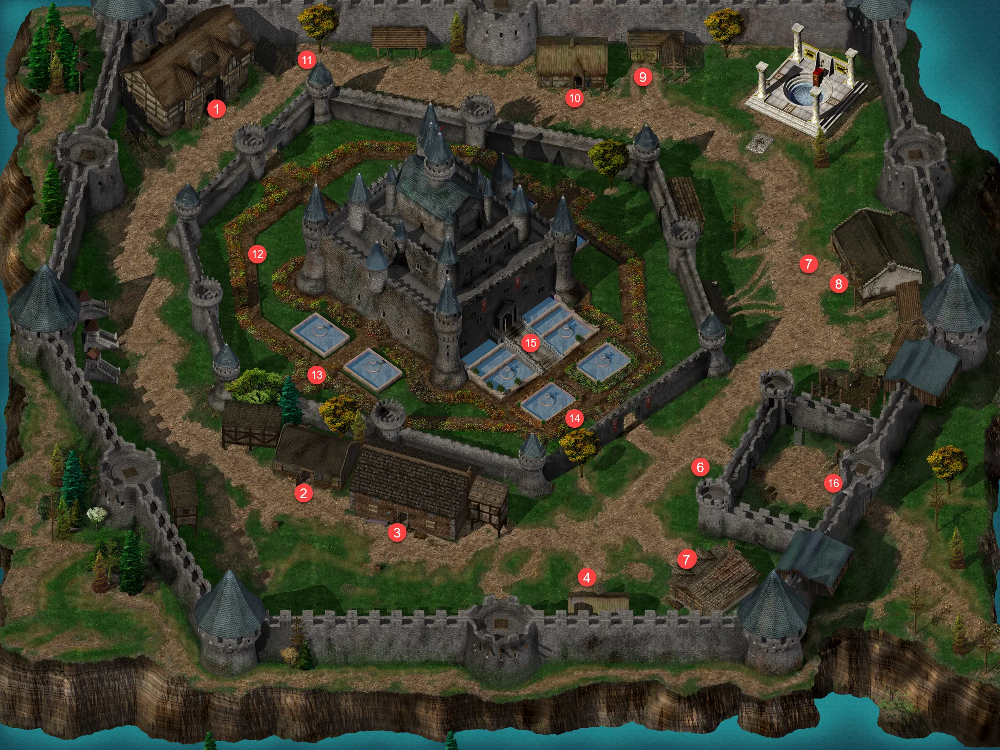
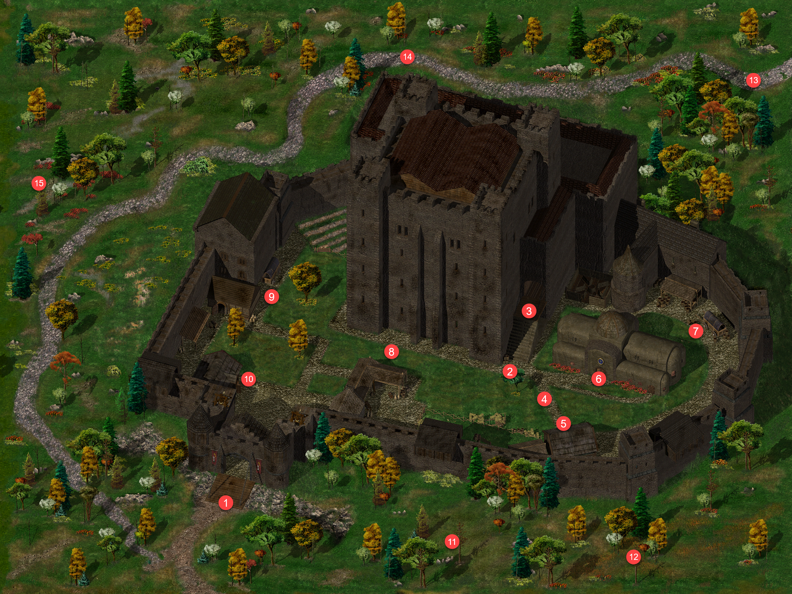

| Nazwa | Kod | Mapa | Bestiariusz |
|-------|-----|------|-------------|
| Mapa świata | Faerun | [{ width="100" }](../maps/worldmap.webp) ||
| Candlekeep [1] | BG2600 | [{ width="100" }](../maps/BG2600.webp) ||
| Lwi Trakt [2] | BG2700 | [{ width="100" }](../maps/BG2700.webp) | Czarny niedźwiedź, Olbrzymi wąż, Chory gibberling |
| Nadbrzeżny Trakt [3] | BG2800 | [{ width="100" }](../maps/BG2800.webp) |Chory gibberling, Bandyta, Niedźwieżuk, Xvart, Rozbójnik karawanowy, Ogr, Wilk|
| Pod Pomocną Dłonią [4] | BG2300 | [{ width="100" }](../maps/BG2300.webp) ||
||||
||||
||||
||||
||||
||||
||||