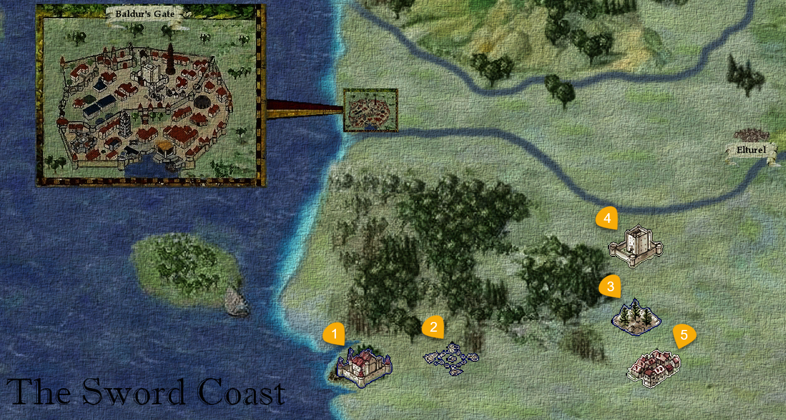
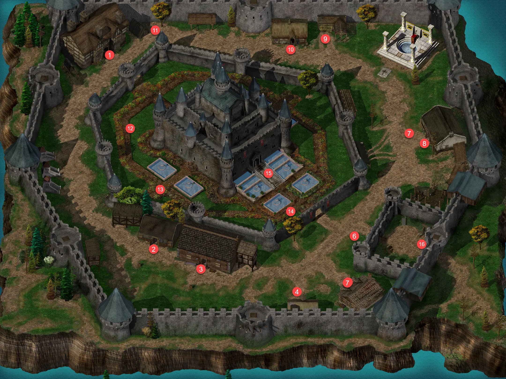
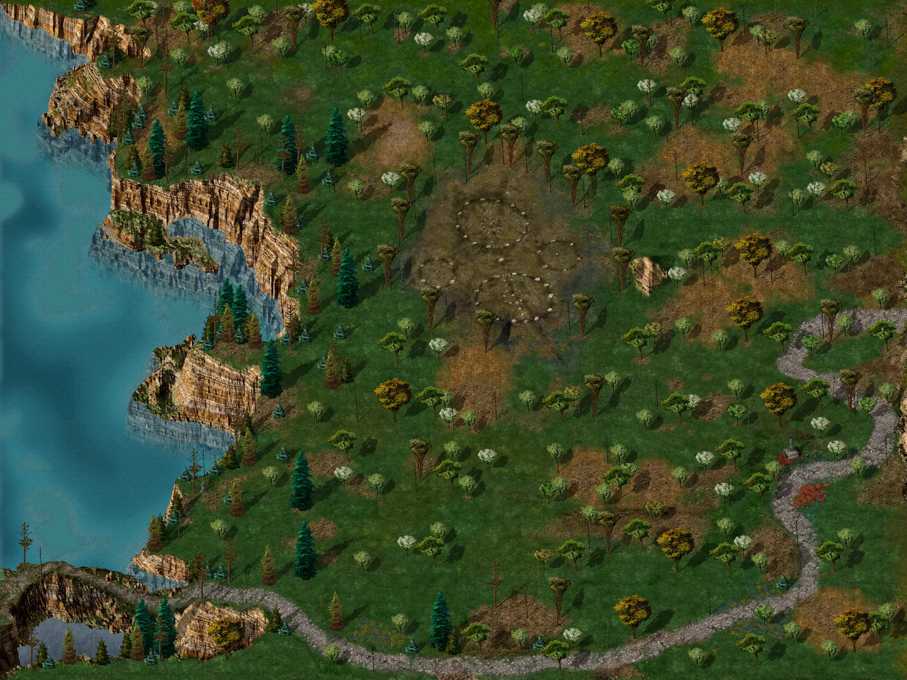
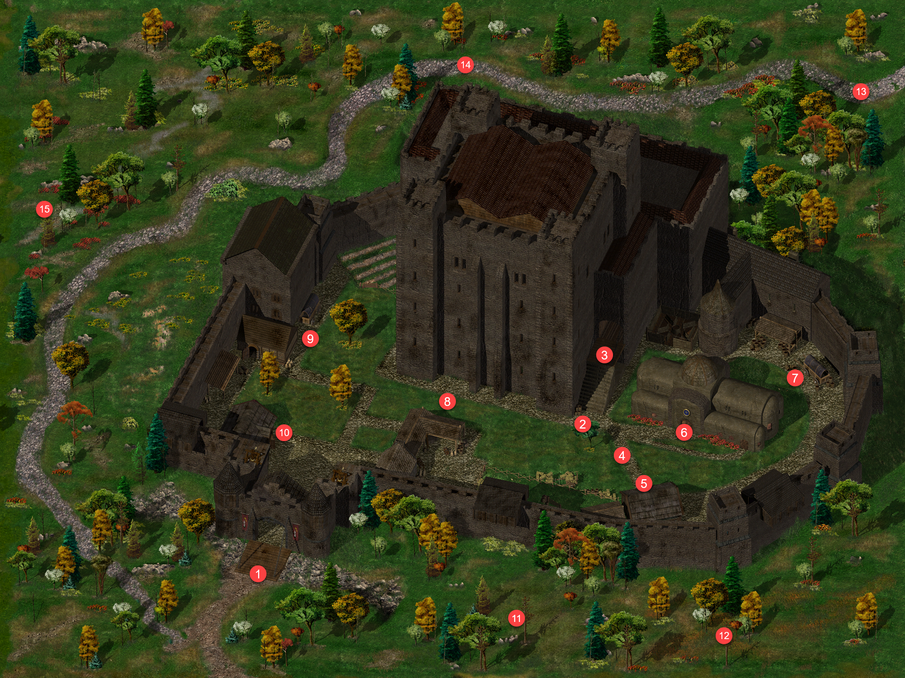
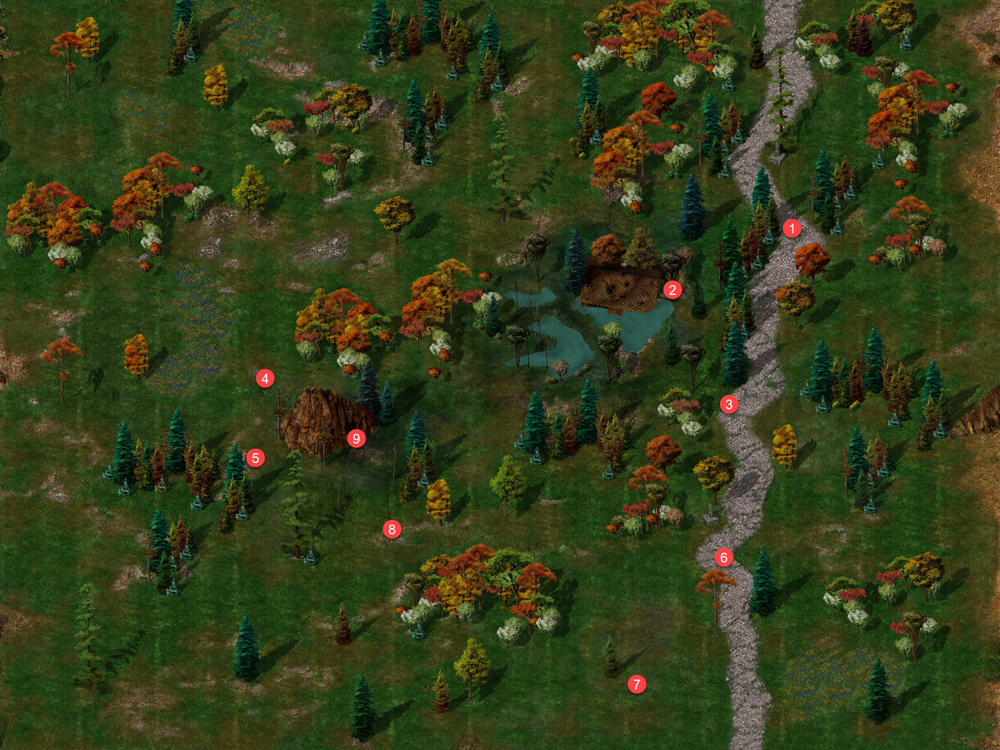

| Nazwa | Kod | Mapa |
|------------------------------|---------|--------------------------|
| Mapa świata | Faerun | [{ width="100" }](../maps/worldmap.webp) |
| Candlekeep [1] | BG2600 | [{ width="100" }](../maps/BG2600.webp) |
| Lwi Trakt [2] | BG2700 | [{ width="100" }](../maps/BG2700.webp) |
| Nadbrzeżny Trakt [3, 9] | BG2800 | [{ width="100" }](../maps/BG2800.webp) |
| Pod Pomocną Dłonią [4] | BG2300 | [{ width="100" }](../maps/BG2300.webp) |
| Beregost [5, 7, 8, 11] | BG3300 | [{ width="100" }](../maps/BG3300.webp) |
| Świątynia Lathandera [6,9] | BG3400 | [{ width="100" }](../maps/BG3400.webp) |
| Wysoki Żywopłot [10,13] | BG3200 | [{ width="100" }](../maps/BG3200.webp) |
| Czerwone Jary [12] | BG3700 | [{ width="100" }](../maps/BG3700.webp) |
| Dzicze Beregostu [14] | BG3800 | [{ width="100" }](../maps/BG3800.webp) |
| Przełęcz Nashkel [15] | BG4300 | [{ width="100" }](../maps/BG4300.webp) |

