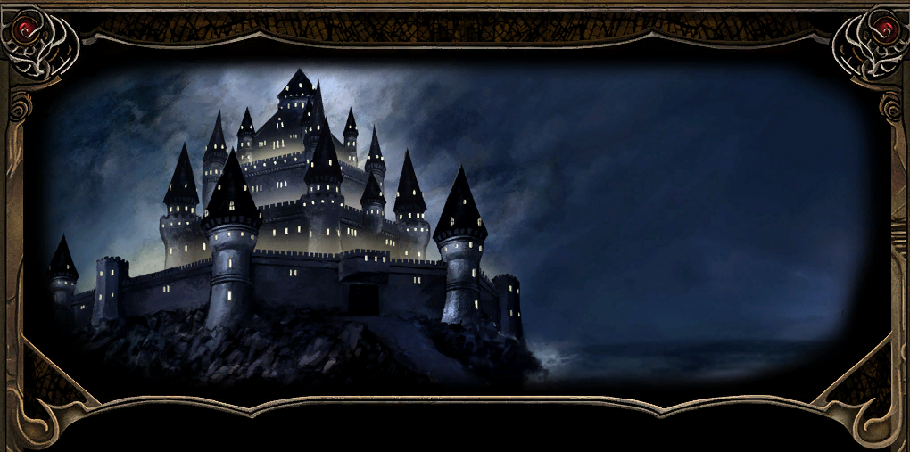

*Usytuowana na klifach wznoszących się z Wybrzeża Mieczy, cytadela Candlekeep mieści najwspanialszą i najbardziej wszechstronną kolekcję pism na obliczu Faerûnu. Jest to imponująca forteca, utrzymywana w ścisłej izolacji od intryg, które od czasu do czasu nękają resztę Zapomnianych Krain. Jest odosobniona, ściśle uregulowana i jest domem Leecha.
Pod opieką mędrca Goriona, wewnątrz uświęconych sal wiedzy nasz bohater spędził większość swoich dwudziestu lat życia. Gorion jak przybrany ojciec, wychował naszego bohatera na tysiącu opowieści o bohaterach i potworach, kochankach i niewiernych, bitwach i tragediach. Jednak jedna historia zawsze pozostawała nieopowiedziana: historia prawdziwego dziedzictwa Leecha. Był sierotą, ale jego przeszłość jest w dużej mierze nieznana. Ostatnio Gorion stawał się coraz bardziej zdystansowany, jakby jakaś poważna sprawa ciążyła mu na sercu. Jedyną pociechą jest wiedza, że jest mądrym człowiekiem i podzieli się troskami, gdy nadejdzie czas. Niemniej jednak, jego milczenie jest niepokojące i nie można się oprzeć wrażeniu, że dzieje się coś strasznie złego...*
---

{ .center-img width="100%" }

[{ .center-img width="40%" }](../maps/BG2600.webp)

---
Dzisiaj rano **Gorion** wydaje się bardziej wzburzony niż kiedykolwiek, a teraz w nietypowy dla siebie sposób przerwał rutynę **Leecha** w środku dnia przekazując mu pośpieszne instrukcje, aby wyposażył się do podróży i wręczył mu trochę złota bez żadnej wskazówki i powodu tej nagłej wyprawy. Nasz bohater jest właśnie przy Gospodzie w **Candlekeep** i tak zaczyna się ta opowieść 1.

**Leech** znał tę gospodę jak własną kieszeń i od dawna urywał się tam na piwo lub dwa. Z tym miejscem wiązało się też niemało przelotnych romansów, a sam nierzadko stawał się zdobyczą mniej lub bardziej dojrzałych niewiast. Tym bardziej jego uwagę przykuła **Linda**, która właśnie wróciła do miasteczka po serii niezwykłych przygód.

Okazało się, że jej narzeczony, **Sir Trun**, stracił rękę, gdy grupa potworów wyłoniła się z magicznego portalu i próbowała wciągnąć go do środka. Wówczas ślicznotka zareagowała w jedyny rozsądny sposób. Chwyciła miecz ukochanego i jednym cięciem odrąbała mu rękę, ratując go przed losem zapewne gorszym od kalectwa. Niestety jej oblubieniec nie potrafił pogodzić się z niespodziewaną rycerskością swojej wybranki. Zamknął się w sobie i przebywał teraz w miejscowym szpitalu. **Linda** była zrozpaczona i obawiała się, że już nigdy nie odzyska jego względów. **Leech** uznał, że warto porozmawiać z ofiarą tego ataku i uzmysłowić mu, jaki skarb ma u swego boku ([LINDA AND SIR TRUN](../other/zadania.md#q1)).

Dziwny to dzień, gdyż w gospodzie pojawił się kolejny przybysz. **Firebead Elvenhair** zdawał się znać **Leecha** i poprosił go o przyniesienie zwoju identyfikacji od **Tethornila**. Wspomniał także o jakimś „*żelaznym kryzysie*”, przez który jego podróż z **Beregostu** okazała się znacznie bardziej ryzykowna niż zwykle ([FIREBEAD'S SCROLL](../other/zadania.md#q2)).

W izbie przy kominku podróżny o imieniu **Thurston** oraz jego małżonka narzekali na chłodne przyjęcie ze strony tutejszych mnichów.

Na piętrze Leech spotkał **Quincy'a** i **Christiana**. Żaden z nich nie okazał się szczególnie rozmowny, choć ten drugi mimochodem wspomniał, że pochodzi z Waterdeep.

Właściciel gospody Winthrop, jak zwykle uśmiechnięty, serdeczny i pełen żartów, powiedział, że jakaś młoda uzdrowicielka, o ile dobrze pamiętał imieniem Sanna, poszukiwała Leecha i pozostawiła dla niego piękny miecz o nazwie „Podarunek Mystry”.

Po załatwieniu wszystkich spraw Leech wyposażył się w skórzaną zbroję oraz zapas bełtów. Kilka piw dodatkowo rozwiązało język karczmarzowi. Dzięki temu dowiedział się, że od kilku miesięcy żelazo w całym regionie zaczęło się psuć, jak gdyby rdzewiało bez żadnej widocznej przyczyny. Większość wadliwego surowca pochodziła podobno z kopalń w Nashkel, gdzie wydarzyło się coś złowieszczego. Krążyły pogłoski, że jakaś nieznana siła morduje tamtejszych górników.

---

Z karczmy Leech skierował się do koszar 2, gdzie przekazał **Fullerowi** bełty, które szczęśliwie miał już w swoim ekwipunku ([AN ERRAND FOR FULLER](../other/zadania.md#q3)). Żołnierz wspomniał również o swoim kamracie **Hullu**, który po nocnej popijawie stał przy bramie i cierpiał z powodu jej przykrych następstw. Być może on także będzie miał dla Leecha jakieś zlecenie.

----

W kwaterach żołnierzy 3 na Leecha napadł **Carbos**. Niedoszły zabójca przyznał, że otrzymał zlecenie na uciszenie go, nie zdążył jednak wyjawić nazwiska swojego mocodawcy, gdyż wkrótce sam przestał oddychać. Na zawsze.

Po wyjściu z budynku Leech natknął się na jednego ze swoich nauczycieli, **Karana**, którego zainteresował hałas dobiegający z koszar. Gdy usłyszał o próbie zabójstwa, wyraźnie zaniepokojony ponaglił wychowanka, aby jak najszybciej spotkał się z **Gorionem**. Cała sprawa zaczynała wyglądać coraz groźniej. O co tu chodziło? Dlaczego ktoś pragnął śmierci młokosa?

----

Kawałek dalej **Gatewarden** 4, mistrz fechtunku, zaproponował ostatni sparing przed podróżą. Podobno sam **Gorion** prosił go o przeprowadzenie tego treningu. Leech nadal nie rozumiał, co się wokół niego dzieje. Po kilku piwach i walce, z której ledwie uszedł z życiem, nie miał większej ochoty na bezcelowe tępienie miecza, lecz mimo wszystko nie zamierzał odmówić. Iluzjonista **Obe** przygotował dla niego znacznie bardziej wymagające ćwiczenie. Wyczarował bandę Xvartów, z którą Leech wraz z towarzyszami szybko się rozprawił.

---

Następnie nasz bohater skierował kroki do infirmerii 5, aby porozmawiać z **Sir Trunem** a przebywający tam kapłan Oghmy podarował mu miksturę leczniczą, która z pewnością może przydać się podczas nadchodzącej podróży.

W rozmowie okaleczony szlachcic przyznał, że nie potrafił pogodzić się z myślą, iż jego narzeczona okazała się urodzoną wojowniczką. Nie wiedział, jak powinien zachować się wobec kobiety, która uratowała mu życie, lecz przy okazji dowiodła, że posiada więcej odwagi i zdecydowania niż on sam. Na szczęście Leech zdołał przemówić mu do rozsądku. **Sir Trun** zrozumiał wreszcie, że czystej wody rycerski talent jego oblubienicy nie stanowi dla niego zagrożenia, lecz jest darem, który przy jego wsparciu może zostać przekuty w coś znacznie większego. Podziękowawszy Leechowi za pomoc, udał się na spotkanie z Lindą ([LINDA AND SIR TRUN](../other/zadania.md#q1)).
:material-trending-up: **Reputacja +1**.

Po chwili odwiedziła go Linda, aby podziękować za wsparcie i pomoc w szczęśliwym zakończeniu całego impasu. Pozostawało mieć nadzieję, że ta niezwykła para przeżyje razem jeszcze wiele wspaniałych chwil.

---

Przy bramie 6 Leech rzeczywiście zastał **Hulla**, który po nocnej popijawie ledwie widział na oczy, a na domiar złego zapomniał zabrać z koszar własnego miecza. Strażnik poprosił o jak najszybsze dostarczenie zguby. Czego nie robi się dla kilku sztuk złota? ([HULL’S SWORD](../other/zadania.md#q4)). Wspomniał również, że w jego kufrze znajduje się antidotum, którego podobno poszukuje **Dreppin**.

Wychowanek **Goriona** wrócił więc do koszar 2, skąd zabrał miecz **Hulla** oraz odtrutkę na wszelkie trucizny. Po odzyskaniu broni skacowany strażnik odwdzięczył się dziesięcioma sztukami złota. Przy okazji niezbyt pochlebnie wypowiedział się o opiekunie młodzieńca, ale najwyraźniej alkohol wciąż nie zdążył całkowicie wywietrzeć mu z głowy.

---

Niedaleko magazynu **Jondalar** i **Erik** 7 postanowili sprawdzić umiejętności Leecha w walce. Jak twierdzili, również ich poprosił o to Gorion. Kolejny trening tego samego dnia trudno było uznać za przypadek. Ten dzień stawał się coraz dziwniejszy!

---

Przy magazynie **Reevor** przypomniał młodemu awanturnikowi o zadaniu, którego ten podjął się poprzedniego dnia. W spichlerzu 8 zalęgły się szczury i należało jak najszybciej pozbyć się uciążliwych szkodników ([REEVOR’S STOREHOUSE](../other/zadania.md#q5)).

Wewnątrz, oprócz całej gromady gryzoni, czekał jednak kolejny zabójca. **Mendas** rzucił się na naszego bohatera, lecz podobnie jak **Carbos** nie zdołał wykonać powierzonego mu zadania. Przy ciele napastnika znalazł się kontrakt wystawiony na życie młodzieńca. Dwa zamachy jednego dnia nie mogły być dziełem przypadku. Najwyraźniej nadszedł czas, aby potraktować całą sprawę naprawdę poważnie.

Po opuszczeniu spichlerza Leech nie wspomniał **Reevorowi** o próbie zabójstwa ani o odznalezionym kontrakcie. Zarządca magazynu podziękował jedynie za wytępienie szczurów, nieświadomy, że liczba usuniętych tego dnia szkodników była o jednego większa, niż zakładał.