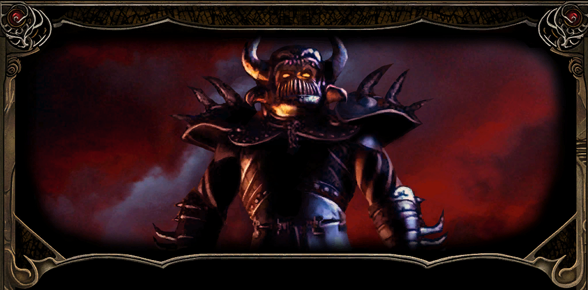
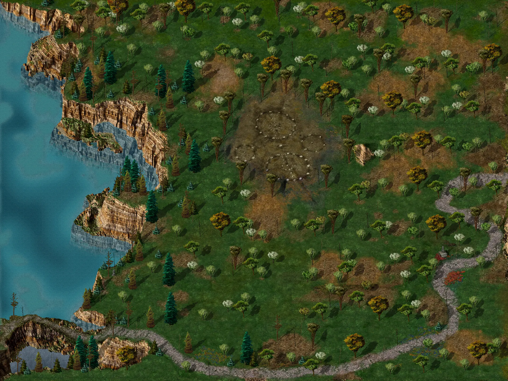
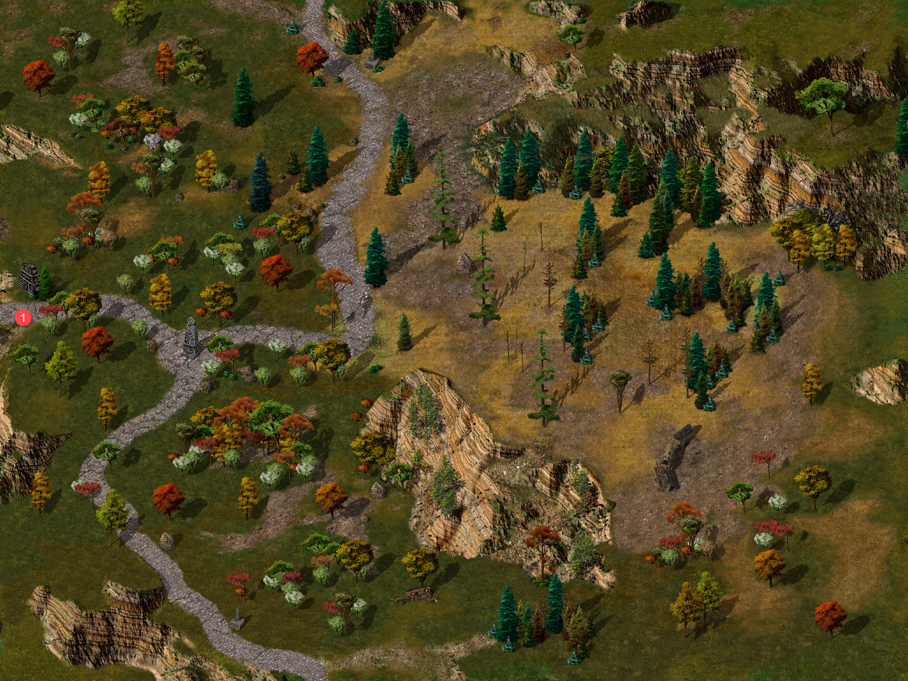

{ .center-img width="100%" }

Po zmierzchu obaj opuścili główny szlak i ruszyli na wschód, mając nadzieję, że przed nastaniem głębokiej nocy znajdą bezpieczne schronienie. Nie zdążyli jednak ujść daleko, gdy **Gorion** zatrzymał się gwałtownie. Wystarczyło mu jedno spojrzenie na otaczające ich ciemności, aby zrozumieć, że wpadli w zasadzkę.

Z mroku wyłonili się napastnicy, a na ich czele stanął zamaskowany rycerz odziany w czarną zbroję. Nie pozostawił żadnych wątpliwości co do celu zasadzki. Przybył po **Leecha** i był gotów oszczędzić **Goriona**, jeśli ten dobrowolnie odda mu swojego podopiecznego.

Młody gnom nie zamierzał pozwolić, aby opiekun samotnie stawił czoła całej grupie. Chwycił za broń i chciał stanąć u jego boku, lecz **Gorion** nakazał mu uciekać. W jego głosie nie było miejsca na sprzeciw ani wahanie. Obiecał zatrzymać napastników i dać wychowankowi czas na znalezienie schronienia.

**Leech** wykonał rozkaz, choć każdy krok oddalający go od przybranego ojca wydawał się zdradą. Pobiegł w czerń bezksiężycowej nocy, a gdy dotarł między skały, nie potrafił zmusić się do dalszej ucieczki. Ukryty w ciemności obserwował rozpoczynającą się walkę.

**Gorion** bronił się z potęgą, jakiej wychowanek nigdy wcześniej u niego nie widział. Zaklęcia rozświetlały noc, a kolejni napastnicy padali na ziemię. Przez krótką chwilę młodzieniec uwierzył, że jego opiekun zwycięży i za moment obaj ponownie wyruszą w drogę. Czarny rycerz okazał się jednak zbyt silny. Żadne zaklęcie nie zdołało go powstrzymać, a jego miecz ostatecznie dosięgnął starego maga.

**Leech** patrzył bezsilnie, jak **Gorion**, jego mistrz, opiekun i najbliższa mu osoba, ginie z ręki opancerzonego zabójcy. Chciał krzyczeć, rzucić się naprzód i choćby zginąć u jego boku, lecz wiedział, że w ten sposób uczyniłby ofiarę przybranego ojca daremną. Pozostał więc w ukryciu, zaciskając dłonie tak mocno, że paznokcie wbijały się w skórę.

Dopiero gdy napastnicy odeszli, a odgłosy ich kroków całkowicie ucichły, młody gnom pozwolił sobie zrozumieć, co naprawdę się wydarzyło. Człowiek, który wychował go i przez całe życie chronił, odszedł. Nie będzie już jego rad, spokojnego głosu ani odpowiedzi na pytania, których **Leech** nie zdążył zadać. Pozostała jedynie pustka, przejmujący żal i świadomość, że od tej chwili musi radzić sobie sam.

Bezksiężycowa noc ocaliła go przed mordercami, lecz nie przyniosła ukojenia. Drżąc z zimna, strachu i rozpaczy, skulił się pomiędzy skałami. Sen długo nie nadchodził, a kiedy w końcu zmęczenie wzięło górę, był płytki i niespokojny. Nawet wtedy przed oczami wciąż miał ostatnie chwile **Goriona**.

---
[{ .center-img width="40%" }](../maps/BG2700.webp)

**Leech** obudził się ze świadomością, że wydarzenia minionej nocy nie były jedynie okropną marą senną. Zasadzka, walka i śmierć **Goriona** wydarzyły się naprawdę. Wciąż miał przed oczami opiekuna powalonego mieczem czarnego rycerza. Nawet potężna magia starego maga nie zdołała powstrzymać napastników.

Ostatnim życzeniem przybranego ojca było, aby uciekał i ocalił życie. Świadomość, że wykonał jego rozkaz, nie przynosiła jednak pocieszenia. Nie potrafiła również zagłuszyć bolesnego poczucia bezradności. **Leech** przeżył tylko dlatego, że **Gorion** pozostał na miejscu i poświęcił się, by zatrzymać oprawców.

*Candlekeep* znajdowało się niedaleko, lecz wiedział, że nie znajdzie tam schronienia. Bibliotekarze płacili za swój spokój drakońskimi zasadami wstępu, a bez protekcji nestora bramy cytadeli pozostałyby przed nim zamknięte. Miejsce, które przez całe życie nazywał domem, nagle stało się równie niedostępne jak każdy odległy zakątek *Faerûnu*.

Samotny, pogrążony w żałobie i wyposażony zaledwie w kilka podstawowych przedmiotów, nie miał wielkich szans na przetrwanie. Pozostawała jeszcze nadzieja na uzyskanie pomocy od przyjaciół, o których wspomniał **Gorion**. Jeśli jego ostatnie słowa miały wskazywać dalszą drogę, należało dotrzeć do *Pomocnej Dłoni* i odnaleźć **Jaheirę** oraz **Khalida**.

Z ciężkim sercem **Leech** wszedł na szlak. Nie zdążył jednak ujść daleko, gdy niespodziewanie pojawiła się **Imoen** 1. Choć zawsze traktował ją jak młodszą siostrzyczkę, niemal jak dziecko wymagające opieki, widok znajomej twarzy i jej pogodnego uśmiechu wyrwał go z otępienia. Dziewczyna przyznała, że wiedziała o grożącym mu niebezpieczeństwie. Przeczytała list pozostawiony na biurku **Goriona**, a następnie wymknęła się z *Candlekeep*, aby ruszyć za swoim przyjacielem i udzielić mu pomocy. Młody gnom nie mógł już zawrócić, lecz nie zamierzał również pozwolić, by samotnie wałęsała się po niebezpiecznych rozdrożach. Ostatecznie zgodził się, aby do niego dołączyła.

Pierwsze kroki skierowali ku miejscu nocnej kaźni 2. Tam spotkali dziewczynę, która poprzedniego dnia rozmawiała z **Gorionem** na schodach biblioteki. Nieznajoma przedstawiła się jako **Sandrah**. Okazało się również, że to właśnie ona pozostawiła dla **Leecha** miecz w gospodzie. Kleryczka była doskonale zorientowana w sytuacji i znała nawet imię **Imoen**. Budziło to wiele pytań, ale nie był to odpowiedni moment na dociekanie, skąd wiedziała tak dużo. W obliczu śmierci opiekuna i czyhających na szlaku zagrożeń młodzieniec z wdzięcznością przyjął zaoferowaną pomoc. **Sandrah** posiadała zaczarowaną księgę, która co jakiś czas pozwalała jej bezbłędnie rozpoznawać właściwości magicznego ekwipunku. Taki dar z pewnością mógł okazać się niezwykle przydatny podczas dalszej podróży.

Przy ciele przybranego ojca odnalaźli piękny sztylet z wygrawerowaną literą „A” ([GORION'S DAGGER](../other/zadania.md#q8)) oraz list podpisany przez tajemniczego „E”. Autor ostrzegał w nim przed nadciągającym niebezpieczeństwem i nalegał, aby mag jak najszybciej opuścił *Candlekeep*. Wspominał również o dwojgu zaufanych przyjaciół przebywających w *Pomocnej Dłoni*. Kim był tajemniczy „E”? O jakich innych osobach powierzonych opiece **Goriona** wspominał list? Dlaczego przybrany ojciec nigdy mu o nich nie powiedział? Każda odpowiedź zdawała się prowadzić do kolejnych pytań, lecz jedno było pewne: **Leech** chciał poznać prawdę. Musiał ją poznać!

Po chwili do niewielkiej drużyny dołączył także **Haiass**. Leech pozostawił wilka pod opieką w *Candlekeep*, ale zwierzę najwyraźniej miało własne plany i postanowiło podążyć za swoim panem. Młody gnom odnalazł je kilka lat wcześniej przy ciele zabitej matki. Od tamtej pory niemal się nie rozstawali. Obecność wiernego towarzysza jednocześnie go ucieszyła i zasmuciła. Dobrze było mieć przy sobie bliską istotę, lecz szlak stawał się coraz bardziej niebezpieczny i młodzieniec nie chciał narażać wilka na śmierć. **Haiass** został wyszkolony do atakowania wrogo nastawionych przeciwników, ze szczególnym uwzględnieniem magów i kapłanów. **Sandrah** również miała czworonożnego przyjaciela, lecz nie mogła zabrać go w tę podróż.

Wspólnymi siłami wykopali płytki grób i ostrożnie złożyli w nim ciało **Goriona**. **Leech** długo stał nad mogiłą, nie potrafiąc znaleźć słów odpowiednich na pożegnanie człowieka, który był mu ojcem, nauczycielem i najbliższym przyjacielem. Mógł jedynie obiecać, że jeśli przeżyje, pewnego dnia wróci i godniej upamiętni jego miejsce spoczynku.

Przy klifie drużyna natknęła się na **Chase’a** 3, który groził, że rzuci się w odmęty. Kiedy jednak przyszło mu skonfrontować słowa z rzeczywistością, szybko porzucił ten zamiar. Najwyraźniej bardziej niż śmierci pragnął widowni. **Imoen** zupełnie nie potrafiła pojąć jego zachowania.

Po powrocie na szlak podróżnicy minęli Kolsseda 4. Napotkany wędrowiec wspomniał o dwojgu podróżnych przebywających niedaleko. **Leech** przez chwilę zastanawiał się, czy mogli to być zaufani przyjaciele wymienieni w liście do Goriona.

Nieopodal rzeczywiście czekała dwójka nieznajomych 5, choć zdecydowanie nie byli to ludzie, których drużyna spodziewała się spotkać. Przedstawili się jako **Xzar** i **Montaron**. Ani **Imoen**, ani **Sandrah** nie zapałały do nich szczególną sympatią. Młody gnom także odniósł wrażenie, że spotkanie nie było całkowicie przypadkowe. Miał jedynie nadzieję, że przemawia przez niego nieufność wywołana niedawnymi wydarzeniami. Ponieważ obaj nieznajomi zmierzali w stronę *Nashkel*, tymczasowo zgodził się połączyć siły i kontynuować podróż razem z nimi ([XZAR AND MONTARON](../other/zadania.md#q9)).

Idąc dalej, podróżnicy pośpiesznie wymienili kilka zdań z Binkosem 6. Mężczyzna pędził, aby poinformować Wielkich Książąt o kolejnej karawanie napadniętej na północny wschód od Beregostu. Wieści te stanowiły kolejne ostrzeżenie, że na szlakach grasują bandyci, a podróż wcale nie będzie bezpieczna.

Nie zwlekając dłużej, drużyna ruszyła zgodnie z drogowskazami na północ, w stronę Pomocnej Dłoni.

---

[{ .center-img width="40%" }](../maps/BG2800.webp)

Podróżnicy dotarli na Nadbrzeżny Trakt. Niedługo później spotkali starego człowieka odzianego w czerwoną tunikę i spiczasty kapelusz 1. Wygląd nieznajomego oraz jego sposób bycia wskazywały, że mają przed sobą maga. Starzec nawiązał krótką rozmowę z **Sandrah**. **Leech** odniósł wrażenie, że oboje już wcześniej się spotkali, choć żadne z nich nie powiedziało tego wprost. Nieznajomy życzył drużynie powodzenia w podróży, lecz wykazywał przy tym niepokojąco dobrą znajomość jej członków. Znał nawet imię **Imoen**. Pomimo tego młody gnom nie wyczuwał z jego strony zagrożenia. Przeczucie podpowiadało mu jednak, że nie było to ich ostatnie spotkanie.

Na południowym odcinku szlaku prowadzącego w stronę **Beregostu** podróżnicy spotkali **Andouta** 2, zmierzającego do gubernatora **Keldatha**. Mężczyzna podzielił się wiadomością, że **Beregost** może zostać obsadzony załogą wojskową na wypadek ataku ze strony **Amnu**, choć samo królestwo zaprzeczało jakimkolwiek agresywnym zamiarom.

Nieopodal drużyna odnalazła ciała podróżnych leżące przy rozbitym wozie 3. Wszystko wskazywało na to, że była to karawana, o której wspominał **Binkos**. Kawałek dalej natrafili na kolejny wóz 4. Tym razem przy wraku czekali bandyci odpowiedzialni za napady. Po krótkiej walce napastnicy przestali stanowić zagrożenie, a przy ich ciałach znaleziono broszę z pieczęcią **Entara Silvershielda**, jednego z książąt Wrót Baldura.W pobliżu leżało również ciało młodzieńca odzianego w płaszcz oznaczony tym samym symbolem. Leech podejrzewał, że poległy mógł być synem księcia. Być może drużynie uda się kiedyś dotrzeć do *Wrót Baldura* i przekazać ojcu wiadomość o losie młodzieńca.

Dalej na północnym wschodzie 5 podróżnicy natknęli się na ogra. Bestia szybko przekonała się, że wybrała niewłaściwych przeciwników. Przy jej ciele znaleziono dwa magiczne pasy, jednak jeden z nich okazał się przeklęty. Było to wystarczające ostrzeżenie, aby nie zakładać nieznanych magicznych przedmiotów bez wcześniejszego rozpoznania ich właściwości.

W północnej części szlaku drużyna minęła Aolna 6. Napotkany wędrowiec przestrzegał przed zagrożeniami czyhającymi w okolicy, ze szczególnym przejęciem wspominając o grasującym nieopodal ogrze. Nie wiedział jeszcze, że potwór, którym próbował ich przestraszyć, został już ubity.

Wreszcie w oddali zamajaczyły masywne mury otaczające cel ich podróży. Po wielu godzinach marszu drużyna dotarła do warownej gospody *Pod Pomocną Dłonią*. Leech miał nadzieję, że za jej bramami odnajdzie **Jaheirę** i **Khalida**, a wraz z nimi odpowiedzi na przynajmniej część pytań pozostawionych przez śmierć **Goriona**.

