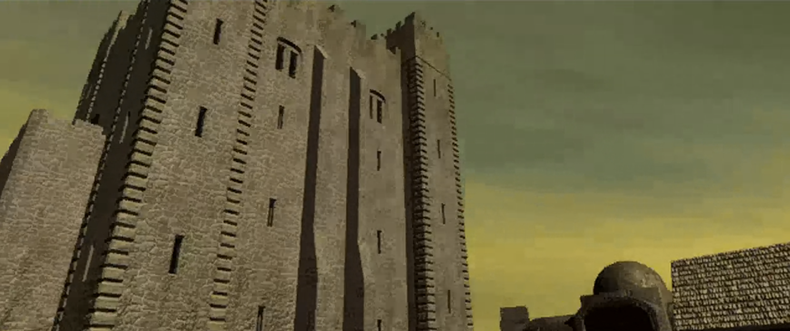
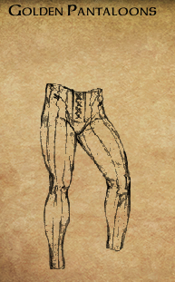

{ .center-img width="100%" }\

[{ .center-img width="40%" }](../maps/BG2300.webp)

Zmęczeni podróżnicy dotarli w końcu do *Pomocnej Dłoni*. Gospoda okazała się w rzeczywistości warownią otoczoną wysokim murem. Wewnątrz znajdowały się zabudowania gospodarcze, świątynia oraz przysadzista wieża, w której wędrowcy mogli znaleźć bezpieczny nocleg i odpocząć od niebezpieczeństw szlaku. Przy bramie strażnicy 1 poinformowali nowo przybyłych, że za murami obowiązują dwie proste zasady: należy zachowywać się uprzejmie i nie wszczynać żadnych bójek.

Jeszcze podczas marszu **Sandrah** zapytała Leecha o życie w *Candlekeep*, nieświadomie kierując rozmowę ku wciąż bolesnym wspomnieniom o **Gorionie**. Młody gnom przyznał jednak, że przywoływanie dobrych chwil spędzonych z przybranym ojcem przynosi mu pewną ulgę, gdyż milczenie i tak nie jest w stanie uciszyć żalu po jego stracie. Choć cytadela pozostawała połączona z całym światem dzięki nieustannemu napływowi gości oraz gromadzonej w bibliotece wiedzy, dla wychowanka **Goriona** zawsze była miejscem odizolowanym i niemal pozbawionym rówieśników poza **Imoen** i **Adamem**. Leech zdobył tam rozległą wiedzę o *Wybrzeżu Mieczy*, jego mieszkańcach i historii, lecz dopiero teraz przekonywał się, jak bardzo teoria różni się od rzeczywistości. Czym innym było bowiem czytać o niebezpieczeństwach szlaku, a czym innym stanąć z nimi twarzą w twarz.

**Sandrah**, która również wychowała się z dala od trudów codziennego życia, podzielała jego ciekawość świata i pragnęła sprawdzić wartość własnego wykształcenia. Zwróciła uwagę, że o powodzeniu wyprawy nie zdecydują jedynie umiejętności bojowe, lecz także wiedza, rozwaga i zdolność właściwego wykorzystywania talentów wszystkich członków drużyny. Zapewniła, że będzie wspierać młodego gnoma zarówno radą i magią leczniczą, jak i własnym orężem. Na zakończenie dodała z uśmiechem, że jego bystry umysł może się okazać równie przydatny jak młot trzymany w dłoni.

Spokojna atmosfera warowni sprawiła, że tym większym zaskoczeniem okazał się atak **Tarnesha** 2, który próbował w pojedynkę zgładzić całą drużynę. **Sandrah** natychmiast rozpoznała w nim łowcę głów, dzięki czemu napastnik nie zdołał wykorzystać elementu zaskoczenia. Starcie nie trwało długo, a przy ciele niedoszłego zabójcy znaleziono kolejny list gończy wystawiony na Leecha. Tym razem nagroda za jego głowę wynosiła dwieście sztuk złota.

Młody gnom po raz kolejny przekonał się, że **Sandrah** jest niezwykle interesującą osobą. W przeciwieństwie do niego większość życia spędziła w wielkim mieście, lecz podobnie jak on nie obawiała się nieznanego i z ciekawością oczekiwała, co przyniesie przyszłość. Również **Imoen** szybko nabierała wprawy w magicznym rzemiośle. Dziewczyna opanowała już umiejętność zapisywania zaklęć na zwojach, udowadniając, że jej zainteresowanie magią nie było jedynie przelotnym kaprysem. Jeśli nadal będzie rozwijać się w takim tempie, może jeszcze niejednego zaskoczyć.

W pobliżu gospody drużyna poznała gnoma o dumnie brzmiącym imieniu **Ygnatz Bombastus III**. Od słowa do słowa uczony przeszedł do sprawy i poprosił o odzyskanie księgi należącej do wielkiego **Karliniego**. Według jego informacji wolumin znajdował się gdzieś w ruinach dawnej szkoły *Ulcastera*. Drużyna postanowiła przyjąć zlecenie i rozejrzeć się za księgą, gdy tylko droga zaprowadzi ją w tamte okolice ([THE MAGNIFICENT KARLINI](../other/zadania.md#q10)).

Wewnątrz gospody 3 zaczepił ich **Jopi**, lecz rozmowa nie doprowadziła do żadnych konkretów. Lokalny pijaczyna **Whelp** narzekał na niedobór żelaza, choć problem najwyraźniej nie przeszkadzał mu w dalszym obciążaniu wątroby i ostatnich ocalałych szarych komórek. **Surrey** wyjaśnił, że kryzys żelaza zmusił go do opuszczenia mistrza, kowala **Taeroma Fuiruima** z *Beregostu* i zamierzał teraz udać się do *Waterdeep*, gdzie miał nadzieję znaleźć lepsze perspektywy. Szef kuchni **Martel** prowadził natomiast niewielki handel miksturami i owocami, które z pewnością będą mogły przydać się podczas dalszej podróży.

Siedzący w rogu półork **Dorn** nie okazał się rozmowny. Ponury wojownik pomylił Leecha ze służbą i od pierwszych słów zachowywał się wyjątkowo nieuprzejmie. Wyglądał na doświadczonego i niebezpiecznego wojownika, lecz zdecydowanie nie był zainteresowany dłuższą konwersacją.

W gospodzie drużyna spotkała również **Sama**, jednego z wędrownych Poetów Jeziora. Bard zaoferował, że za odpowiednią opłatą ułoży pieśń o czynach drużyny, a następnie przez kilka kolejnych dni będzie ją rozpowszechniał wśród mieszkańców *Wybrzeża Mieczy*. W zależności od wersji opowieści jego występ mógł poprawić reputację bohaterów albo skutecznie ją nadszarpnąć. Tym razem Leech postanowił, że nie potrzebuje kolejnej pieśni przedstawiającej go jako nieskazitelnego bohatera. **Sam** otrzymał tysiąc sześćset sztuk złota i opuścił *Pomocną Dłoń*, aby rozgłaszać znacznie mniej pochlebną wersję czynów drużyny. Zapowiedział, że powróci po wykonaniu zadania. :material-trending-down: **Reputacja -3**.

Wśród gości znajdował się także **Thorengrim Hammerfist**, krasnoludzki kowal i handlarz dysponujący imponującym wyborem broni, pancerzy oraz magicznego wyposażenia. Rzemieślnik nie ograniczał się jednak do sprzedaży gotowych przedmiotów. Twierdził, że po dostarczeniu odpowiednich składników będzie potrafił połączyć niektóre elementy ekwipunku i przekuć je w znacznie potężniejsze przedmioty. Leech postanowił zapamiętać jego ofertę. Podczas dalszej wędrówki drużyna z pewnością natrafi na wiele osobliwych artefaktów i materiałów, które w rękach utalentowanego kowala mogą zyskać zupełnie nowe właściwości.

Znacznie bardziej rozmowna okazała się **Nessie**, pomocnica karczmarza. Wyjaśniła, że w czasach poprzedzających powstanie gospody warownia należała do kapłana **Bhaala**, boga mordu. Po śmierci bóstwa obecni właściciele, **Bentley Mirrorshade** i jego żona **Gellana**, zdołali pokonać sługę Pana Mordu, oczyścić twierdzę i przekształcić ją w bezpieczną przystań dla podróżnych. **Nessie** podzieliła się również kilkoma informacjami o gościach na górze. **Unshey** podobno pracował nad nową książką, natomiast **Landrin** próbowała utopić swoje zmartwienia w alkoholu.

Wewnątrz gospody Leech odnalazł wreszcie **Jaheirę** i **Khalida**, przyjaciół wskazanych przez **Goriona**. Półelfka wyjaśniła, że przybrany ojciec od dawna obawiał się o bezpieczeństwo wychowanka i chciał, aby w razie jego przedwczesnej śmierci oboje otoczyli młodego gnoma opieką. Leech był już jednak dorosły, dlatego ostateczna decyzja o przyjęciu ich pomocy należała do niego. Szybko okazało się również, że **Jaheira** znała **Sandrah** z czasów jej dzieciństwa, a **Khalid** pamiętał nawet jej matkę. Kleryczka nie chciała jednak wracać do dawnych wydarzeń i skierowała rozmowę ku bieżącym problemom. Przyjaciele **Goriona** zaproponowali, że będą towarzyszyć jego wychowankowi, dopóki nie odnajdzie własnego miejsca w świecie. Poprosili również drużynę o pomoc w zbadaniu niepokojących wydarzeń w kopalniach *Nashkel*. Zamierzali spotkać się tam z burmistrzem **Berrunem Ghastkillem** i ustalić przyczynę pogłębiającego się kryzysu żelaza. ([JAHEIRA AND KHALID](../other/zadania.md#q11))

**Imoen** z charakterystycznym dla siebie entuzjazmem przywitała nowych towarzyszy, przedstawiając się **Jaheirze** nie tylko jako przyjaciółka Leecha, lecz wręcz jego samozwańcza opiekunka. Młody gnom przyjął propozycję wspólnej podróży, traktując ją jako ostatnią wolę przybranego ojca i zarazem pierwszy krok ku odkryciu prawdy o wydarzeniach, które doprowadziły do jego śmierci.

Następnie nadszedł czas na rozmowę z właścicielem warowni. Leech zapytał **Bentleya Mirrorshade’a**, czy ten nie potrzebuje pomocy w jakiejś sprawie. Gospodarz przyznał, że chociaż w *Pomocnej Dłoni* zawsze znajdowało się zajęcie przy pilnowaniu porządku wśród podróżnych, tym razem potrzebował wsparcia w znacznie poważniejszym problemie. **Bentley** potwierdził opowieść o dawnym właścicielu twierdzy. Przed laty warownia należała do nieumarłego kapłana **Bhaala**, którego karczmarz wraz ze swoimi towarzyszami zdołał pokonać. Po zwycięstwie oczyścili budowlę i przekształcili ją w gospodę przeznaczoną dla zmęczonych wędrowców oraz poszukiwaczy przygód. Nie zdołali jednak całkowicie zniszczyć sanktuarium znajdującego się na najniższym poziomie podziemi. Usunęli pozostałości świątyni oraz odnalezione tam przeklęte przedmioty, lecz samych murów i konstrukcji nie mogli zburzyć bez ryzyka naruszenia fundamentów całej warowni. Zdecydowali się więc zamknąć przejście i pozostawić to miejsce zapomnieniu. Niedawno w gospodzie pojawiła się podejrzana grupa, która znacznie bardziej niż odpoczynkiem interesowała się piwnicami. Intruzom udało się odnaleźć tajne przejście prowadzące do podziemi, gdzie rozpoczęli poszukiwania pozostałości dawnego sanktuarium. Aby zapewnić sobie spokój, przyzwali ogromne szczury, nieumarłych oraz potężniejsze plugastwa, które miały powstrzymać każdego, kto spróbowałby za nimi podążyć. **Bentley** zamknął przejście, aby zło nie wydostało się na powierzchnię, lecz potrzebował kogoś, kto zejdzie do piwnic, rozprawi się z przyzwanymi stworzeniami i zmusi intruzów do opuszczenia warowni. Sam zamierzał pozostać na górze, pilnować porządku i zadbać o bezpieczeństwo gości. **Jaheira** pochwaliła zniszczenie dawnej świątyni, zauważając, że *Wybrzeże Mieczy* nie potrzebuje kolejnego sanktuarium poświęconego mordowi. **Imoen** natomiast natychmiast zainteresowała się możliwością przeszukania zapomnianych podziemi i odnalezienia pozostawionych tam skarbów. Drużyna zgodziła się pomóc, gdy tylko będzie odpowiednio przygotowana ([SHADOWS BELOW THE FRIENDLY ARM INN](../other/zadania.md#q12)).

---

Na piętrze karczmy **Sherman** potwierdził, że gospoda stara się zapewnić schronienie każdemu, kto rzeczywiście go potrzebuje. Pozostali goście byli znacznie mniej otwarci. **Marlon** oraz pewien szlachcic jasno wyrazili niezadowolenie z powodu nieproszonej wizyty. 

W jednym z pokojów drużyna spotkała **Unsheya**, który poprosił o odzyskanie pasa skradzionego mu przez ogra. Szczęśliwym zbiegiem okoliczności chodziło o dokładnie tego samego potwora, którego podróżnicy zabili wcześniej na trakcie prowadzącym do gospody. Leech zwrócił właścicielowi odzyskaną własność, a uradowany **Unshey** wypłacił obiecaną nagrodę i dodatkowo opłacił drużynie kąpiel. Najwyraźniej uznał, że zapach może mieć wiele imion, ale woń poszukiwaczy przygód po kilku dniach spędzonych na szlaku zdecydowanie nie powinna być jednym z nich ([A ROGUE OGRE](../other/zadania.md#q13)).

---

Na najwyższym piętrze podróżnicy odnaleźli **Landrin**, która opuściła swój dom w *Beregostcie* z powodu inwazji pająków. Kobieta poprosiła o oczyszczenie budynku, a także odzyskanie butów należących do jej męża oraz butelki wina pozostawionej w środku. Drużyna zgodziła się pomóc, jeśli podczas dalszej podróży nadarzy się okazja odwiedzenia *Beregostu* ([LANDRIN’S POSSESSIONS](../other/zadania.md#q14)).

W narożnym pokoju pewien szlachcic pomylił przybyszów ze służbą i bez większego zastanowienia oddał im do wyczyszczenia swoje złote pantalony pochodzące z *Calimshanu*. Drużyna nie zamierzała wyprowadzać go z błędu. Złote portki były niewątpliwie osobliwym znaleziskiem, choć trudno było przewidzieć, do czego mogłyby się kiedykolwiek przydać. W pokojach przeznaczonych dla biedniejszych gości spotkali również **Cartha**, lecz mężczyzna szybko ich zbył i nie zamierzał wdawać się w rozmowę.

W kolejnym pomieszczeniu drużyna zastała **Jen’lig** stojącą nad martwym ciałem jakiegoś nieszczęśnika. Nieznajoma okazała się githyanki ścigającą złodzieja i mordercę odpowiedzialnego za kradzież świętego miecza jej ludu. Winowajca zdążył już zapłacić za swoje czyny życiem, lecz skradziony artefakt trafił do *Wrót Baldura*. Bramy miasta pozostawały jednak zamknięte z powodu rosnącego zagrożenia ze strony bandytów i pogłębiającego się kryzysu żelaza. **Sandrah** wyjaśniła, że githyanki pochodzą z bezbożnych pustkowi Planu Astralnego i przybywają na inne plany przede wszystkim w poszukiwaniu utraconych relikwii. **Jaheira**, choć nie pochwalała zabójstwa, uznała, że przybyszka postąpiła zgodnie z prawami własnego ludu. Ponieważ odzyskanie miecza wymagało dotarcia do *Wrót Baldura*, **Sandrah** zaproponowała **Jen’lig** wspólną podróż. Wszystko wskazywało na to, że miasto prędzej czy później i tak znajdzie się na szlaku drużyny, a wzajemna pomoc mogła przynieść korzyść obu stronom.

Wojowniczka zgodziła się dołączyć, lecz postawiła warunek, że nie podporządkuje się słabemu przywódcy. Leech, pamiętając lektury z *Candlekeep*, odpowiedział, że zna reputację githyanki jako bezwzględnych wojowników i oddanych wykonawców powierzonych zadań. Następnie jasno dał do zrozumienia, że to on dowodzi wyprawą i oczekuje posłuszeństwa od każdego członka drużyny. **Jen’lig** przyjęła te słowa bez dalszego sprzeciwu, po czym zajęła się ciałem swojej ofiary, odsyłając je na inny Plan.

---

Po zakończeniu spraw na górnych piętrach podróżnicy powrócili na dół. Nadszedł czas, aby dotrzymać obietnicy złożonej **Bentleyowi** i zejść do piwnic gospody. Już na pierwszych poziomach podziemi drogę zastąpiły im ogromne szczury, nieumarli oraz inne stworzenia przyzwane przez intruzów. Im głębiej schodzili, tym wyraźniejsze stawały się ślady dawnego sanktuarium i mrocznych obrzędów odprawianych niegdyś pod warownią. Na trzecim poziomie piwnic drużyna spotkała **Leilo**, który bez ostrzeżenia ruszył do ataku. Napastnik uznał, że przybysze zamierzają przeszkodzić niejakiemu **Klarinnowi**, i nie zamierzał dopuścić ich do najniższej części podziemi. Jego opór nie trwał jednak długo. Na samym dole podróżnicy odnaleźli **Klarinna** i jego psa **Apsu**, sługa **Bhaala** badający pozostałości dawnego sanktuarium. **Klarinn** przeklinał **Bentleya Mirrorshade’a** za oczyszczenie twierdzy oraz zniszczenie większości ksiąg, symboli i innych śladów pozostawionych przez poprzedniego rezydenta. Fanatyk poszukiwał zwłaszcza potężnego przedmiotu należącego niegdyś do jednego z najważniejszych wyznawców Pana Mordu. Wierzył, że gdzieś w ruinach wciąż mogą znajdować się zapomniane relikwie i wiedza, które pozwolą przywrócić dawną potęgę kultu.

Leech oskarżył go o sprowadzenie do podziemi potworów i zagrożenie życiu niewinnych gości gospody. Nie zamierzał również pozwolić, aby kolejny czciciel **Bhaala** opuścił to miejsce i rozpoczął szerzenie śmierci na powierzchni. **Klarinn** odpowiedział, że pragnie oczyścić świat ze słabeuszy próbujących zapomnieć o jego bogu, po czym wraz z **Apsu** rzucił się do walki. Starcie zakończyło się znacznie szybciej, niż fanatyk zapewne przewidywał. **Jen’lig** zadała mu potężny cios i pozbawiła życia, zanim zdążył urzeczywistnić choćby część swoich gróźb. 

Po rozprawieniu się z ostatnimi przeciwnikami drużyna dokładnie przeszukała pozostałości sanktuarium i upewniła się, że żadne z przyzwanych plugastw nie pozostało przy życiu. Podziemia *Pomocnej Dłoni* zostały oczyszczone, a podróżnicy mogli wrócić na powierzchnię i zdać **Bentleyowi** raport z wykonania zadania.

:material-paw: **Bestiariusz:** *Olbrzymi szczur, Pełzacz ścierwojad, Mały pająk, Szkielet wojownik*

-----
Po oczyszczeniu piwnic drużyna wróciła do **Bentleya Mirrorshade’a** z wiadomością o wykonaniu zadania. **Sandrah** poinformowała gospodarza, że intruzi oraz przyzwane przez nich plugastwa nie będą już niepokoić gości *Pomocnej Dłoni*. Wyjaśniła również, że przywódca grupy interesował się przede wszystkim pozostałościami sanktuarium Bhaala i poszukiwał ukrytego tam niegdyś potężnego symbolu Pana Mordu. **Bentley** przyznał, że był to jedyny przedmiot, którego nie udało mu się zniszczyć podczas oczyszczania twierdzy. Relikwia została jednak skradziona wiele lat wcześniej i od tamtej pory nikt jej nie widział. **Khalid** wyraził nadzieję, że przepadła na zawsze, lecz właściciel gospody obawiał się, że nadal może spoczywać gdzieś na *Wybrzeżu Mieczy* lub w *Amnie*, zamknięta w skarbcu jakiegoś złowrogiego kolekcjonera. Na zakończenie podziękował drużynie za pomoc, wypłacił obiecaną nagrodę i zapewnił, że w razie potrzeby zawsze będzie można znaleźć go w gospodzie ([SHADOWS BELOW THE FRIENDLY ARM INN](../other/zadania.md#q12)). :material-trending-up: **Reputacja +1**.

**Jen’lig** zagaiła rozmowę i powróciła do okoliczności ich pierwszego spotkania, przyznając, że widok Leecha stojącego z bronią nad zakrwawionym ciałem sierżanta Płomiennej Pięści mógł wzbudzić uzasadnione podejrzenia. Wyjaśniła jednak, że zabity uczestniczył w kradzieży świętego miecza githyanki, a tym samym dopuścił się zbrodni przeciwko jej ludowi. Poszukiwany artefakt nie był zwykłym srebrnym ostrzem, lecz bronią wykutą z fragmentu miecza używanego niegdyś przez samą **Gith** podczas wyzwalania jej pobratymców spod jarzma Illithidów. Wiele wieków później miecz rozpadł się podczas bitwy Króla Cieni z tajemniczym magiem, a jego odłamki rozproszyły się po *Mokradłach Umarłych*. Kradzież okryła hańbą klan i miasto wojowniczki, dlatego musi odzyskać relikwię bez względu na przeszkody. Złodziej zamierzał użyć jej do wyrządzania krzywdy, a każda jego kolejna zbrodnia obciążała honor **Jen’lig**. Ponieważ sierżant przybył z *Wrót Baldura*, właśnie tam prowadził następny trop w jej poszukiwaniach ([JEN’LIG’S HUNT](../other/zadania.md#q15)). Githyanka poprosiła abyśmy znaleźli dla niej srebrny amulet.

:material-account-group: **Pozostawieni NPC:** *Xzar i Montaron* (Pomocna Dłoń)

---

Po uporaniu się z problemem karczmarza drużyna postanowiła ruszyć na południe. Opuścili więc bezpieczne mury *Pomocnej Dłoni*, zostawiając za sobą ciepłe posiłki, miękkie łóżka i złudne poczucie bezpieczeństwa. Przed nimi rozciągał się szlak prowadzący ku *Nashkel*, a wraz z nim bandyci, potwory i zapewne kolejni osobnicy przekonani, że dwieście sztuk złota to uczciwa cena za głowę młodego gnoma.

Przy wyjściu **Sandrah** zapytała towarzysza o rodzinę. Wychowanek **Goriona** przyznał, że po śmierci przybranego ojca właściwie pozostał sam. Zawsze traktował jednak **Imoen** jak siostrę, mimo że nie łączyły ich więzy krwi. Kleryczka zauważyła, że wspólne dorastanie w odosobnionym *Candlekeep* musiało stworzyć między nimi szczególnie silną więź, i wyraziła przekonanie, że dziewczyna pozostanie mu wierną towarzyszką. Następnie opowiedziała o własnym dzieciństwie. Była jedynaczką wychowaną przez ojca, a jej matka zmarła rok po narodzinach córki. **Sandrah** nie zachowała o niej żadnych wspomnień i znała ją jedynie z opowieści innych. Jej słowa uświadomiły młodemu awanturnikowi, jak niewiele sam wiedział o swoim pochodzeniu. **Gorion** nigdy nie zdradził mu nawet imienia matki, a wraz z jego śmiercią odpowiedzi na wiele pytań mogły przepaść na zawsze.

Na schodach 3 prowadzących do wejsci do karczmy zaczepiła drużynę **Giran**, przekazując **Sandrah** list od maga w spiczastym kapeluszu. Wszystko wskazywało na to, że chodziło o tego samego tajemniczego starca, którego spotkali wcześniej na *Lwim Trakcie*. Nieznajomy ponownie dawał do zrozumienia, że wie o ich podróży znacznie więcej, niż powinien.

Nieopodal spotkali **Mal’meta Bloomducka** 4, uczonego zajmującego się badaniem miejscowej flory, dawnych tekstów i, jak się szybko okazało, spraw dostatecznie zagmatwanych, by zainteresować każdego szanującego się poszukiwacza przygód. Badacz poprosił, aby odwiedzili go w pobliskim domu 5, gdzie przedstawił szczegóły swojego odkrycia. Podczas jednej z kwerend **Mal’met Bloomduck** odnalazł wzmianki o czterech ukrytych kręgach, z których każdy przechowywał osobną magiczną sferę. Zebrane razem artefakty miały ujawnić piąte miejsce i uwolnić energię potrzebną do osiągnięcia celu, którego uczony nie potrafił jeszcze dokładnie wyjaśnić. Istnienie kręgów potwierdzały również inne dzieła poświęcone *Wybrzeżu Mieczy* i wiedzy tajemnej. Kryjówki miały znajdować się gdzieś pomiędzy *Wrotami Baldura* a *Nashkel*. **Mal’met** zaproponował, aby drużyna odnalazła wszystkie cztery sfery, podczas gdy on zajmie się zgromadzeniem pozostałych siedemdziesięciu czterech składników potrzebnych do ukończenia badań. Trudno było nie docenić tak sprawiedliwego podziału obowiązków: on zdobędzie siedemdziesiąt cztery składniki, oni jedynie cztery, choć zapewne te pilnowane przez potwory, pułapki i inne nieprzyjemności. W zamian uczony obiecał siedem tysięcy sztuk złota oraz uwzględnienie imion uczestników wyprawy w swojej pracy. Przekazał również Leechowi specjalny pierścień ujawniający wejścia do kryjówek oraz zapiski, które powinny ułatwić ich odnalezienie. Ostrzegł jednak, że pierścień zadziała tylko wtedy, gdy w pobliżu nie będzie obcej energii zakłócającej zaklęcie. **Sandrah** uznała propozycję za wartą przyjęcia, a świeżo upieczony dowódca drużyny chętnie się zgodził. Wizja siedmiu tysięcy sztuk złota potrafiła nadać naukowym badaniom wyjątkowego uroku ([CIRLES OF INTEREST](../other/zadania.md#q16)).

Ponieważ **Khalid** znał matkę **Sandrah**, kleryczka wykorzystała chwilową nieobecność **Jaheiry** i poprosiła go, aby opowiedział jej coś o kobiecie, której sama nie mogła pamiętać. Mężczyzna zauważył, że dziewczyna zapewne wielokrotnie słyszała o niezwykłym podobieństwie do matki, dlatego zamiast wyglądu opisał jej charakter. Wspominał kobietę, która całym sercem kochała ojca **Sandrah**, mimo dzielącej ich różnicy wieku, i obdarzała wielką miłością wszystkie żywe istoty: ludzi, zwierzęta oraz rośliny. Szczególnie dobrze zapamiętał jej śpiew, niegdyś rozbrzmiewający w rodzinnym ogrodzie w *Waterdeep*. Rozmowę przerwała powracająca **Jaheira**, która natychmiast zainteresowała się ich szeptami. Speszony **Khalid** przyznał, że opowiadał o matce **Sandrah**. Półelfka skwitowała to z charakterystyczną bezpośredniością, nazywając męża romantycznym głupcem. Najwyraźniej nawet po latach małżeństwa nadal potrafił ją zaskoczyć, choć niekoniecznie w sposób, na jaki liczył.

W świątyni 6 **Gellana**, partnerka **Bentleya**, oferowała leczenie ran oraz inne usługi kapłańskie. Sklep prowadził tam również **Ratava Artsym**, którego imię natychmiast wywołało w drużynie podejrzenie, że kapłani Mystry mają szczególne zamiłowanie do anagramów. Niezależnie od językowych zabaw handlarz posiadał kilka naprawdę interesujących przedmiotów, a wyznawcy bogini magii najwyraźniej wiedzieli, jak uczynić zakupy duchowym przeżyciem.

Za świątynią 7 **pani Godfrey** oferowała torby i pojemniki na niemal każdą okazję a obok **Sintara Al-Mustafa** sprzedawała magiczne przedmioty dobrej jakości, sprawiając przy tym wrażenie, jakby na kogoś oczekiwała. Z rozmowy wynikało, że mogła wypatrywać swojej siostrzenicy, **Alexii**.

Przy głownym placu wewnątrz murów drużyna spotkała **Churina** 8, który rozglądał się za doświadczonymi poszukiwaczami przygód gotowymi pomóc mieszkańcom *Easthaven*. Jedno spojrzenie na wciąż mało znaną kompanię wystarczyło mu jednak, by uznać, że nie zdobyła jeszcze wystarczającej sławy do podjęcia tak ważnej misji.

**Churin** polecił im najpierw dowieść swojej wartości czynami. Wspomniał przy tym o problemach w *Nashkel* oraz o swoim zaginionym kuzynie **Brage’u**, który służył dotąd w tamtejszej straży. **Sandrah** zauważyła, że *Easthaven* leży bardzo daleko, lecz zapewniła nieznajomego, że ich drogi jeszcze się skrzyżują. Najwyraźniej lista spraw do załatwienia rosła szybciej niż doświadczenie nowo narodzonego bohatera.

Przy wozie stojącym w części parkowej 9 rozłożył swój kram sprzedawca perfum. Angebot pachniał niewątpliwie lepiej niż większość napotkanych dotąd trupów, choć jego przydatność w walce z hobgoblinami pozostawała dyskusyjna.

W domu przy bramie 10 mieszkała **Joia**, która opowiedziała o pierścieniu skradzionym przez hobgobliny grasujące niedaleko murów warowni. Poprosiła o odzyskanie rodzinnej pamiątki, a drużyna zgodziła się rozejrzeć za rabusiami podczas obchodu okolicy ([JOIA’S FLAMENDANCE RING](../other/zadania.md#q17)).

Podczas dalszej wędrówki **Sandrah** powróciła do tajemnicy dzieciństwa Leecha i **Imoen**. Oboje niemal nic nie wiedzieli o swoim pochodzeniu, a dziewczyna pojawiła się w *Candlekeep* w wieku kilku lat, pozostając odtąd pod opieką **Winthropa**, podobnie jak mały Leech wychowywany przez **Goriona**. Początkowo uznali, że przyjmowanie osieroconych dzieci nie musiało być niczym niezwykłym. Na *Wybrzeżu Mieczy* brakowało miejsc gotowych zapewnić im bezpieczne schronienie, a zamknięta cytadela pełna mnichów, ksiąg i surowych zasad mogła uchodzić za całkiem przyzwoity sierociniec, przynajmniej jeśli dziecko szczególnie lubiło ciszę. Szybko dostrzegli jednak poważną nieścisłość. Według zasłyszanych opowieści Leech miał około dziesięciu lat, gdy **Imoen** trafiła do cytadeli, lecz żadne z nich nie pamiętało tak znaczącego wydarzenia. Co więcej, ich wspomnienia nie pasowały do wersji przekazywanej przez opiekunów. **Sandrah** uznała, że **Gorion**, **Winthrop** i pozostali mnisi mogli celowo ukrywać przed nimi prawdę, sprowadzając dzieci do *Candlekeep* osobno i w innych okolicznościach, niż później twierdzili. Rozmowa pozostawiła więcej pytań niż odpowiedzi i wzmocniła podejrzenie, że nieznane pochodzenie Leecha oraz **Imoen** może łączyć wspólna tajemnica.

Przy innej okazji **Sandrah** zauważyła, że pomimo dorastania wśród mnichów jej towarzysz nie wydawał się szczególnie religijny. Trudno było odmówić jej racji. Młody gnom znał wielu bogów z ksiąg, lecz najwyraźniej żaden nie przekonał go jeszcze, że warto codziennie wstawać wcześniej tylko po to, aby składać mu modły. Kleryczka wyjaśniła, że służba **Mystrze** nie polega na nawracaniu ani wygłaszaniu kazań, lecz na czuwaniu nad właściwym wykorzystywaniem magii i przeciwstawianiu się tym, którzy używają jej w złych celach. Bogini nie może odebrać dostępu do Splotu wyznawcom innych bóstw, nawet tych uznawanych za złe. Jej kapłani wspierają więc odpowiedzialnych użytkowników magii i zwalczają tych, którzy nadużywają jej darów. Wychowanek **Goriona** uznał zatem **Mystrę** raczej za strażniczkę niż władczynię decydującą o losach śmiertelników. **Sandrah** zgodziła się, dodając, że bogowie mogą prowadzić i udzielać rad, lecz świat materialny należy do jego mieszkańców, którzy sami kształtują swoje przeznaczenie. Na zakończenie zauważyła, że takie podejście doskonale pasuje do niezależnej natury gnoma, chętniej podejmującego własne decyzje, niż ślepo podporządkowującego się narzuconym zasadom.

Przy murach warowni 11 **Sandrah** zachwyciła się dzikim ogierem spokojnie pasącym się na trawie. Leech natomiast coraz mniej uwagi poświęcał koniowi, a coraz więcej swojej towarzyszce. Dziewczyna fascynowała go z każdą kolejną rozmową, dlatego zaczął ostrożnie badać grunt i wplatać w rozmowę pierwsze próby flirtu. Na razie delikatnie, bez szarży godnej dwóch katan, bo nawet mistrz ostrzy powinien wiedzieć, że nie każdą potyczkę wygrywa się frontalnym atakiem.

Podczas dalszego obchodu **Jen’lig** próbowała zrozumieć znaczenie małżeństwa w społeczeństwie mieszkańców *Faerûnu*. Początkowo błędnie uznała związek **Jaheiry** i **Khalida** za formę własności oraz układ służący przede wszystkim podtrzymaniu rodu. Półelfka stanowczo wyjaśniła, że nie traktuje męża jak niewolnika, a ich więź opiera się na czymś znacznie głębszym niż obowiązek wobec własnego ludu. **Khalid**, wyraźnie zakłopotany kierunkiem rozmowy, próbował poprzeć słowa ukochanej, lecz jego niefortunne sformułowania tylko pogorszyły sytuację. **Jen’lig** uznała ostatecznie, że zaczyna rozumieć ideę małżeństwa, po czym natychmiast dodała, że **Khalid** nie wydaje się jej najlepszym wyborem partnera. Rozdrażniona **Jaheira** nazwała go wprawdzie głupcem, lecz zaraz zaznaczyła, że jest inteligentnym głupcem. Tym samym jasno dała do zrozumienia, że wyłączne prawo do krytykowania jej męża należy do niej, a githyanki powinny najpierw dobrze poznać miejscowe obyczaje.

Kawałek dalej drużyna natknęła się na pierwszą grupę hobgoblinów 12, lecz żaden z napastników nie miał przy sobie pierścienia **Joi**. Podobny rezultat przyniosło starcie z kolejną bandą na północy 13. Najwyraźniej w okolicy działało więcej hobgoblinów niż przypuszczano, a poszukiwana biżuteria była w rękach innej grupy szemranego towarzystwa.

Pierścień odnaleźli dopiero przy grupie czekającej na trakcie 14. Rabusie wyraźnie liczyli na łatwy łup, lecz dwa ostrza głównego bohatera i broń jego coraz liczniejszych towarzyszy szybko wyprowadziły ich z błędu. Podczas walki **Sandrah** w ostatniej chwili uleczyła rannego szermierza. Leech pochwalił jej umiejętności, żartując, że nawet w *Candlekeep* trudno byłoby znaleźć równie sprawną uzdrowicielkę. Kapłanka wyjaśniła, że świadomie poświęciła się sztuce leczenia, ponieważ jako służka **Mystry** woli naprawiać i chronić, niż niszczyć. Przyznała jednak, że wspólna droga niejednokrotnie zaprowadzi ich w sam środek walki, dlatego pod okiem ojca i nauczycieli przygotowywała się również do zadawania śmierci. Mistrz dwóch kling zauważył, że sama potrafi znieść wiele bólu, lecz jeszcze lepiej radzi sobie z jego zadawaniem. **Sandrah** odpowiedziała, że skoro nadchodzące wydarzenia pozostawiają im niewielki wybór, cieszy się, iż może wspierać go zarówno uzdrawiającą magią, jak i talentem bojowym. Młody wojownik nie zamierzał protestować przeciwko żadnemu z tych talentów.

W drodze powrotnej do **Joi** drużyna natknęła się jeszcze na dwóch Szaroskórych (14). Ich obecność w pobliżu *Pomocnej Dłoni* była co najmniej zastanawiająca, szczególnie że w okolicy nie znajdowało się żadne znane wejście do *Podmroku*. Skąd przybyli i czego szukali na powierzchni, pozostawało tajemnicą.

Po uporaniu się z nieproszonymi przybyszami drużyna wróciła do domu przy bramie 10. Leech oddał **Joi** odzyskany pierścień, a wdzięczna kobieta podziękowała za przywrócenie rodzinnej pamiątki ([JOIA’S FLAMENDANCE RING](../other/zadania.md#q17)).
:material-trending-up: **Reputacja +1**

:material-paw: **Bestiariusz:** *Dziki Niedźwiedź, Hobgoblin czarodziej, Hobgoblin, Hobgoblin szaman, Szaroskóry*

---

Trivia: Złote Pantalony

{ .center-img }
Złote Pantalony z pewnością były świadkami samych początków naszego świata, choć należy podkreślić, że „widziały” owe czasy wyłącznie przez swoją obecność, a nie za pomocą jakichś szczątkowych oczu, które mogłyby wyłonić się z tylnej kieszeni, być może ukrywającej zęby i inne równie nieprawdopodobne kończyny. Jestem przekonany, że liczni właściciele pantalonów mogliby zaświadczyć o całkowitym braku ruchomych palców czy narządów wzroku, czego dowodzi niezmiennie zachowana przyzwoitość i prywatność ich szanownych pośladków.
Liryczne pantalony z od dawna niedostępnej epoki wspominają o „spodniach z metalu, choć miękkich wokół goleni”.
Choć łatwo byłoby wysnuć pozornie nieunikniony wniosek, że pantalony wzniosły się do chwały, podczas gdy Netheril upadło, wątpliwe jest, by owe wersy odnosiły się właśnie do Złotych Pantalonów. Należy wyjaśnić te błędnie cytowane strofy dzięki wiedzy o Pantechnikonie, starożytnym bazarze niegdyś cenionym przez Srebrnych Pantaletów. Drobne egzemplarze można tam podobno jeszcze znaleźć, lecz złotych nigdy nie było. Mówi się też, że obecnie dostępne są Niklowe Majtki, jednak przystanie i sklepy twierdzące, że je oferują, wykraczają poza zakres mojego skromnego doświadczenia, dlatego nie mogę ich opisać.
Przeznaczenie Pantalonów pozostaje równie tajemnicze jak zawsze i zapewne takie pozostanie, dopóki sam Pantokrator nie powróci, choć pewne właściwości można wywnioskować na podstawie uważnej obserwacji.
„Unoszące” właściwości tego odzienia bardzo skutecznie przeciwstawiają się grawitacji, korzystnie modelując sylwetkę zarówno z przodu, jak i z tyłu. Taki efekt mógłby znacząco zwiększyć pewność siebie osoby dowolnej płci. Ośmielę się jednak przypuszczać, że długotrwałe złudzenie własnej doskonałości mogłoby z czasem negatywnie wpłynąć na zdolności poznawcze. Dlatego zaleca się ostrożność przy noszeniu pantalonów wszelkiej złotej natury.
