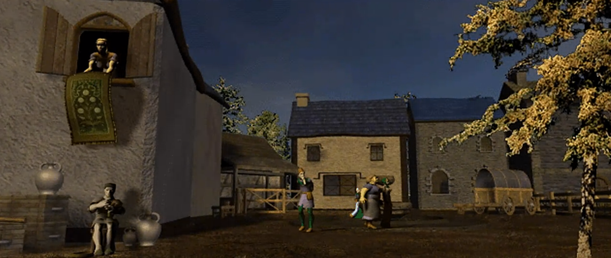
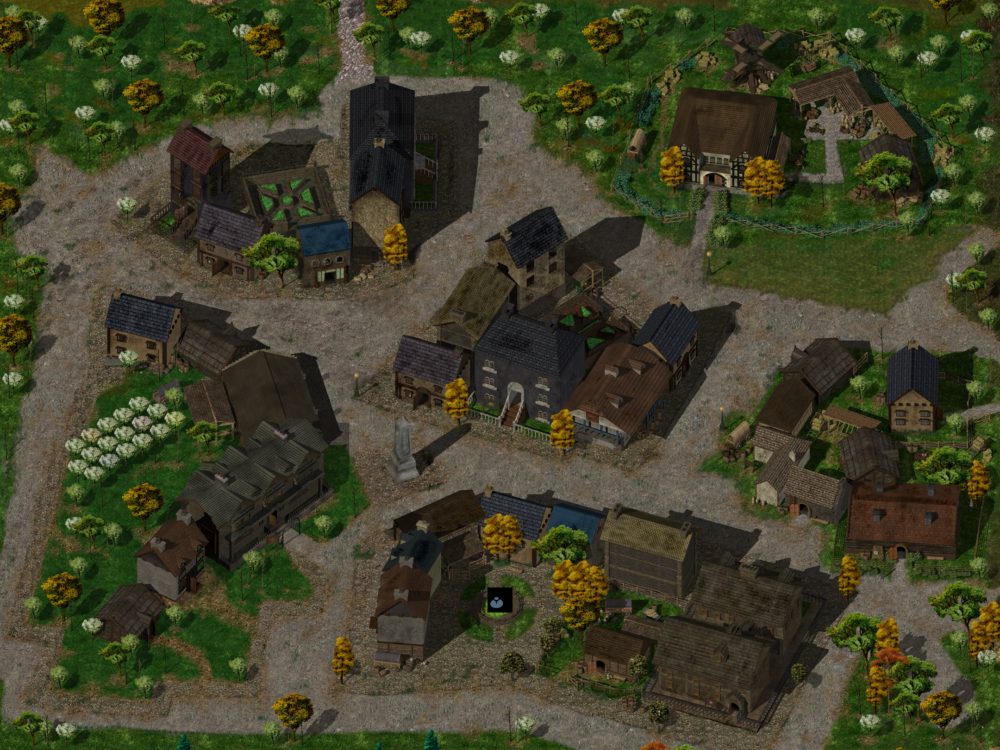

{ .center-img width="100%" }

[{ .center-img width="40%" }](../maps/BG3300.webp)

Po dotarciu do *Beregostu* **Imoen** natychmiast uznała, że najważniejszym punktem dalszej wyprawy powinny być porządne zakupy. Najpierw zaproponowała znalezienie pokoi w gospodzie **Feldeposta**, ponieważ od dawna marzyła o gorącej kąpieli. Chwilę później zaczęła już wyliczać niezbędne zapasy: nową patelnię w miejsce tej zniszczonej przez Leecha, koce, mydło, oliwę do latarni, zapasowe śledzie do namiotów, nóż myśliwski oraz ubrania. Mistrz dwóch katan przyjął te zarzuty z godnością człowieka, który najwyraźniej potrafił pokonać hobgobliny, ale poległ w nierównej walce z kuchennym sprzętem. Sam również nabrał ochoty na rozejrzenie się po sklepach, licząc zwłaszcza na odnalezienie jakiejś elfiej biżuterii. **Sandrah** chętnie dołączyła do wyprawy handlowej i zaoferowała **Imoen** pomoc w wyborze ubrań. Ta zgodziła się bez wahania, zastrzegając jednak, że wszystko powinno wyglądać równie dobrze jak ona, a kolor różowy pozostaje wyłącznie jej domeną.

Po dotarciu do *Beregostu* **Sandrah** poprosiła Leecha o chwilę rozmowy. Wyznała, że od pewnego czasu coś nie dawało jej spokoju. Tuż przed opuszczeniem rodzinnego domu ujrzała w kryształowym odłamku ojca wizję nieznanej kapłanki, prawdopodobnie pochodzącej z dalekiej Północy. Nieznajoma toczyła gwałtowny spór z wyjątkowo nieprzyjemnym magiem, który ostatecznie rzucił zaklęcie przemieniające ciało w kamień. Nieszczęsna służka bogów pozostawała gdzieś uwięziona pod postacią posągu i, jeśli wizja była prawdziwa, z pewnością potrzebowała pomocy.

Młody gnom zgodził się rozpocząć poszukiwania, choć wskazówki pozostawiały wiele do życzenia. **Sandrah** zapamiętała jedynie namioty, kupców, chorągwie i tłum typowy dla targowiska albo wielkiego jarmarku. Nie znała ani nazwy miejsca, ani drogi prowadzącej do niego. Wyglądało więc na to, że drużyna będzie musiała wypatrywać wyjątkowo zatłoczonych festynów, na których kamienny posąg kapłanki nikogo przesadnie nie dziwił.

Do zdjęcia klątwy potrzebny był zwój *Przemiany kamienia w ciało*. Kleryczka nie miała zapamiętanego odpowiedniego zaklęcia, dlatego należało kupić zwój w jednej ze świątyń. Największe szanse na jego zdobycie dawała Świątynia Porannego Władcy w *Beregostcie* albo Świątynia Helma w *Nashkel*. Leech uznał, że zakup zwoju będzie znacznie prostszy niż przeczesywanie całego *Wybrzeża Mieczy* w poszukiwaniu skamieniałej nieznajomej, ale od czegoś trzeba było zacząć.

**Sandrah** dodała jeszcze, że w wizji dostrzegła w pobliżu wóz objazdowego karnawału. Istniała więc szansa, że kapłanka została wystawiona jako osobliwa atrakcja, na której ktoś zarabiał kilka monet od zaciekawionego widza. Sama myśl napełniła kleryczkę niesmakiem, a Leecha przekonała, że warto mieć oczy szeroko otwarte podczas dalszej drogi na południe. (FIND THE PETRIFIED PRIESTESS 18)

Podczas spokojniejszej chwili **Sandrah** zapytała, jakie danie najbardziej lubił **Gorion**. Pytanie z początku zaskoczyło młodego gnoma, który pamiętał przede wszystkim ich wspólne śniadania, po których opiekun wracał do nauki, a wychowanek ruszał na zajęcia i wykonywanie codziennych obowiązków. Najczęściej jadali gotowane jajka, choć **Gorion** wolał je na miękko. Problem w tym, że **Martha**, surowa kucharka z *Candlekeep*, przygotowywała je zawsze na twardo i nie dopuszczała żadnych dyskusji, wyjątków ani kulinarnych herezji. To drobne, niemal banalne wspomnienie po raz pierwszy od opuszczenia cytadeli przypomniało Leechowi zwyczajne życie u boku przybranego ojca, niezwiązane z jego śmiercią, tajemnicami czy czyhającymi na szlaku zabójcami. **Sandrah** zauważyła, że właśnie takie szczęśliwe chwile stanowią najcenniejsze dziedzictwo pozostawione mu przez **Goriona**. Wdzięczny za chwilę wytchnienia od żałoby mistrz dwóch ostrzy podziękował swojej uzdrowicielce i pocałował ją w policzek, najwyraźniej dochodząc do wniosku, że nie wszystkie podboje wymagają dobywania katan.

Imoen wolne chwile poświęca na studiowanie księgi znalezionej prxzy Tarneshu i w końcu wyczarowała artefakt, który zwiększył na stale jest zdolność dexterity.

Imoen :material-trending-up: dexterity +1

W Bergost na rogatkach wita nas Golin Vend (1) i przekazuje informacje o sklepach i karczmach.

Nieopodal (2) Otter O’Forest prosi nas o przysługę. Mamy znaleźć lekarstwo dla kogoś jej bliskiego. Chodzi o bursztynowy kwiat, który kwitnie tylko w miejscu wielkiej straty. Tym miejscem jest podobno stare drzewo w pobliżu kopalni na południu. Kwiat można zerwać tylko nocą (AMBER FLOWER 19).

Przed jednym z domów (3) spotykamy małą Annie Dudley, która wydaje się bardzo zmartwiona kłócącymi się rodzicami. Sprawdzamy dom a tam rzeczywiście rodzice małej są w pacie (FAMILY QUARREL IN BEREGOST 20). Kłócą się o rodowy naszyjnik, który zaginął a przecież miał zostać sprzedany, żeby uratować dom. Po kilku rozmowach z rodzicami i samą Annie udało się odkryć, że to mała Annie schowała naszyjnik, aby nie został utracony. Po ujawnieniu tej informacji rodzina ponownie zaczęła funkcjonować. Postanowiłem kupić ich klejnot za zawyżoną cenę a następnie podarowałem go małej Annie (FAMILY QUARREL IN BEREGOST 20) (reputacja +1). Pani Dudley odszukała nas po cjwili i chciała oddać nadwyżkę jaką jej bez wiedzy dodaliśmy w mieszku z opłata za naszyjnik. Wyjaśniliśmy jej, że chcemy pomóc i prosimy o przyjęcie tej dotacji. Zgodziła sie nie bez oporów ale była nam bardzo wdzięczna.

W jednym z domów **Alanna** poprosiła drużynę o pomoc w ustaleniu, co przydarzyło się jej sąsiadowi, **Eltolthowi**. Mężczyzna zmienił się w bezkształtną kałużę żywego śluzu, a jedynym śladem prowadzącym do wyjaśnienia tej osobliwej katastrofy była pusta butelka znaleziona na podłodze. **Imoen** z trudem powstrzymywała chichot, choć widok człowieka przypominającego zawartość przewróconego kociołka raczej nie powinien nikogo bawić. **Jaheira** szybko przywołała ją do porządku, natomiast **Sandrah** obiecała dokładnie przeszukać dom i odnaleźć sposób na przywrócenie nieszczęśnikowi właściwej postaci. Po bliższym przyjrzeniu się leżącej w domu notatce okazało się, że był to fragment dziennika należącego do **Eltoltha**. Z zapisków wynikało, że spotkał się w umówionym miejscu z **Tulborem**, od którego regularnie kupował podejrzane mikstury. Handlarz zapewniał, że jego specyfiki są równie dobre jak wyroby **Juomy**, tylko znacznie tańsze. Tym razem zaoferował klientowi wyjątkowy eliksir, za który zażądał fortuny. **Eltolth** uznał jednak, że warto zaryzykować, i postanowił go wypić. W tym miejscu zapiski nagle się urywały. Wszystko wskazywało więc na to, że przemiana nie była dziełem potężnego zaklęcia, lecz skutkiem wypicia eliksiru zakupionego od niezbyt uczciwego handlarza. Drużyna musiała odnaleźć **Tulbora**, dowiedzieć się, co naprawdę znajdowało się w butelce, i zdobyć sposób na odwrócenie działania mikstury. Mistrz dwóch ostrzy nieraz widział już ludzi gotowych zapłacić za cudowne specyfiki, lecz **Eltolth** prawdopodobnie jako pierwszy dosłownie rozpłynął się pod wpływem atrakcyjnej oferty. (Nieopodal dalej (4) o nagłą pomoc prosi nas Alanna, coś stało się jej sąsiadowi Eltolth’owi (BEREGOST: ALANNA’S NEIGHBOUR IN TROUBLE 21). W domu (5) zamiast sąsiada znajduje się nieagresywny śluzowiec. Dziewczyna znalazła fiolkę i sądzi, że został przemieniony. Po dokładniejszym przyjrzeniu się śluzowcowi w galaretowatej substancji znajdujemy notatki, z których wynika, że kupił jakąś miksturę od Tulbora. Trzeba delikwenta znaleźć.)

W budynku naprzeciw (6) spotykamy chłopca, która woła Tatusia – okazuje się nim by ogr! Chłopiec po tej interwencji nie był zbytnio zadowolony.

Na ulicach *Beregostu* Leech został nagle zatrzymany przez **Pontaga** (7), który ostrzegł go przed nadepnięciem na wielowymiarowego żuka. Problem polegał na tym, że owada nigdzie nie było widać. Starzec wyjaśnił, że postrzega żuki w wielu chwilach jednocześnie, przez co nigdy nie jest pewien, czy ogląda teraźniejszość, przeszłość, czy dopiero coś, co może się wydarzyć. Próbował nawet schwytać jeden z tych okazów, aby udowodnić innym, że nie są jedynie wytworem jego wyobraźni. **Imoen** uznała opowieść za godną jednej z gawęd **Winthropa**, natomiast mistrz dwóch kling ostrożnie zasugerował, że rozmówca może potrzebować odpoczynku. Wyraźnie dotknięty **Pontag** zapewnił, że nic mu nie dolega, po czym odszedł, pozostawiając drużynę z zagadką owadów istniejących jednocześnie wczoraj, dziś i być może w przyszły czwartek. Wraz z nim była tam **Miji**, która potwierdziła, że **Pontag** jest jej ojcem i od pewnego czasu opowiada o żukach, innych wymiarach oraz chwilach nakładających się na siebie. Zapewniła jednak, że staruszek jest nieszkodliwy, choć odrobinę ekscentryczny. Poprosiła, aby w razie kolejnego spotkania nie traktować go zbyt surowo. Wspomniała również, że nocami często można go znaleźć za gospodą *Feldeposta*, gdzie przeszukuje rzędy drzew w nadziei na schwytanie jednego z tajemniczych owadów. Nasz świeżo upieczony poszukiwacz przygód postanowił przyjrzeć się sprawie bliżej. W końcu od walki z zabójcami i hobgoblinami można było czasem odpocząć, tropiąc żuki, które być może jeszcze się nie pojawiły (**BEETLES, DREAMS AND AN OLD MAN** 22).

Podążając do gospody komendant Seraphinea Whitewood (8). Powitała mnie w mieście, a jej głos niósł ton ostrzeżenia. Mówiła o niesławnej gildii złodziei, Oku Gorgony, i ich enigmatycznym przywódcy, Baldwinie. Wygląda na to, że Straż Miejska jest uwikłana w nieustanną walkę o utrzymanie porządku przeciwko ich skrytych operacjom. Seraphina jasno dała do zrozumienia, że na razie nie potrzebuje dodatkowych rąk do działań Straży. Zamiast tego, doradziła mi, abym czujnie obserwował ruchy w mieście i zapoznał się z topografią terenu. Jest to rozsądne podejście, dające mi czas na zrozumienie złożonej dynamiki, jaka ma miejsce. Być może, w odpowiednim czasie, nadarzy się okazja, by pomóc Straży Miejskiej. Do tego czasu muszę poruszać się po ulicach z ostrożnością i rozwagą.

Po wejściu do *Beregostu* drużynę powitała **Seraphina Whitewood**, dowódczyni miejscowej Straży Miejskiej, pomocniczej formacji złożonej wyłącznie z mieszkańców miasta. Zapewniła, że przybysze mogą swobodnie korzystać z miejscowych atrakcji, lecz powinni zachować czujność. W ostatnim czasie wyraźnie wzrosła bowiem aktywność **Oka Gorgony**, osławionej gildii złodziei, która z pospolitej bandy przeistoczyła się w sprawną organizację i przeniknęła niemal do każdej warstwy miejscowego społeczeństwa.

Na czele gildii stał **Baldwin**, zwany „Rzeźnikiem”, człowiek równie przebiegły, co bezwzględny. Dowódczyni przyznała, że potrafi wykorzystać nawet największy chaos na swoją korzyść, a działania jego ludzi mogą zwiastować znacznie poważniejsze kłopoty. **Sandrah** zaoferowała pomoc, lecz **Seraphina** wyjaśniła, że walka z tak dobrze zorganizowaną siatką wymaga doświadczenia i znajomości miasta, które przychodzą dopiero z czasem.

Zamiast od razu wysyłać świeżo przybyłych na polowanie na najbardziej niebezpiecznego złodzieja w *Beregostcie*, dowódczyni poradziła im poznać ulice, obserwować mieszkańców i zwracać uwagę na wszystko, co wydaje się podejrzane. Leech przyjął tę radę bez sprzeciwu. Wyglądało na to, że zanim mistrz dwóch katan będzie mógł pomóc straży, najpierw musi dowiedzieć się, gdzie w mieście można zjeść, przespać się i nie zostać przy okazji okradzionym. Być może z czasem pojawi się okazja, aby pokrzyżować plany **Oka Gorgony** i jego tajemniczego przywódcy.

Przed Płonącym Czarodziejem (9) spotkaliśmy Garricka, który wynajął nas do ochrony Silke Roseny, utalentowanej artystki. Jacyś bandyci zostali wynajęci przez Feldeporta, żeby ją skrzywdzić, ponieważ nie wystąpiła w jego gospodzie, mimo że miała. Zgodziliśmy się na bycie ochroniarzami i przenieśliśmy się w pobliże gospody Czerwony Bukiet (10). Okazało się, że artystce tym razem przedstawienie nie wyszło. Trzech przybyszów pojawiło się z jakimiś klejnotami, a Silke chciała wykorzystać nas do ich likwidacji. Gdy nie daliśmy się nabrać zaatakowała i tak skończyła swoje życie. Glayde, Faltis i Tessilan byli nam wdzięczni za przemyślaną decyzję. Sam Garrick przyłączył się do naszej grupy, po tym jak zrozumiał, że dał się zwieźć uroczej aktoreczce.

Khalid i Jaheira czekają na nas przed Czerwonym Bukietem a my zaglądamy do środka (11). A tam kolejna próba pozbawienia mnie życia przypuszczona przez Karlat’a. Przy ciele znaleźliśmy kontrakt, tym razem cena mojej głowy podskoczyła do 350 sztuk złota.

W środku knajpki drużyna odnalazła wreszcie **Tulbora**, którego imię pojawiło się w notatkach znalezionych w domu nieszczęsnego **Eltoltha**. **Sandrah** natychmiast oskarżyła handlarza o sprzedaż eliksiru, po którego wypiciu mężczyzna przemienił się w śluz. **Tulbor** nie okazał ani odrobiny skruchy. Roześmiał się tylko i stwierdził, że mikstura zadziałała dokładnie tak, jak powinna, a klient sam ponosi winę, ponieważ zignorował ostrzeżenie i wypił jej zbyt wiele.
Według kupca eliksir w niewielkich dawkach chwilowo osłabiał, lecz zażyty w nadmiarze zapewniał potężny efekt wzmacniający. **Eltolth** najwyraźniej uznał, że skoro jedna porcja działa, to cała butelka zadziała jeszcze lepiej. Zadziałała. Tyle że zamiast bohatera o nadludzkiej sile powstała galaretowata plama wymagająca natychmiastowej pomocy. **Sandrah** zażądała antidotum, lecz **Tulbor** wyjaśnił, że u niego nie obowiązują gwarancje ani zwroty. Skoro klient sam doprowadził się do stanu półpłynnego, powinien teraz uczciwie zapłacić za lekarstwo przywracające właściwy kształt. Kupiec przypadkiem miał przy sobie odpowiedni eliksir przemiany, który za jedyne sto sztuk złota mógł odwrócić skutki niefortunnej kuracji. Mimo obrzydzenia wobec bezczelnych praktyk handlarza drużyna kupiła ostatnią porcję antidotum. **Tulbor** polecił jeszcze dopilnować, aby **Eltolth** wypił całą zawartość. Mistrz dwóch katan zapamiętał tę radę szczególnie dobrze. Po doświadczeniach z pierwszą butelką należało pilnować zarówno tych, którzy piją za dużo, jak i tych, którzy mogliby tym razem wypić podejrzanie za mało (BEREGOST: ALANNA’S NEIGHBOUR IN TROUBLE 21).
Tam też spotkali **Perdue’a**, który rozglądał się za wielkim oprychem o psiej głowie i oddechu zdolnym obedrzeć farbę ze ściany. **Sandrah** szybko rozszyfrowała ten barwny opis: chodziło o gnolla. Bestia zaszyła się na wzgórzach na zachód od miasta, w pobliżu *Wysokiego Żywopłotu*, a kilka dni wcześniej ukradła rozmówcy krótki miecz. Broń nie była szczególnie cenna, lecz pozostawała w rodzinie **Perdue’a** dłużej, niż żyła jego babka, i miała dla właściciela ogromną wartość sentymentalną. Za odzyskanie oręża zaoferował pięćdziesiąt sztuk złota, prosząc przy okazji, aby drużyna solidnie przetrzepała futrzasty zad gnolla. Mistrz dwóch katan nie miał wprawdzie zwyczaju ścigać złodziei cudzych krótkich mieczy, lecz uznał, że odrobina ruchu i pięćdziesiąt monet jeszcze nikomu nie zaszkodziły (**PERDUE’S SHORT SWORD** 23).

Na dole spotykamy także ponownie uroczą bibliotekarkę Finch. Obowiązki dla świątyni Deneir nakładają na nią założenie nowej biblioteki w Nashkel a przy tym całym skupieniu na tamtejszych kopalniach, ludzie są żałośnie niepiśmienni, a jej obowiązkiem jest zapewnienie im narzędzi do zdobywania wiedzy. Ma listę dzieł do zebrania i zasugerowała abyśmy przez czas jakiś podróżowali wspólnie. Nie mogłem odmówić jej wdziękom (**FINCH BOOKS** 24).

Lachluger nie śpiewał, ale wył coś na kształt szanty ale udało nam się roztroić jego nastrój i sobie poszedł a Karczmarz potwierdził plotki o problemach z żelazem. Ponadto jeden z gości wspomniał Bassilusa, ktory zamienia zabitych w zombie i dręczy okolice. Bassilus pochodzi podobno ze zniszczonego Zhentil Keep. (BASSILUS MURDERER 25).

Na piętrze **Raleo Windspeara**, wędrownego gawędziarza, który chętnie poznawał nowych ludzi i zbierał zasłyszane po drodze historie. **Imoen** natychmiast przyznała, że opowieści najlepiej poznaje się podczas podróży, ponieważ w gospodzie zawsze znajdzie się ktoś, kto zamówi kolejne piwo albo posiłek dokładnie wtedy, gdy bajarz dociera do najciekawszej części. Brakujące fragmenty trzeba później uzupełniać samodzielnie, co najwyraźniej nigdy nie stanowiło dla niej większego problemu. Zapytany o miejscowe kłopoty **Raleo** wspomniał o ruinach szkoły *Ulcastera*, leżących na południowy wschód od miasta. W ruinach miały ostatnio dziać się dziwne rzeczy, a wielu śmiałków, którzy zapuścili się pomiędzy stare mury, nigdy nie wróciło. Gawędziarz stanowczo odradził wyprawę każdemu, kto nie był całkowicie pewien swoich umiejętności. Leech nie zamierzał jednak skreślać tego miejsca z planów. W końcu ruiny, zaginieni poszukiwacze i tajemnicze zjawiska brzmiały jak zestaw przygotowany specjalnie dla kogoś, kto dopiero zaczynał żałować wyboru zawodu. Wędrowiec opowiedział również o **Miriam**, mieszkającej na wschodnim krańcu *Beregostu*. Kobieta od pewnego czasu oczekiwała wieści o swoim mężu, który wyruszył z miasta i dotąd nie powrócił. Drużyna postanowiła zapamiętać tę informację, gdyby podczas dalszych wędrówek natrafiła na jakikolwiek ślad zaginionego. Kryzys żelaza dotknął także miejscowego kowala. Według **Ralea** **Taerom Fuiruim** nadal dysponował przyzwoitymi zapasami, lecz z powodu niedoboru surowca coraz częściej pracował z egzotycznymi materiałami. Mistrz dwóch katan uznał, że warto odwiedzić jego kuźnię. Jeśli żelazne ostrza rzeczywiście zaczynały rozpadać się wszystkim w rękach, należało sprawdzić, czy krasnoludzki rozmiar wojownika obejmuje również korzystniejszy rabat na dwie katany naraz. Na pytanie o zakupy **Raleo** polecił gospodę *Feldeposta*, gdzie sprzedawano rozmaite zdobyczne przedmioty, w tym również wyroby magiczne. Ostrzegł jednak, że ceny nie należą do najniższych. Wspomniał także o magu **Thalantyrze**, mieszkającym w swojej warowni na zachód od miasta. Czarodziej prowadził tam sklep, choć nie przepadał za nieproszonymi gośćmi i potrafił śmiertelnie potraktować każdego, kto zbyt długo kręcił się po jego posiadłości bez pozwolenia. Drużyna zyskała więc kilka nowych tropów: ruiny *Ulcastera*, zaginionego męża **Miriam**, kuźnię **Taeroma**, towary w gospodzie *Feldeposta* oraz sklep nieprzyjaznego maga na zachodzie. Wyglądało na to, że w *Beregostcie* nawet krótka rozmowa na ulicy potrafiła powiększyć listę spraw do załatwienia o dobrych kilka pozycji.

W jednym z pokojów spotkali **Aishę**, która po trudnej nocy wyraźnie pragnęła pozostać sama. Nie chciała zdradzić, co dokładnie ją spotkało, sugerując jedynie, że sytuacja była skomplikowana, a ujawnienie szczegółów mogłoby narazić zarówno ją, jak i rozmówców. **Garrick**, natychmiast przechodząc w tryb szlachetnego obrońcy, zaoferował pomoc i serię poetyckich zapewnień, lecz jego przesadna troska tylko dodatkowo ją przytłoczyła. **Aisha** spokojnie wyjaśniła, że nie potrzebuje bohatera ani kolejnych pytań, lecz odrobiny przestrzeni i czasu na uporządkowanie myśli. Nawet **Imoen**, zwykle ciekawska jak kot zaglądający do otwartej sakiewki, szybko zrozumiała, że tym razem lepiej uszanować prywatność nieznajomej. Drużyna pozostawiła więc **Aishę** w spokoju, zachowując jednak w pamięci, że za jej ostrożnością może kryć się coś znacznie poważniejszego.

 **Jen’lig** nie przepada za Garrickiem i po raz kolejny dała do zrozumienia, że nie należy do wielbicielek talentu **Garricka**. Porównała jego śpiew do wycia ogara szukającego towarzystwa, czym skutecznie ugodziła w dumę barda. Ten próbował odgryźć się pytaniem, czym githyanki zajmują się dla rozrywki, lecz szybko pożałował swojej ciekawości. **Jen’lig** odpowiedziała, że w jej ojczyźnie już małe dzieci uczestniczą w brutalnych wyprawach i uczą się walczyć, gdy tylko są w stanie utrzymać miecz. Dodała też, że większość czasu spędziła samotnie, więc nadal poszukuje odpowiedniego partnera do wspólnych zajęć. Gdy **Garrick** ponownie zaczął śpiewać, wojowniczka cierpko zauważyła, że jego nawoływania najwyraźniej nie przynoszą oczekiwanych rezultatów. Nieco później urażony bard zapytał Leecha o szczerą opinię na temat swojej muzyki. Mistrz dwóch katan postanowił nie dokładać kolejnego ciosu do ran zadanych już przez **Jen’lig** i pochwalił jego bogaty repertuar pieśni oraz opowieści. **Garrick** natychmiast odzyskał pewność siebie i zapowiedział, że wspomni o dobroci oraz szlachetnym usposobieniu dowódcy drużyny w jednym ze swoich przyszłych utworów. Niewielki komplement wystarczył więc, by ocalić bardowską dumę, choć zapewne nie poprawił jakości samego śpiewu.

Czas odwiedzić kolejny przybytek – Płonącego Czarodzieja (12)
W środku jedna z bywalczyń okazała się bardzo marzycielska, otwarcie zazdrościła poszukiwaczom przygód. Zamiast codziennej pracy pomywaczki wolałaby wspólnie z siostrą walczyć ramię w ramię z amnijskimi żołnierzami, odpierać potwory w świetle księżyca i poznawać wszystkie cuda skryte za horyzontem. **Sandrah** spróbowała ostudzić jej wyobrażenia, przypominając, że życie awanturnika bywa znacznie mniej romantyczne, niż przedstawiają je pieśni. Jeden zabity żołnierz może ściągnąć na człowieka gniew całego *Amnu*, a cudowne stwory z legend równie często przynoszą rdzę, zimno i śmierć, co zachwyt. Marzycielka nie zamierzała jednak rezygnować ze swoich fantazji. Przyznała, że tylko one pozwalają jej przetrwać szarą codzienność i wierzyć, że poza ciasnymi murami miasta nadal istnieje świat pełen cudów. Leech nie próbował odbierać jej tej nadziei. Sam dopiero niedawno opuścił *Candlekeep* i zdążył już przekonać się, że prawdziwa przygoda znacznie częściej pachnie potem, błotem i krwią niż kwiatami oraz księżycowym blaskiem. Mimo to dobrze rozumiał pragnienie ujrzenia tego, co znajduje się za odległym horyzontem. Gdyby nie podobna ciekawość, jego dwie katany zapewne nadal kurzyłyby się w bezpiecznej cytadeli, a on sam martwiłby się głównie tym, czy na kolację znów podadzą jajka ugotowane niezgodnie z życzeniem.

Tam też dostajemy zlecenie od Zhurlonga aby odnaleźć jego buty (ZHURLONG’S MISSING BOOTS 26), pomocne w złodziejskiej profesji. Nawet bez nich ukradł nam trochę złota. Musimy być bardziej ostrożni.

Karczmarz wspomniał, że w *Nashkel* odbywa się właśnie Jarmark Świętojański. Nie był jednak pewien, czy impreza poradzi sobie z ostatnimi problemami nękającymi okolicę. Podróżowanie dla odrobiny jarmarcznej rozrywki stało się zbyt niebezpieczne, więc wielu gości mogło zrezygnować z udziału. Dla drużyny była to jednak cenna wskazówka. Opis pasował do targowiska z wizji **Sandrah**, gdzie wśród namiotów, kupców i chorągwi miała znajdować się skamieniała kapłanka. Wyglądało na to, że droga do *Nashkel* może przynieść nie tylko odpowiedzi w sprawie kryzysu żelaza, lecz także okazję do przeprowadzenia osobliwej akcji ratunkowej pośród straganów i jarmarcznych atrakcji.

Na piętrze natkneli się na **Spena Gil’meha**, który zdecydowanie bardziej cenił sobie spokój i lekturę niż towarzystwo przypadkowych wędrowców. Zapytany przez **Jen’lig** o ruiny *Mostu Firewine*, wskazał je na południowym wschodzie, lecz od razu ostrzegł, że miejsce to słynie z wyjątkowej śmiertelności wśród niedoświadczonych poszukiwaczy przygód. Radził ćwiczyć nogi nie tylko po to, by tam dotrzeć, ale przede wszystkim po to, by w razie potrzeby wrócić w jednym kawałku. Zapytany o inne atrakcje *Beregostu*, **Spen** wspomniał o świątyni położonej na wschodzie, lecz szybko dodał, że sam nie przepada ani za widokiem, ani za pytającą go githyanki. Po tej niezbyt gościnnej wymianie zdań wrócił do swojej księgi, a drużyna zyskała kolejny punkt na coraz dłuższej liście miejsc, do których należało kiedyś zajrzeć: ruiny *Mostu Firewine*. Najlepiej dopiero wtedy, gdy mistrz dwóch katan i jego kompania będą równie sprawni w powrotach, jak w pakowaniu się w kłopoty.

Rozmowy z mieszkańcami *Beregostu* potwierdziły, że kryzys żelaza staje się coraz poważniejszy. Dostawy z kopalń w *Nashkel* niemal całkowicie wyschły, a szlaki handlowe zostały odcięte przez bandytów. Wieści zaczęły już docierać nawet do odległego *Waterdeep*, co nie wróżyło regionowi niczego dobrego. Nie brakowało przy tym ludzi przekonanych, że za wszystkimi problemami stoi *Amn*. Jeden z miejscowych bez ogródek oskarżył południowe królestwo o celowe skażenie żelaza wydobywanego w *Nashkel*. Podejrzewał, że Amnijczycy sami wywołali kryzys, aby osłabić strażników i żołnierzy na północy, a następnie przejąć *Wrota Baldura*. Wzywał nawet do zajęcia kopalni siłą, zanim rzekomy spisek przyniesie zamierzony skutek. Młody dowódca wysłuchał tych rewelacji z odpowiednią ostrożnością. Trudno było rozstrzygnąć, ile kryło się w nich prawdy, a ile zwykłej niechęci do południowych sąsiadów. Jedno było jednak pewne: zanik dostaw, kruche żelazo i coraz śmielsze napady bandytów zaczynały zagrażać całemu *Wybrzeżu Mieczy*.

Czas na Zajazd Feldeposta (14). Po drodze młody chłopak Yumil (13) poinformował mnie o kilku podejrzanie wyglądających postaciach wchodzących do tunelu za Zajazdem Feldposta. Być może powinienem się temu przyjrzeć.

Zaraz po wejściu do gospody zaczepił nas ze złością - Marl - goszczący tu z Dunkin’em ale Sandrah dała mu do zrozumienia, że powinien trzymać gębę na kłódkę. Ślicznotka Gyllian wymsknęło się coś o jakiejś Betsy i chciała chyba spędzić ze mną trochę czasu, ale mnie ciągle Sandrah w głowie. Hephis zdzierał gardło na szancie, ale uprzykrzyliśmy mu pobyt w knajpie i się zmył się.

Illasera Szybka (the Quick) szuka kogoś do wykonania trudnego, ale dobrze płatnego zadania ale nie chce z nami rozmawiać, dopóki nie zdobędziemy doświadczenia. Sądzi, że jeśli rozwiążemy problem pobliskiej kopalni to możemy do niej wrócić. Okazało się, że Garrick do niej startował wcześniej, ale dostał kosza.

Na górze zajazdu spotykamy Algernona, ale nie chciał podtrzymać konwersacji.

Goście podzielili sie kolejnymi wieści o problemach nękających region. Niedobór żelaza narastał już od dłuższego czasu, dając nieuczciwym kupcom mnóstwo okazji do zawyżania cen i oszukiwania zdesperowanych klientów. Jeden z przechodniów nie omieszkał nawet zasugerować, że gdyby młody gnom zechciał odstąpić mu kilka sztabek, chętnie ubiłby z nim interes. Inny mieszkaniec skierował uwagę drużyny ku ruinom dawnej szkoły *Ulcastera*. Według niego w pozostałościach siedziby magów z pewnością musiały nadal spoczywać magiczne skarby. Ostrzegł jednak, że dotarcie do nich może okazać się wyjątkowo niebezpieczne, ponieważ martwi czarodzieje nie słyną ani ze spokojnego snu, ani z dobrego humoru po przebudzeniu. Była to kolejna zachęta, aby odwiedzić ruiny, choć najlepiej dopiero wtedy, gdy kompania będzie przygotowana na spotkanie z gospodarzami, którzy od dawna nie przyjmowali gości. Nie brakowało również głosów obwiniających *Amn* o całe nieszczęście. Jeden z mieszkańców był przekonany, że amnijscy szpiedzy celowo zatruwają rudę wydobywaną w *Nashkel*, aby osłabić północne ziemie przed planowanym atakiem. Domagał się nawet, aby Wielcy Książęta natychmiast ruszyli przeciwko południowemu sąsiadowi. Leech wysłuchał tych oskarżeń z ostrożnością. Kryzys żelaza był faktem, lecz rozpoczynanie wojny na podstawie ulicznych pogłosek wydawało się pomysłem niewiele rozsądniejszym od sprawdzania jakości miecza poprzez uderzenie nim we własną głowę. Najbardziej przejmujące były jednak słowa rodzica, którego syn podróżował z jedną z karawan zmierzających do *Wrót Baldura*. Wóz nie dotarł do celu, a los podróżnych pozostawał nieznany. Zrozpaczony mieszkaniec modlił się do **Tymory**, prosząc boginię, aby bezpiecznie sprowadziła syna do domu, a bandytom pozwoliła potknąć się o własne miecze. Nawet jeśli nie była to kara szczególnie bohaterska, trudno było odmówić jej pewnej poetyckiej sprawiedliwości.

Karczmarz miał w sprzedaży rzadkie jagody Gurila. Kupiliśmy trochę.

Po dotarciu do słynnej gospody *Feldeposta* **Sandrah** uznała, że nawet poszukiwaczom przygód należy się czasem odrobina wygody. Zaproponowała kąpiel, zmianę ubrań i spokojny wieczór przy kominku. Leech przyznał, że miejsce doskonale pasuje do damy takiej jak ona, na co kleryczka z figlarnym uśmiechem zapowiedziała, że chętnie pokaże mu również swoją bardziej wytworną stronę. Towarzyszki porwały więc **Imoen** na górę, aby doprowadzić ją do porządku po trudach podróży i wspólnie przygotować się do wieczornego posiłku. **Sandrah** pożegnała młodego gnoma szybkim pocałunkiem, a zaskoczony szermierz zdołał jedynie bezradnie odpowiedzieć tym samym. Walka dwiema katanami przychodziła mu zdecydowanie łatwiej niż zachowanie niewzruszonej miny w podobnych sytuacjach. Kiedy jakiś czas później **Sandrah** i **Imoen** zeszły na dół w odświętnych strojach, ich przemiana zrobiła na Leechu ogromne wrażenie. Z trudem rozpoznawał w nich utrudzone towarzyszki, które jeszcze niedawno przedzierały się przez lasy i walczyły z hobgoblinami. **Imoen** z dumą zauważyła, że z niepozornego kaczątka stała się tego wieczoru prawdziwym łabędziem, a **Sandrah** żartobliwie skłoniła się przed nimi, zapraszając całą kompanię do zajęcia wygodnych miejsc przy kominku. Zapowiadał się spokojny wieczór, podczas którego największym zagrożeniem miały być pieczony kurczak, kufle piwa i rozproszenie uwagi młodego mistrza dwóch ostrzy.

Garrick póki co wrócił do Pomocnej Dłoni.

Rozpoczął się poranek i przy miejskim obelisku pojawił się herold (15), który oznajmił wielką nagrodę za głowę Bassilus’a, który popełnił jakąś straszną zbrodnię (BASSILUS THE MURDERER 24). Dowód jego śmierci należy przedstawić w świątyni Pieśni Poranka.

Z antidotum wracamy do sąsiada Alanny (5). Szczęśliwie Eltolth powraca do humanoidalnej postaci (BEREGOST: ALANNA’S NEIGHBOUR IN TROUBLE 21) i wyjawia, że pragnął wyglądać bardziej męsko, aby podbić serce sąsiadki. Gdy zrozumiał, że wcale nie musiał tego robić, szybko się stamtąd zabraliśmy i trzymamy kciuki za łóżko, stoły i inne meble, które zostaną pewnie poddane testom niezwłocznie.

Zaglądamy do Kagain’a (16), krasnoludzkiego przedsiębiorcy zajmującego się ochroną karawan podróżujących z *Amnu* do *Wrót Baldura*. Jeden z wozów eskortowanych przez jego najemników nigdy nie dotarł do celu, dlatego poszukiwał wojowników gotowych ustalić, co się z nim stało. Z początku rozmowa wyglądała jak zwykła propozycja dobrze płatnej pracy, lecz **Sandrah** szybko skojarzyła zaginiony transport z rozbitą karawaną odnalezioną wcześniej na *Lwim Trakcie*. Krasnolud przyznał, że ostatnio coraz więcej przewoźników padało ofiarą bandytów. Zazwyczaj rabusie zabierali ładunek, pozostawiając pasażerów przy życiu, lecz tym razem wymordowali wszystkich. Jeden z podróżnych był synem **Entara Silvershielda**, wpływowego księcia z *Wrót Baldura*, a bezpieczeństwo całej wyprawy spoczywało na barkach najemników **Kagaina**. **Sandrah** pokazała krasnoludowi broszę znalezioną przy ciele młodzieńca. **Kagain** rozpoznał znak rodu **Silvershieldów** i z przerażeniem zrozumiał, że chodziło właśnie o jego karawanę. Śmierć syna księcia oznaczała dla niego nie tylko utratę klienta, lecz także kłopoty zdolne pogrzebać reputację, interes i zapewne sporą część krasnoludzkiego majątku. Przedsiębiorczy brodacz szybko zaproponował rozwiązanie korzystne przede wszystkim dla siebie. Postanowił dołączyć do drużyny i pomóc w zemście na bandytach, licząc, że dobre słowo u **Silvershieldów** pozwoli mu ocalić nazwisko przed całkowitą kompromitacją a także osobiście przekazać tragiczna informacje. Leech przyjął jego propozycję. W końcu dodatkowy topór zawsze mógł się przydać, a krasnolud walczący o odzyskanie pieniędzy i reputacji bywał zwykle bardziej zdeterminowany niż paladyn broniący świętej relikwii (SO BE IT! AT LEAST THIS MESS IS OVER WITH NOW 27).

Rozejrzwszy się bo zakamarkach firmy Kagaina natrafiamy na podręcznik obsługi golemów. Sandrah jest bardzo zaciekawiona tym znaleziskiem bo być może odpowie na pytanie jak sobie radzić z tymi tworami.

Na przeciw Gospody Feldeposta zmależli dom spotkanego w Candlekeep przez Leecha **Firebeada Elvenhaira**. Natychmiast rozpoznał w Leechu wychowanka **Goriona** i złożył mu szczere kondolencje. Młody gnom podziękował za dobre słowo, choć wieść o śmierci przybranego ojca nadal ciążyła mu bardziej niż oba noszone przy boku ostrza. Starzec szybko przeszedł jednak do spraw bardziej przyziemnych. Poprosił dawnego znajomego o kupienie egzemplarza księgi „Historia Fatalnej Monety”, którą można było znaleźć w jednym z miejscowych sklepów. Szczęśliwie mieliśmy już tę ksiegę w ekwipunku i ochoczo ją podarowaliśmy (A BOOK FOR FIREBEAD 28). Ponadto **Imoen** natychmiast zgłosiła gotowość do dalszej pomocy, z dumą przypominając, że nie jest już dziewczynką w fartuszku i czepku, lecz „Imoen Wspaniałą”. Zastrzegła jednak, że w odpowiednio drogim stroju mogłaby rozważyć powrót do dawnej garderoby. Najlepiej, gdyby ubranie zostało uszyte ze skarbca jakiegoś smoka. Wspomniana przez **Firebeada** księga szczególnie zainteresowała **Finch**. Kapłanka znała „Historię Martwej Trójki” ze słyszenia i przyznała, że choć jej treść jest dość ponura, dzieło nadal zasługuje na uwagę. Młody dowódca mógł więc dopisać do listy zakupów kolejny tom. (reputacja +1)

**Firebead** zwrócił również uwagę na obecność **Sandrah**. Przez chwilę wyglądał na zaskoczonego jej widokiem, po czym przyznał, że świat jest znacznie mniejszy, niż czasem się wydaje. Nie spodziewał się spotkać kleryczki właśnie u boku wychowanka **Goriona**. Następnie stary mag opowiedział o osobliwym zwoju znalezionym przy martwym niewolniku duergarów, którego ciało odkryto niedawno na pobliskich pustkowiach. Podejrzewał, że dokument ma demoniczne pochodzenie i może zainteresować ojca **Sandrah**. Nie chciał jednak sam odprawiać związanych z nim rytuałów. Poprosił więc kleryczkę, aby przy najbliższej okazji przekazała zwój ojcu. **Sandrah** zgodziła się bez wahania.

Zwój znajdował się na piętrze posiadłości maga i emanował złą energią. **Sandrah** dokładnie go przestudiowała i odkryła że można z nim rozmawiać. Zwój podał kkolejne informacje o jego właścicielu. Dokument należał do demona imieniem **Alzaligrundel**, który prawdopodobnie przebywał w górzystej krainie na południu. W jego pobliżu miał znajdować się wodospad, co stanowiło jedyną konkretną wskazówkę dotyczącą położenia kryjówki. Kleryczka podejrzewała również, że zwój może otwierać portal prowadzący bezpośrednio do **Alzaligrundela** albo przyzywać demona do osoby odprawiającej rytuał. Żadna z tych możliwości nie brzmiała zachęcająco. **Sandrah** nie zamierzała eksperymentować bez przygotowania, a Leech nie protestował. Na razie drużyna mogła jedynie zachować zwój i czekać, aż **Sandrah** lub jej ojciec zdobędą więcej informacji. Jedno było pewne: jeśli podczas dalszej podróży trafią na góry położone na południu i wodospad skrywający podejrzane przejście, będzie to odpowiednie miejsce, by rozpocząć poszukiwania demonicznego właściciela dokumentu (A DEMONIC SCROLL 29).

W domu obok sziedzibt maga (18) nic ciekawego oprócz kilku ksiąg, w tym poszukiwana przez Firebead’a ale mieliśmy ją już z innego źródła.

Na placu przy fontannie spotykamy dwóch Magnus’ów. Jeden (19) to handlarz z dobrym sprzętem zwłaszcza pociski i strzały a drugi (20) zbył nas naprędce.

Kolejni mieszkańcy potwierdzili, że w *Nashkel* odbywa się właśnie Jarmark Świętojański. Nie wiadomo jednak, jak długo zdoła przyciągać gości, skoro kryzys żelaza, napady bandytów i inne kłopoty skutecznie odbierają podróżnym ochotę na wyprawy podejmowane jedynie dla rozrywki. Wieści natychmiast zainteresowały **Sandrah**. Jarmark pełen namiotów, kupców, chorągwi i wędrownych kuglarzy pasował do wizji, w której ujrzała skamieniałą kapłankę. Drużyna zyskała więc kolejny powód, aby jak najszybciej ruszyć do *Nashkel*. Oprócz zbadania kryzysu żelaza należało odwiedzić miejscowy jarmark i rozejrzeć się za kamiennym posągiem, który mógł być kimś znacznie bardziej żywym, niż wskazywał na to jego obecny stan.

Jeden z mieszkańców przyjrzał się drużynie z wyraźną podejrzliwością i zapytał, czy przypadkiem nie ma do czynienia z magami. Szczególnie nie ufał **Thalantyrowi**, mieszkającemu na zachód od *Beregostu*. Według niego czarodziej był wyjątkowo nieprzyjemnym człowiekiem, a jego słudzy atakowali każdego, kto nieopatrznie zapuścił się w pobliże jego siedziby. Młody mistrz dwóch ostrzy uznał to ostrzeżenie za warte zapamiętania. Jeśli przyjdzie im odwiedzić maga, najlepiej będzie najpierw schować katany i dopiero potem sprawdzić, czy miejscowe sługi znają różnicę między klientem a intruzem. Inny przechodzień opowiedział o **Bassilusie**, złowrogim człowieku grasującym w okolicy. Mężczyzna nie tylko mordował swoje ofiary, lecz także przemieniał je w nieumarłych i traktował jak członków własnej rodziny. Nawet jak na standardy coraz bardziej osobliwego *Wybrzeża Mieczy* brzmiało to wyjątkowo niepokojąco. Drużyna postanowiła zapamiętać jego imię. Ktoś prowadzący rodzinne spotkania z udziałem zwłok zdecydowanie zasługiwał na bliższe zainteresowanie, najlepiej z bezpiecznej odległości i przy dwóch dobytych katanach.

Odwiedzamy dom Landrin (21) a tam wielkie pająki. Zabieramy ze sobą ciało jednego z nich oraz butelkę wina i znoszone buty o które prosiła właścicielka. Oddamy je gdy wrocimy do Pomocnej Dłoni.

Czas odwiedzić kolejną karczmę – Wesoły Żongler (22). Zaczepia nas rudowłosa piękność z Neverwinter – Morwen Alandel i próbuje się przyłączyć do drużyny ale mam dość bardów i ich śpiewów.

W gospodzie drużyna spotkała rannego **Bjornina**, który ledwie uszedł z życiem ze starcia z grupą półogrów. Bestie ufortyfikowały się w górach na południowy zachód od *Beregostu*, a wojownik poprosił o wymierzenie im sprawiedliwości. Drużyna postanowiła zapamiętać położenie ich kryjówki i rozprawić się z nimi, gdy tylko droga zaprowadzi ją w tamte strony (HALF-OGRES NEAR BEREGOST 30).

**Sandrah** zauważyła, że pomimo upływu czasu rany **Bjornina** goją się wyjątkowo powoli. Zaoferowała więc pomoc i dokładniejsze zbadanie obrażeń. Wojownik z miejsca odzyskał nieco wigoru i zaproponował, aby przenieśli się do jego pokoju na piętrze, gdzie kapłanka mogłaby spokojnie kontynuować leczenie. Służka **Mystry** przyjęła propozycję i pozwoliła poprowadzić się na górę, najwyraźniej zdecydowana nie pozostawić cierpiącego pacjenta bez stosownej opieki. Leech obserwował ich odejście z rosnącym zainteresowaniem. Wyglądało na to, że dotkliwie pobity wojownik właśnie odkrył w sobie niezwykłe pokłady sił, a uzdrawiające talenty **Sandrah** zaczynały działać, zanim jeszcze zdążyła rzucić choćby jedno zaklęcie. Cóż Sandrah prowadzi otwarty sposób życia i trzeba to zaakceptować (Cios w moje serce! Wygląda, że Sandrah jak kapitan ma ostoję w każdym porcie. Tu okazał się nią być Bjornin. We dwójkę wymknęli się na chwil parę. Hmm, jestem zazdrosny!). 

Krasnolud Gurke pragnie odzyskać płaszcz skradziony przez bandę Tasloi gdzieś w Płaszczowym lesie (GURKE’S CLOAK 31).

Goście karczmy podzielili sie swoimi troskami, jak mocno kryzys żelaza odbijał się na codziennym życiu miasta. Rosnące napięcie sprawiało, że ludzie coraz chętniej szukali winnych, na których mogliby zrzucić wszystkie swoje lęki. Jeden z przechodniów obawiał się, że wystarczy wskazać wspólnego wroga, aby na ulicach pojawił się rozwścieczony tłum. Sam miał jedynie nadzieję, że kiedy do tego dojdzie, będzie już bezpiecznie siedział w domu za dobrze zamkniętymi drzwiami. Pełniący służbę **Morningstar** nie zamierzał wdawać się w rozmowę i stanowczo polecił przybyszom ruszać dalej. Zdecydowanie wyglądał na człowieka, który traktował wartę równie poważnie jak własną niechęć do pogawędek. Inny mieszkaniec, widząc ozdobne stroje i efektowne uzbrojenie drużyny, uznał jej członków za miłośników magicznych błyskotek. Polecił im odwiedzić **Thalantyra**, mieszkającego na zachód od miasta. Ostrzegł jednak, że stary mag jest wyjątkowo zrzędliwy, a jego słudzy zwykle atakują każdego, kto naruszy spokój posiadłości. Jeśli jednak zdoła się z nim porozmawiać bez utraty kończyn, ma podobno wiele magicznych przedmiotów na sprzedaż. Zachowuje się przy tym tak, jakby przyjmowanie pieniędzy było wielką łaską wyświadczaną klientowi. Kupcy potwierdzali tymczasem, że karawany kursujące *Drogą Wybrzeża* coraz rzadziej docierają do celu. Trakt, który zwykle tętnił ruchem, niemal opustoszał. Gdyby nie bandyci i kruszące się żelazo, szlak mógłby stać się prawdziwą arterią dostaw, lecz obecnie zapewniał raczej stały dopływ trupów niż sztabek metalu. Jeden z ocalałych opowiedział o napadzie, podczas którego pozostawiono go na pewną śmierć. Życie uratował mu tajemniczy nieznajomy, który uleczył rany i zniknął, zanim ranny zdążył mu się dobrze przyjrzeć. Mieszkaniec nie rozpoznał wybawcy, lecz był przekonany, że uratował go wędrowny kapłan. Drużyna postanowiła zachować tę opowieść w pamięci, gdyby podobny dobroczyńca ponownie pojawił się na szlaku. Trudności w handlu najbardziej uderzały w zwyczajnych mieszkańców. Jeden z rozmówców musiał wracać do czekających w domu dzieci, podczas gdy jego partner szukał jakiegokolwiek zajęcia pozwalającego zarobić na jedzenie. W mieście ogarniętym kryzysem nawet utrzymanie rodziny stawało się wyzwaniem, a bochenek chleba bywał cenniejszy niż niejedna bohaterska pieśń. Ponownie pojawiły się także opowieści o **Bassilusie**, który mordował napotkanych ludzi, przemieniał ich w nieumarłych, a następnie urządzał z nimi ponure przedstawienie rodzinnego życia. Mistrz dwóch katan uznał, że jeśli wszystkie pogłoski okażą się prawdziwe, szaleniec zasługuje na szybką wizytę kogoś uzbrojonego w dwa ostre argumenty. Kilku mieszkańców powtarzało ostrzeżenia przed wybuchem niepokojów. Kryzys żelaza, bezrobocie i napady na karawany tworzyły mieszaninę równie niebezpieczną jak źle opisany eliksir. Wystarczyłby jeden przekonujący podżegacz, aby przestraszeni ludzie ruszyli przeciwko pierwszemu wskazanemu wrogowi. Leech miał nadzieję, że prawdę o wydarzeniach w *Nashkel* uda się odkryć wcześniej, niż ulice *Beregostu* wypełnią się rozwścieczonym tłumem.

W pokojach na górze schodami z przodu Oogie Wisham boi się zejść na dół ze względu na obecność tam Bjornina ale nie chciał zdradził co się za tym kryje. Na tyłach karczmy na górze znajduję się grupa wiedźm przygotowujących się do jakiegoś rytuału, ale na razie nie czuję się na siłach wchodzić w szczegóły.
Karczmarz wspomniał, że członkowie Płonącej Pięści zostali delegowani do Beregostu co nie jest wygodne i miłe mieszkańcom.

Zaglądamy do kuźni Taeroma Fuiruima (23), który ma do sprzedania kołczan.

W domu powyżej kuźni (24) Marianne wyczekuje informacji o swoim mężu Roe, który wybrał się do Amn (MIRIANNE’S HUSBAND 32). Obiecałem rozglądać się za informacjami o nim.

W północnej części miasteczka (25) spotykamy Neerę, która prosi nas o ochronę. Po chwili pojawiają się czerwoni czarodzieje z Thay pod przewodnictwem Ekandora. Chcą schwytać dziewczynę, ze względu na jej anormalne moce Dzikiej Magii. Oczywiście nie zgadzamy się na taki obrót sprawy. W międzyczasie Neera przypadkowo teleportuje Ekandora w nieznane a nam zostaje do neutralizacji trzech jego pomocników. Zgadzamy się, aby młoda adeptka magii dołączyła do nas.

Kagain będzie na nas czekał w swoim przedsiębiorstwie.

Trochę na północ (26) natknęliśmy się na trójkę podróżników zajętych rozliczeniami: Agnus, Uddolf i Teliel. Agnus próbuje rozwiązać problem matematyczny związany z bardzo szybkim rozejściem się pieniędzy za dostarczenie paczki do Beregost: Agnus wziął jedną trzecią złota, z pozostałej reszty Uddolf wziął jedną trzecią, a Teliel na koniec także trzecią część. Teraz mają tylko 80 sztuk złota w sakiewce i nie wiedzą, ile było na początku. Po wyjaśnieniu im, że zarobili 270 sztuk byli bardzo ukontentowani i mi podziękowali (RAUKNER’S RUFFIAN ROUGHNECKS 33).

Zaglądamy do kolejnego domu (27) i tam pan Colquette zamartwia się o syna i jego żonę, którzy wybrali się w podróż, ale nie ma o nich żadnej wieści (COLQUETTE FAMILY 34).

Wypada sprawdzić pogłoski o tym co się dzieje za gospodą Feldeposta.
Na tyłach gospody (28) spotykamy ponownie Pontag’a i prosi nas, abyśmy się ponownie spotkali następnego dnia a wtedy udowodni mi, że owady które widzi są prawdziwe (BEETLES, DREAMS AND AN OLD MAN).

Na tyłach budynków (29) przy wiacie faktycznie znajduje się ukryte zejście i tak zaczyna się nasza znajomość z pewną organizacją.

