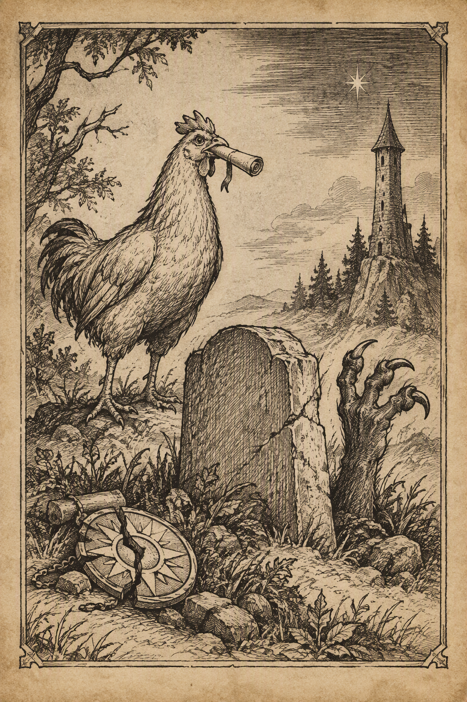{ .center-img width="40%" }

Świątynia Lathandera&nbsp;6

[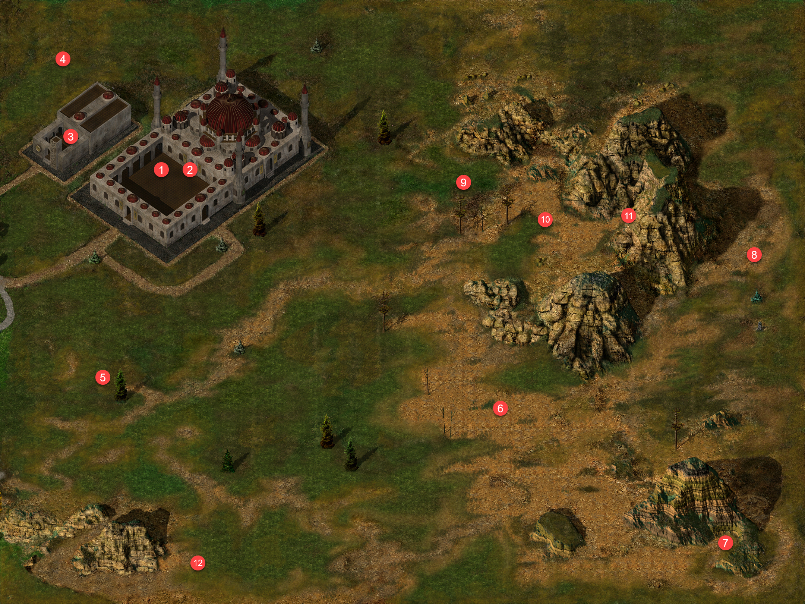{ .center-img width="40%" }](../maps/BG3400.webp)

Drużyna skierowała się prosto do *Świątyni Pieśni Poranka*. W wirydarzu 1 spotkała **Rashel**, olśniewającą kapłankę **Lathandera** odzianą w czerwoną suknię. Leech szybko przekonał się jednak, że jej serce należy całkowicie do boga i nawet najbardziej niewinny flirt nie ma większych szans z religijnym oddaniem.

**Rashel** opowiedziała za to o historii *Beregostu*. Miasto było niegdyś niewielką osadą pozostającą pod ochroną pobliskiej szkoły magii, założonej przez słynnego czarodzieja **Ulcastera**. Akademię zniszczyli magowie z *Kalimszanu*, którzy obawiali się rosnącej potęgi jej twórcy. W okolicy znajdowały się również posiadłości amnijskiego rodu **Craumerdaunów**, słynącego z hodowli szlachetnych koni cenionych w *Amnie* i *Tethyrze*. Na północnym zachodzie wznosił się natomiast *Wysoki Żywopłot*, siedziba potężnego i niezbyt gościnnego **Thalantyra**.

Wewnątrz świątyni 2 kompani spotkali **Keldatha Ormlyra**. W zamian za dotację kapłan podzielił się najnowszymi wieściami z regionu. Kryzys żelaza stale się pogłębiał: metal drożał, a wykonane z niego narzędzia i broń rdzewiały lub rozpadały się bez wyraźnej przyczyny. Większość wadliwego surowca pochodziła z kopalń w *Nashkel*, gdzie dodatkowo ginęli pracujący pod ziemią górnicy. Miejscowy kowal **Taerom Fuiruim** podejrzewał nawet, że ktoś celowo zanieczyszcza rudę. Równie źle wyglądała sytuacja na drogach. Karawana zmierzająca z *Amnu* ku *Wrotom Baldura* została doszczętnie rozbita przez współpracujących ze sobą ludzi i hobgobliny. Bandyci doskonale znali teren i bez trudu wymykali się patrolom **Płonącej Pięści**, co sugerowało, że ich kryjówka znajduje się gdzieś w okolicznych lasach. Do *Beregostu* skierowano dodatkowe oddziały najemników, ale ich obecność bardziej niepokoiła mieszkańców, niż dodawała im otuchy. Jednocześnie pogarszały się stosunki między *Amnem* a *Wrotami Baldura*. Wielcy Książęta obwiniali południowe królestwo o napady na szlakach, a *Amn* coraz ostrzej domagał się wycofania oskarżeń. Mimo narastających problemów w *Nashkel* nadal odbywał się Jarmark Świętojański. Nie było jednak wiadomo, ilu kupców i gości zdecyduje się na podróż, gdy drogi pełne były rabusiów, a żelazny miecz mógł rozpaść się przy pierwszym porządnym uderzeniu. Dla drużyny był to kolejny znak, że odpowiedzi na coraz więcej pytań czekają właśnie na południu.

**Keldath Ormlyr** wspomniał także o szaleńcu imieniem **Bassilus**, mordującym każdego, kto stanął mu na drodze. Za dostarczenie świętego symbolu kapłana **Cyrika** wyznaczono sowitą nagrodę ([BASSILUS THE MURDERER](../other/zadania.md#q24)).

W świątyni drużyna poznała również **Eloran**, praktycznie usposobioną kapłankę **Lathandera**. Poszukiwała kogoś zdolnego tropić niebezpieczne cele, zwalczać zło i działać z większą dyskrecją niż zazwyczaj wykazywała **Płonąca Pięść**. W zamian oferowała złoto, mikstury, magiczne przedmioty i doświadczenie. Pierwsze zlecenie dotyczyło nawiedzonego domu stojącego naprzeciwko *Płonącego Czarodzieja*. **Eloran** zaznaczyła, że przemoc nie zawsze jest najlepszym rozwiązaniem. Duchy często pozostają w świecie żywych z konkretnego powodu, dlatego należało najpierw ustalić pragnienie zjawy i spróbować je spełnić. Dopiero gdyby rozmowa zawiodła, można było sięgnąć po bardziej stanowcze argumenty ([AN ORDINARY HAUNTING](../other/zadania.md#q47)).

W przylegającym do świątyni westybulu 3 drużyna odnalazła **Vapulę Simberga**, odbywającego pokutę pod opieką kapłanów **Lathandera**. Były złodziej przyznał, że zdradził dawną gildię, ponieważ nie potrafił dłużej tolerować mordowania niewinnych dla kilku monet. Leech postanowił dać skruszonemu rzezimieszkowi szansę na odkupienie. **Vapula** obiecał wyruszyć na południowe trakty i pomagać potrzebującym, po czym przekazał swój wisior jako dowód rzekomej śmierci. Kontrakt mógł zostać zamknięty bez rozlewu krwi ([LIEDEL’S BOUNTY: VAPULA SIMBERG](../other/zadania.md#q41)).

Nieopodal westybulu 4 zaczepiał podróżników agresywny pijak. Zanim trafił na kogoś o mniejszej cierpliwości, drużyna wróciła z informacja o nim do **Keldatha**. Kapłan rozpoznał w awanturniku **Polusa** i obiecał się nim zająć ([DRUNK NEAR BEREGOST TEMPLE](../other/zadania.md#q48)).

Na trakcie spotkali **Ashena** 5, który rozpoznał **Sandrah** z czasów pobytu w *Waterdeep*. Sam opuścił miasto po bankructwie, pozostawiając za sobą niespłacone długi i wierzycieli. Córka zamożnego mieszkańca Miasta Wspaniałości zauważyła, że próba ukrycia się przed czujnym okiem **Helma** lub wiedzą **Elminstera** była wyjątkowo niemądrym pomysłem. Zdemaskowany dłużnik uznał więc, że najlepiej czym prędzej opuścić okolice świątyni.

Dalej drogę zagrodziła grupa hobgoblinów dowodzona przez **Cattacka** 6. Potyczka zakończyła się szybko i banda przestała zagrażać podróżnym.

Na południu 7 zbieranina śmiałków natrafiła na kamienny posąg, który po odczarowaniu okazał się łuczniczką imieniem **Corianna**. Nie była to jednak kapłanka z wizji **Sandrah**. Kobieta opowiedziała o magu podróżującym z oswojonymi bazyliszkami i wskazała, że udał się na wschód ([BASILISK PETS](../other/zadania.md#q49)).

W dalszej drodze bohaterowie natknęli się na worgi, straszliwe wilki i ich wampirycznych krewniaków 8. Najwyraźniej miejscowa fauna również postanowiła dołożyć własny wkład do listy problemów regionu.

Nieopodal spotkali **Galileusa** 9, astrologa tak pochłoniętego obserwacją nieba, że z trudem skupiał uwagę na czymkolwiek znajdującym się bliżej niż horyzont. Uczony odkrył dwie nowe gwiazdy: jedną w pasie **Mystry**, drugą zaś w konstelacji oznaczanej dawnym elfickim symbolem nadziei. Obie pojawiły się w części nieboskłonu związanej z bogami. **Galileus** nie potrafił jeszcze wyjaśnić ich znaczenia, lecz jego obliczenia wskazywały na nadchodzące wydarzenia i konflikty wielkiej wagi. Odnosił wręcz wrażenie, że same niebiosa śledzą rozwój wypadków. Zafascynowana **Finch** żałowała, że nie zabrała większej ilości pergaminu. Spotkanie uczonego gotowego mówić o gwiazdach równie długo, jak ona o książkach, było okazją zdecydowanie zbyt rzadką.

W pobliżu jaskini 11, położonej u stóp dwóch górskich grzbietów, drużyna spotkała przerażonego **Rudiera** 10. Mężczyzna ostrzegał przed potworami i fantomami kryjącymi się wewnątrz. Tak zachęcającego zaproszenia poszukiwacze przygód oczywiście nie mogli zignorować.

W nawiedzonych podziemiach nawiązali kontakt z **Torqionem**, duchem uwięzionym wraz z dwiema innymi duszami. Widmo przyznało, że za życia polowało na zło, lecz samo padło ofiarą klątwy i zostało związane z tym miejscem. Nie pragnęło już zemsty, lecz uwolnienia od niekończącej się kary. Jedyną nadzieją była broń należąca niegdyś do łowcy wampirów. **Torqion** nie wiedział, gdzie jej szukać, ale zapewnił, że miecz może zakończyć jego mękę. W zamian za pomoc obiecał wskazać ukryte w komnacie kosztowności. Wychowanek **Goriona** zgodził się poszukać oręża, odkładając decyzję o ostatecznym losie widma do czasu poznania całej prawdy ([PHANTOM EAST OF BEREGOST](../other/zadania.md#q50)).

Nad horyzontem pojawiły się pierwsze promienie świtu, dlatego zmęczona kompania wróciła do miasta.

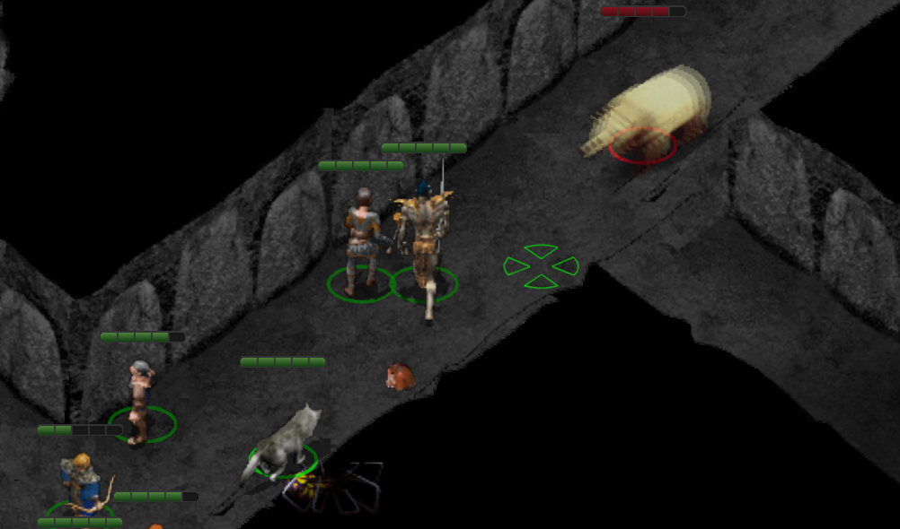{ .center-img width="40%" }

**Bestiariusz:** *Czarny niedźwiedź, Pies bojowy, Hobgoblin, Straszliwy wilk, Dziki pies, Worg, Wampiryczny wilk, Pająk miecznik, Astralny pająk fazowy, Zombie, Pająk upiór*
  

Beregost&nbsp;7

[{ .center-img width="40%" }](../maps/BG3300.webp)

W domu wskazanym przez **Eloran** 40 drużyna zastała **Malicię** i jej partnera, którzy niedawno przeprowadzili się z *Daggerford*. Poprzedni właściciel budynku zmarł, a jego żona sprzedała posiadłość i zatrzymała się w *Czerwonym Bukiecie*, przygotowując się do wyjazdu do *Wrót Baldura*. Na piętrze pozostawał jednak duch, powtarzający wciąż coś o swoich monetach.

W gospodzie 11 kompania rzeczywiście odnalazła wdowę, która przekazała im kolekcję monet należącą do zmarłego męża, chociaż pragnęła zachować ją jako pamiątkę. Przy okazji **Tulbor** napełnił pustą butelkę pozostałą po wcześniejszym śledztwie eliksirem leczniczym.

Po powrocie do domu 40 złożyli monety przy duchu a zjawa odzyskawszy swoją kolekcję spokojnie odeszła, uwalniając obecnych mieszkańców od niechcianego współlokatora. Wykonanie można będzie zgłosić **Eloran** ([AN ORDINARY HAUNTING](../other/zadania.md#q47)).

W drodze do siedziby **Oka Gorgony** 29 drużyna ponownie spotkała **Pontaga** 28. Starzec przyniósł księgę opisującą rzadkie żuki kha’samskie, występujące niegdyś pomiędzy *Waterdeep* a *Athkatlą*. Uważał, że owady nauczyły się unikać ludzi, przeskakując pomiędzy czasami, wymiarami lub cienkimi granicami rozdzielającymi plany. Posiadał przygotowaną przez druida miksturę wzmocnioną szamańską magią, która miała umożliwić zobaczenie stworzeń. Ze względu na wiek nie chciał przeprowadzać eksperymentu samotnie. Leech zgodził się mu towarzyszyć, bo opowieść o wielowymiarowych żukach wymagała przynajmniej jednego świadka, najlepiej względnie trzeźwego ([BEETLES, DREAMS AND AN OLD MAN](../other/zadania.md#q22)). Umówili się na spotkanie na południe od świątyni Lothandera.

W podziemiach gildii przekazali **Liedel** wisior **Vapuli** i odebrali nagrodę. Pozostawało mieć nadzieję, że nawrócony złodziej rzeczywiście znajdzie własną drogę i wykorzysta otrzymaną szansę ([LIEDEL’S BOUNTY: VAPULA SIMBERG](../other/zadania.md#q41)). 

Następnie umieścili spreparowaną wiadomość w beczce za *Płonącym Czarodziejem* 41. Teraz wystarczyło zaczekać do nocy i sprawdzić, kto połknie przynętę ([SHADOWS AND ECHOES](../other/zadania.md#q46)).

Świątynia Lathandera&nbsp;8

[{ .center-img width="40%" }](../maps/BG3400.webp)

Drużyna wróciła do *Świątyni Pieśni Poranka* 2, aby zdać **Eloran** raport z uwolnienia ducha. Kapłanka wynagrodziła kompanię złotem i miksturami, po czym przedstawiła kolejne zadanie ([AN ORDINARY HAUNTING](../other/zadania.md#q47)).

Na szlaku pomiędzy *Beregostem* a *Pomocną Dłonią* zaczęli znikać podróżni. Początkowo podejrzewano bandytów, lecz jedyny ocalały wskazał na wyznawcę **Malara**, krwawego boga łowów. Malarzyci wierzyli, że przeżyć powinni wyłącznie najsilniejsi, a przemoc uznawali za jedyny naprawdę zrozumiały język. **Eloran** poleciła odnaleźć sprawcę na *Drodze Wybrzeża*. Jego kryjówka mogła znajdować się w najbardziej wysuniętych na południe klifach. Choć **Lathander** nauczał o odkupieniu, kapłanka przypomniała, że przemiana wymaga woli winowajcy, a niewinni nie mogą ginąć podczas oczekiwania na cud ([HUNTING THE HUNTSMAN](../other/zadania.md#q51)).

Na południe od świątyni drużyna odnalazła **Pontaga** 12. Leech zgodził się wypróbować przygotowany przez niego eliksir. Po chwili świat zaczął falować, a przed oczami młodego gnoma pojawił się olbrzymi żuk, równie realny jak drzewa i starzec stojący obok.

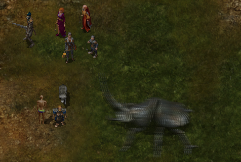{ .center-img width="50%" }

Wizja szybko minęła, pozostawiając bohatera oszołomionego i niezbyt przekonanego. **Pontag** twierdził, że widział dokładnie to samo, lecz jego towarzysz podejrzewał raczej działanie mikstury połączone z siłą sugestii. Starzec poprosił o kolejne spotkanie w *Beregostcie*, gdy opracuje następny sposób na udowodnienie swojej teorii ([BEETLES, DREAMS AND AN OLD MAN](../other/zadania.md#q22)).

Czekając na zmierzch i możliwość schwytania zdrajcy, kompania wyruszyła na *Nadrzeżny Trakt*, aby odnaleźć mordercę wspomnianego przez **Eloran**.

Nadbrzeżny Trakt&nbsp;9

[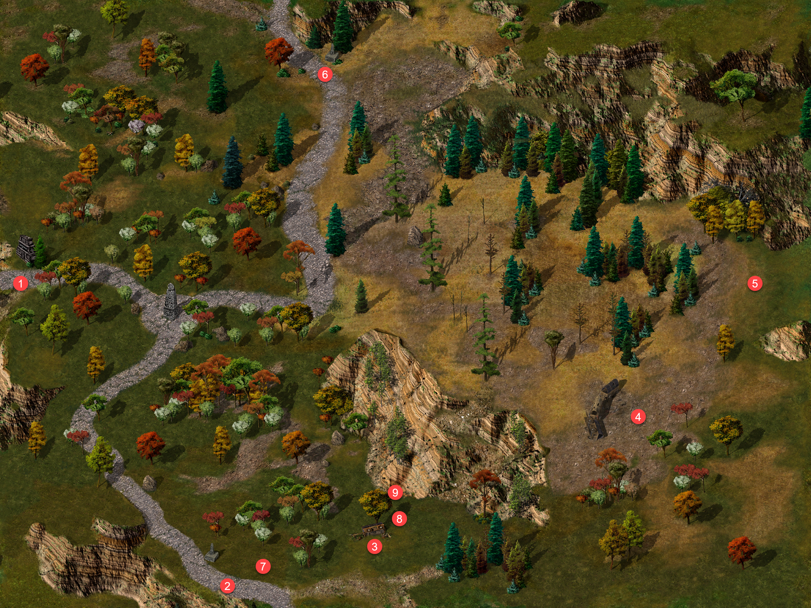{ .center-img width="40%" }](../maps/BG2800.webp)

Za dnia spotkali małego **Jase’a** 7, wystraszonego świadka napadu na karawanę. Nie udało się go uspokoić i chłopiec uciekł, zanim zdołali uzyskać więcej informacji.

Przy rozbitej karawanie 8 pojawił się poszukiwany wyznawca **Malara**. Zadrwił z drużyny, po czym zniknął za pobliskim drzewem. Ślady doprowadziły do wejścia ukrytego pod darnią 9.

W ciemnych tunelach na wędrowców rzuciły się olbrzymie pająki. Prąc naprzód, dotarli jednak do malarity i ostatecznie położyli kres jego polowaniom ([HUNTING THE HUNTSMAN](../other/zadania.md#q51)).

Przy ciele znaleźli pierścień wykonany podobno z pazura jednej z ulubionych bestii Władcy Zwierząt. Przedmiot cuchnął krwią i lekko pulsował pod dotykiem. Dzika magia zapewniała właścicielowi skrytość i zaciekłość drapieżnika, lecz osłabiała rozsądek oraz zdolność obcowania z innymi.
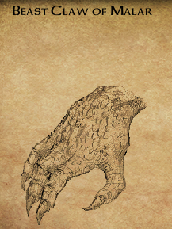{ .center-img width="25%" }

Podczas dalszej drogi **Neera** wyznała, że odkąd dołączyła do drużyny, jej życie stało się zaskakująco łatwiejsze. Po raz pierwszy od dawna nie musiała zasypiać z obawą, że kolejny pościg zmusi ją do ucieczki albo kobold poderżnie jej gardło. Adeptka Dzikiej Magii opowiedziała również o dzieciństwie w *Wysokim Lesie*. Nigdy nie była pilną uczennicą i często lekceważyła ćwiczenia. Podczas jednego z treningów miała przywołać kulę ognia, lecz magia wymknęła się spod kontroli. Dwie osoby zostały ranne, a przerażona dziewczyna uciekła, zamiast stawić czoła konsekwencjom. Przez pewien czas ukrywała się w lesie, kradnąc jedzenie i pozostawiając rodzicom krótkie wiadomości. Ostatecznie opuściła rodzinne strony i po wielu niefortunnych decyzjach zwróciła na siebie uwagę Thayan. Leech zapewnił, że nie zamierza jej osądzać. Każdy mógł spanikować, gdy lekcja magii nagle zamieniała się w płonące pobojowisko. **Neera** nadal nie wiedziała, dokąd prowadzi jej droga, lecz cieszyła się, że nie musi już przemierzać jej samotnie. Opowieść przekonała drużynę, aby odwiedzić miejsce bliskie młodej czarodziejce.

**Bestiariusz:** *Olbrzymi pająk*

Wysoki Żywopłot&nbsp;10

[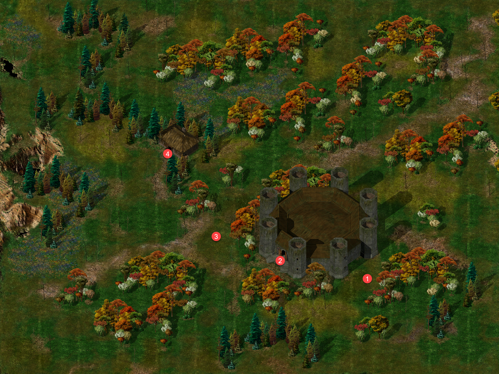{ .center-img width="40%" }](../maps/BG3200.webp)

Podczas marszu **Jen’lig** poprosiła o zwykły srebrny naszyjnik znajdujący się w torbie podróżnej. Astralna wojowniczka przekształciła go następnie w magiczną ochronę przeciwko łupieżcom umysłu. W przypadku *githyanki* nawet niewinna biżuteria mogła więc stać się narzędziem do walki ze śmiertelnym wrogiem jej ludu.

Po wschodniej stronie obwarowań siedziby maga 1 grupę zaatakowały gnolle. Przy ich rzeczach znaleziono krótki miecz skradziony **Perdue’owi** ([PERDUE’S SHORT SWORD](../other/zadania.md#q23)).

Na schodach prowadzących do posiadłości 2 czekała zdesperowana **Aiwell**. Jej mąż **Tonder** został zaatakowany przez wielką bestię podczas wędrówki po wzgórzach. **Thalantyr** uratował go przed pożarciem, lecz rany okazały się niezwykłe. Stan mężczyzny stale się pogarszał, aż dwie noce wcześniej przemienił się na oczach żony w wilkołaka. **Aiwell** błagała maga o przygotowanie lekarstwa, ale dotąd nie została wysłuchana. Poruszona **Neera** obiecała pomóc w przekonaniu czarodzieja. Kobieta przyznała, że jeśli wszystkie próby zawiodą, może nie pozostać inne wyjście niż zabicie przemienionego męża. Prosiła jednak, aby najpierw wykorzystać każdą szansę jego ocalenia ([OF WOLVES AND MEN](../other/zadania.md#q52)).

Nieopodal 3 drużyna spotkała **Permidiona Starka**, złodzieja planującego „największy skok wszech czasów”. Celem był **Thalantyr** i jego pokaźna kolekcja magicznych przedmiotów. Problem stanowiły monstrualne bestie pilnujące posiadłości, zbyt silne do pokonania w bezpośredniej walce. **Permidion** podejrzewał, że strażników można przechytrzyć lub odciągnąć, lecz nie wiedział jak. Zasugerował poszukanie informacji w pobliskiej wiosce niziołków. **Imoen** i **Jen’lig** nie szczędziły mu przy tym złośliwości, skutecznie zakłócając jego genialny tok myślenia. Sprawę warto było jednak zapamiętać. Jeśli niziołki znały słabość bestii, kolekcja maga mogła kiedyś zmienić właściciela.

W domu **Aiwell** 4 rzeczywiście przebywał wilkołak. **Tonder** nie zaatakował przybyszów, dlatego szybko opuścili izbę. Zamierzali wrócić dopiero po zdobyciu lekarstwa.

W siedzibie **Thalantyra** 2 drużynę powitano z właściwą magowi uprzejmością, czyli sugestią natychmiastowego odejścia. Opryskliwy czarodziej zmienił jednak ton, gdy rozpoznał **Sandrah**, najwyraźniej przypominającą mu kogoś z przeszłości. Kapłanka opowiedziała o **Aiwell** i przemienionym **Tonderze**. **Thalantyr** mógł przygotować lekarstwo, lecz potrzebował jednego z trzech składników: belladonny, jagody Gurila albo krwi osoby szczerze kochanej przez wilkołaka. Działanie belladonny było potwierdzone, natomiast pozostałe metody znał jedynie z opowieści. Istniało też rozwiązanie mniej miłosierne: zabicie **Tondera** i dostarczenie jego zwłok do badań. Z powodu ograniczonych zapasów mag mógł przygotować tylko jedną miksturę. Leech postanowił najpierw poszukać belladonny. Zabijanie zawsze można było zostawić na później, zwłaszcza gdy pacjent miał kły, pazury i wyraźnie gorsze maniery po zmroku ([OF WOLVES AND MEN](../other/zadania.md#q52)).

Siedziby maga strzegły dwa golemy z ciała. Podczas oględzin posiadłości **Imoen** odnalazła w szczelinie podłogi kamień strażniczy, którego podniesienie odsłoniło portal prowadzący do prywatnych komnat czarodzieja ([SNOOPING AROUND](../other/zadania.md#q53)). W kufrach znajdowało się kilka interesujących przedmiotów, w tym futro zimowego wilka. Najbardziej niezwykłym znaleziskiem okazał się jednak rozmowny regał, który stanowczo zaprotestował przeciwko dotykaniu bez pozwolenia.

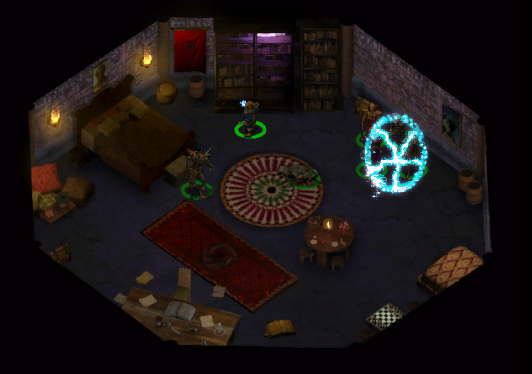{ .center-img width="45%" }

Mebel narzekał na **Thalantyra**, ponieważ mag przeglądał księgi suchymi dłońmi i ignorował prośby o używanie kremu ochronnego. Obrażony regał postanowił nie informować gospodarza o obecności intruzów. Poprosił za to o odnalezienie trzynastego tomu „Historii Cienistej Doliny”. Będąc zagorzałym miłośnikiem historii i podobno całkiem szlachetnym drzewem, bardzo pragnął odzyskać brakującą część kolekcji. W zamian obiecał przekazać coś pożytecznego i poprosił, aby nie budzić go przed zdobyciem księgi ([BIBLIOPHILIA](../other/zadania.md#q54)).

Przed opuszczeniem posiadłości drużyna otrzymała od **Aiwell** fiolkę jej krwi. Posiadali już dwa potencjalne składniki lekarstwa, ale nadal woleli odnaleźć belladonnę i nie ryzykować życia **Tondera** na podstawie niepotwierdzonych opowieści ([OF WOLVES AND MEN](../other/zadania.md#q52)).

W drodze powrotnej **Sandrah** zainteresowała się sztyletem znalezionym przy ciele **Goriona**. Na rękojeści wygrawerowano literę „A”, która nie pasowała do imienia przybranego ojca. Leech widywał tę broń niemal codziennie, lecz nigdy wcześniej nie zastanawiał się nad znaczeniem inicjału. Znawczyni dawnych przedmiotów zauważyła, że ostrze jest bardzo stare. **Gorion** prawdopodobnie otrzymał je w darze i zachował jako pamiątkę lub dziedzictwo. Litera „A” pozostawała kolejną zagadką związaną z jego przeszłością, a niepozorna broń mogła skrywać więcej, niż dotąd przypuszczano ([GORION’S DAGGER](../other/zadania.md#q8)).

Zbliżała się północ. Nadszedł czas powrotu do *Beregostu* i schwytania zdrajcy.

**Bestiariusz:** *Gnoll, Gnoll rozpruwacz, Gnoll weteran, Dzik, Dziki pies, Ghul, Wielki pająk, Szkielet, Golem z ciała*

Beregost&nbsp;11

[{ .center-img width="40%" }](../maps/BG3300.webp)

Spreparowana wiadomość zniknęła z beczki za *Płonącym Czarodziejem* 41. Drużyna udała się więc do południowej fontanny, gdzie wyznaczono miejsce spotkania 19. W cieniu niedaleko **Magnusa** czekała **Valera**.

Złodziejka należała do **Oka Gorgony**, lecz równocześnie przekazywała informacje Straży Miejskiej. Przyłapana na gorącym uczynku przyznała, że skusiły ją pieniądze i obietnica lepszej przyszłości. Próbowała jednak kupić wolność wiadomościami o planowanych działaniach strażników. Leech postanowił poręczyć za nią przed **Arioshem**, zastrzegając, że ostateczna decyzja będzie należała do informatora gildii. **Valera** zgodziła się wrócić z kompanią do podziemi, lecz ostrzegła, że w razie zdrady potrafi odpowiedzieć pięknym za nadobne.

Przed **Arioshem** 29 zdrajczyni ujawniła, że Straż Miejska przygotowuje szeroko zakrojoną obławę, a do miasta zmierza ktoś ważny z *Wrót Baldura*. Wieści miały pochodzić bezpośrednio od **Seraphiny Whitewood**. Mimo wartości informacji **Ariosh** uznał, że **Oko Gorgony** nie może pozostawiać darować zdrady. Wyrok wykonał **Blackthorn**, kończąc sprawę szybko i bez zbędnych słów. Informator pochwalił skuteczność Leecha oraz decyzję o przyjęciu najemnika do gildii. **Valera** zabrała swoje sekrety do grobu, ale jej ostrzeżenie przed nadchodzącą obławą mogło jeszcze okazać się prawdziwe ([SHADOWS AND ECHOES](../other/zadania.md#q46)).

Przy wyjściu z podziemi drużyna ponownie spotkała **Pontaga** 28. Starzec był rozczarowany wynikiem wspólnego eksperymentu i sam nie wiedział już, czy widzieli prawdziwego żuka, czy jedynie zbiorową halucynację. Nie zamierzał się jednak poddawać. Poprosił, aby Leech wrócił za kilka dni, gdy przygotuje kolejną próbę ([BEETLES, DREAMS AND AN OLD MAN](../other/zadania.md#q22)).

Po interwencji **Ileny** drużyna ponownie odwiedziła **Amriusa** w *Płonącym Czarodzieju* 12. Mężczyzna przyznał, że jej argumenty skłoniły go do przemyślenia sytuacji. Nadal uważał **Aishę** za trudną i nieprzewidywalną, ale zrozumiał, że wyznaczenie nagrody za jej głowę niczego nie rozwiąże. Ostatecznie wycofał kontrakt bez żądania tysiąca sztuk złota. Nie był pewien, czy podejmuje właściwą decyzję, lecz uznał, że lepiej pozwolić emocjom opaść, niż dalej podsycać konflikt ([LIEDEL’S BOUNTY: AISHA](../other/zadania.md#q42)).

Następnie kompania udała się do *Czerwonego Bukietu* 11, gdzie zwróciła **Perdue’owi** odzyskany miecz ([PERDUE’S SHORT SWORD](../other/zadania.md#q23)). Na piętrze przekazali **Aishy**, że to rozmowa **Ileny** przekonała **Amriusa** do wycofania nagrody. Zamiast przyjąć wiadomość z ulgą, kobieta uznała ją za kolejne upokorzenie. W jej pokrętnej interpretacji sam kontrakt świadczył o tym, że wciąż zajmowała ważne miejsce w myślach dawnego kochanka, a jego odwołanie oznaczało, że **Ilena** całkowicie ją zastąpiła. Hmm, fatalne zauroczenie. **Neera** i **Imoen** próbowały przemówić jej do rozsądku, lecz rozżalona kobieta nie chciała słuchać. Zapowiedziała, że osobiście odnajdzie **Amriusa** oraz **Ilenę** i pokaże im, że nie można jej tak łatwo odsunąć. Sprawa, która miała zakończyć się cofnięciem kontraktu, najwyraźniej zmierzała ku kolejnemu wybuchowi.

**Liedel** przyjął wiadomość o odwołaniu zlecenia, ale odmówił wypłaty nagrody. Uznał, że młody dowódca zbyt mocno zaangażował się w osobiste problemy celu, zamiast po prostu wykonać kontrakt ([LIEDEL’S BOUNTY: AISHA](../other/zadania.md#q42)).

Po zamknięciu najpilniejszych spraw w mieście drużyna wyruszyła do *Czerwonych Jarów*, aby rozprawić się z **Bassilusem**.

Czerwone Jary&nbsp;12

[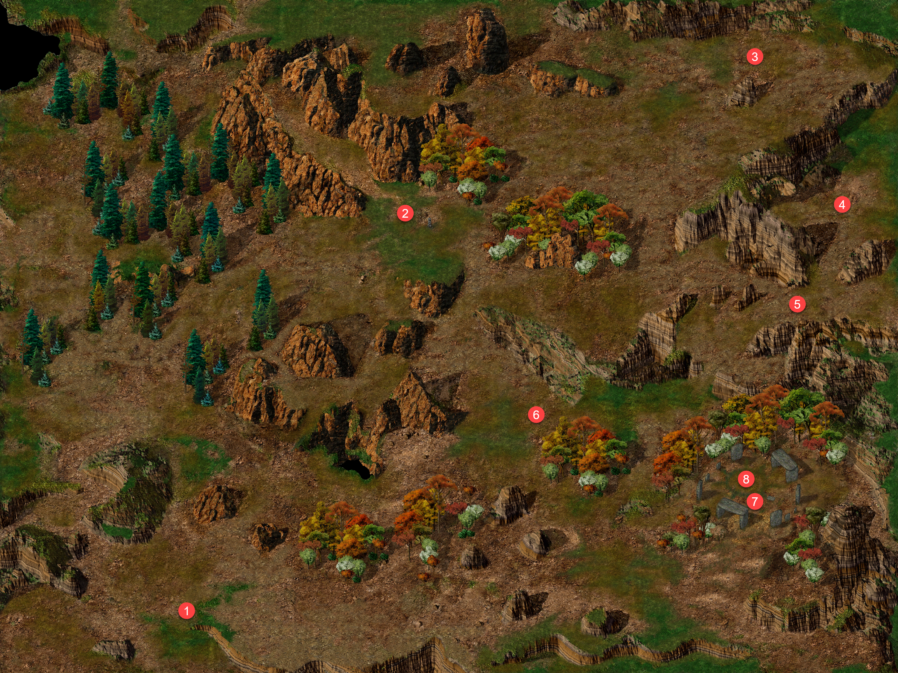{ .center-img width="40%" }](../maps/BG3700.webp)

Na szlaku spotkali posłańca **Rogera** 1, który nie miał czasu na dłuższą rozmowę. Niezależnie od deszczu, goblinów i innych zagrożeń musiał dostarczyć ważną wiadomość. *Amn* coraz ostrzej reagował na oskarżenia o przygotowywanie inwazji i domagał się od Wielkich Książąt *Wrót Baldura* oficjalnego zadośćuczynienia. Napięcie pomiędzy północą a południem rosło równie szybko jak kryzys żelaza. Nieopodal **Kissiq** 2 opowiadał o gadającym kurczaku widzianym w północnej części doliny. Brzmiało to jak kolejna bzdura zasłyszana po kilku kuflach, lecz tym razem historia okazała się prawdziwa.

Drużyna odnalazła **Melicampa** 3, ucznia **Thalantyra** przemienionego w kurczaka. Niefortunny mag przyznał, że popełnił błąd podczas rzucania zaklęcia polimorfii i nie potrafi przywrócić własnej postaci. Mimo gdakania i kilku żartów **Sandrah**, która znała pechowego czarodzieja, szybko zrozumiała, że sytuacja wymaga pomocy. Jedyną osobą zdolną odwrócić przemianę był jego dawny mistrz, chociaż relacje ucznia z opryskliwym magiem pozostawiały wiele do życzenia. Kompania zgodziła się zanieść pierzastego pechowca do *Wysokiego Żywopłotu*. Leech schował **Melicampa** do plecaka, mając nadzieję, że po drodze nikt nie pomyli czarodzieja z zapasem na kolację ([LIEDEL’S BOUNTY: AISHA](../other/zadania.md#q55)).

W jednej z dolin 4 swój kram rozłożył wędrowny kupiec **Trungle**. Miał w ofercie kilka ciekawych przedmiotów, a możliwość dokonania zakupów bez konieczności wracania do miasta była zawsze mile widziana.

Podczas marszu Leech spróbował lepiej poznać nieśmiałą **Finch**. Kapłanka opowiedziała, że dorastała w licznej i hałaśliwej rodzinie gnomów w *Waterdeep*, niedaleko nabrzeża. Sama zawsze pozostawała na uboczu, znacznie lepiej czując się w ciszy biblioteki niż w centrum rodzinnego zamieszania. Jej droga do kapłaństwa rozpoczęła się przypadkowo. Jako głodna młódka kręciła się przy Wielkiej Bibliotece, gdzie spłoszyła konie ciągnące powóz i została przez nie poturbowana. Miłosierny kaligraf zabrał ranną dziewczynę do kapłanów **Deneira**, którzy ją wyleczyli, nakarmili i pozwolili czytać opowieści z całego świata. Wtedy zrozumiała, że odnalazła własne miejsce. **Finch** marzyła o założeniu biblioteki w *Nashkel*. Poszukiwała książek dla dzieci, opracowań o górnictwie i historii regionu, książek kucharskich oraz lekkich romansów pozwalających choć na chwilę zapomnieć o trudach codzienności. Jej ulubionym autorem pozostawał **Frienderik Boscoe**, twórca „Grzechów cielesnego golema”, którego uważała za największego pisarza wśród gnomów. Przyznała również, że lubi oglądać taniec i akrobatykę. Wyraźnie zaczynała czuć się swobodniej w towarzystwie drugiego gnoma, lecz Leech postanowił nie męczyć skromnej bibliotekarki kolejnymi pytaniami i pozwolił jej wrócić do ukochanych ksiąg.

Dalej spotkali chłopca imieniem **Footy** 5, który podglądał **Bassilusa** oraz ożywione zwłoki jego „rodziny”. Szaleństwo kapłana wyraźnie odcisnęło piętno na dziecku. **Footy** uciekł, aby opowiedzieć o wszystkim swojej przyjaciółce **Netty**, której rodzice mogli należeć do ofiar mordercy.

Następnie naszych podróżników zaatakowali **Zargal**, **Geltik** i **Malkax** 6, wspierani przez dwa potężne ettiny. Walka była ciężka, ale współpraca drużyny przyniosła efekty. Kolejna banda przekonała się, że próba ograbienia coraz liczniejszej kompanii była inwestycją o wyjątkowo słabym zwrocie.

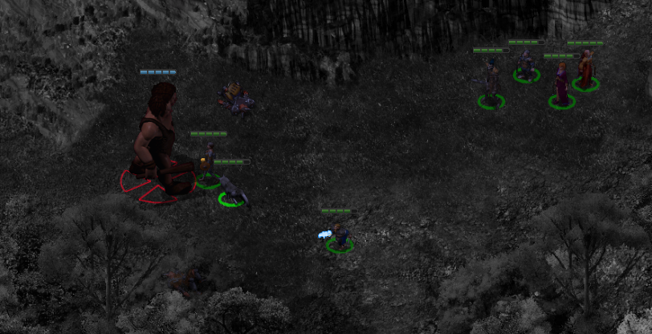{ .center-img width="55%" }

Wreszcie dotarli do starożytnego miejsca kultu, gdzie **Bassilus** 7 otaczał się szkieletami i zombie, zwracając się do nich jak do własnej rodziny. Leech wykorzystał jego obłęd i sprowokował nieumarłych do odwrócenia się od swego pana. Pozbawiony makabrycznego orszaku kapłan **Cyrika** nie zdołał oprzeć się całej drużynie. Przy jego zwłokach znaleziono święty symbol boga kłamstw, który należało dostarczyć do świątyni w *Beregostcie* ([BASSILUS THE MURDERER](../other/zadania.md#q24)).

Pierścień otrzymany od **Mal’meta Bloomducka** przypomniał wtedy o swoim istnieniu, ujawniając fioletowy portal 8. Po przejściu na drugą stronę drużyna znalazła się wewnątrz odizolowanej sfery, gdzie w skalnej niszy spoczywał poszukiwany artefakt. Gdy tylko podniesiono sferę, z ukrycia wypełzły cztery ochrowe galaretowce. Po krótkim, lepkim i zdecydowanie mało eleganckim starciu kompania zdobyła pierwszy z czterech przedmiotów potrzebnych uczonemu ([CIRLES OF INTEREST](../other/zadania.md#q16)).

Z gadającym kurczakiem w plecaku oraz pierwszą magiczną sferą w ekwipunku bohaterowie ruszyli ponownie do **Thalantyra**.

**Bestiariusz:** *Szkielet, Wilk, Hobgoblin, Elita hobgoblinów, Ghul, Ghast, Zombie, Ettin, Ochrowy galaretowiec*

Na szlaku

W drodze do *Wysokiego Żywopłotu* spotykamy na szlaku martwego jelenia, który okazał się być nieumarłym a po chwili dołączyły do niego inne zombie. Nigdy nie słyszano aby jelenie były podatne.

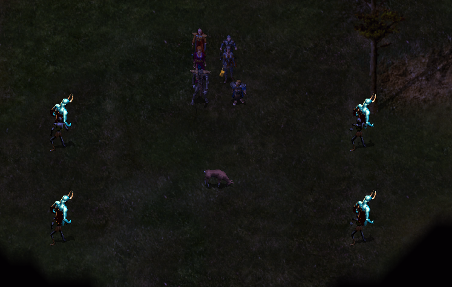{ .center-img width="55%" }