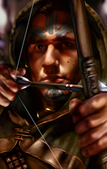
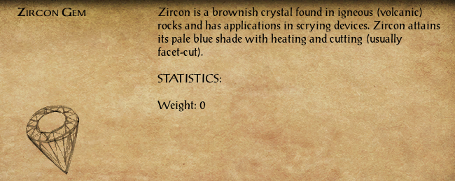
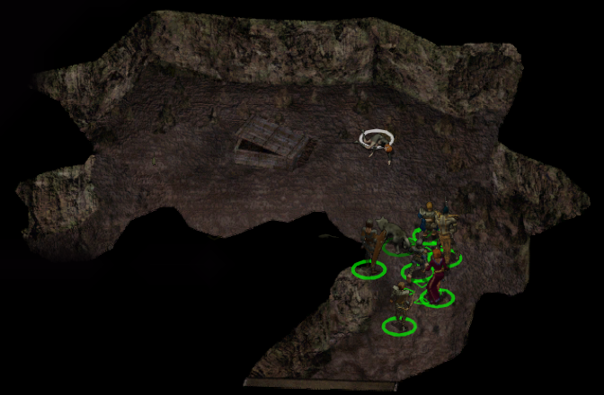
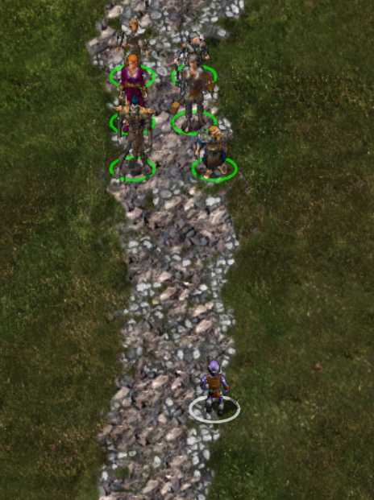
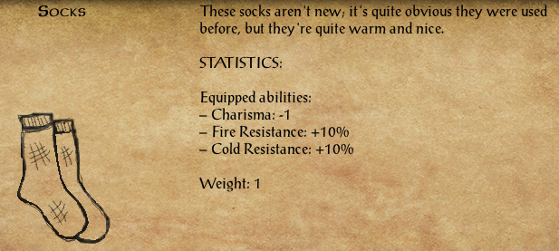

Wysoki Żywopłot&nbsp;13

[{ .center-img width="40%" }](../maps/BG3200.webp)

Po dotarciu do *Wysokiego Żywopłotu* 2 drużyna przedstawiła **Thalantyrowi** gadającego kurczaka. Mag natychmiast rozpoznał w nim **Melicampa**, choć stanowczo zaprzeczył, jakoby niefortunny czarodziej nadal był jego uczniem. Okazało się, że młodzieniec nie tyle studiował magię, ile podkradał mistrzowi wiedzę, składniki i magiczne przedmioty, po czym majstrował przy zaklęciach zdecydowanie przekraczających jego umiejętności. Źródłem przemiany były skradzione, przeklęte karwasze. **Melicamp** próbował przyspieszyć ich działanie własnymi modyfikacjami i skończył jako drób. **Thalantyr** nie mógł po prostu odwrócić zaklęcia, ponieważ klątwa miała zbyt niestabilną naturę. Do rytuału potrzebował czaszki nieumarłego stworzenia, która miała dostarczyć niezbędnego pierwiastka śmierci. Uprzedził przy tym uczciwie, że eksperyment może uratować ucznia albo zabić wszystkich uczestników. Magia najwyraźniej nie uznawała ani gwarancji, ani zwrotów. 

Szczęśliwie drużyna miała przy sobie czaszkę zabraną po jednej z wcześniejszych walk ze szkieletami. Rytuał zakończył się pomyślnie i **Melicamp** odzyskał własne ciało, zachowując komplet kończyn i tracąc większość pierza. Uradowany młodzieniec rzucił się **Sandrah** na szyję i pocałował ją w podzięce. Kapłanka odwzajemniła uścisk, lecz ostrzegła dawnego znajomego, że nie zamierza ponownie ratować go przed skutkami kolejnego nieprzemyślanego eksperymentu ([Melicamp the Chicken](../other/zadania.md#q55)). :material-trending-up: **Reputacja +1**

Na tym sprawa nie dobiegła końca. Przeklęte karwasze zniknęły i mogły trafić w ręce kolejnego nieszczęśnika. **Thalantyr** poprosił Leecha o pomoc w ich odnalezieniu i zniszczeniu. Aby ustalić położenie przedmiotu, należało zbudować magiczne urządzenie wspomagające wróżenie. Czarodziej przekazał więc **Melicampowi** wiadomość dla **Taeroma Fuiruima** z *Beregostu*, który miał przygotować mechaniczną część konstrukcji. Do jej ukończenia potrzebne były również kamienie szlachetne. Najlepiej nadawały się czarne perły, cenione przy tworzeniu narzędzi jasnowidzenia, lecz inne odpowiednio dobrane klejnoty mogły dodatkowo wzmocnić skuteczność urządzenia. Pozostawało ustalić, które kamienie będą użyteczne, zebrać materiały i odnaleźć karwasze, zanim ich klątwa spadnie na kolejną ofiarę ([Destroy the Cursed Bracers](../other/zadania.md#q56)).

Wśród drzew drużyna natknęła się na samotnego elfa. **Kivan** początkowo odniósł się do przybyszów z wyraźną rezerwą, dziwiąc się, co mieszkańcy miast robią tak daleko od cywilizacji. Gdy jednak usłyszał, że kompania również poluje na bandytów nękających okolicę, dostrzegł niezwykły zbieg interesów. Elf od wielu miesięcy tropił tę samą grupę, kierowany osobistą zemstą. Jej przywódca, półogr **Tazok**, odebrał życie komuś bardzo mu bliskiemu. Wspólny wróg okazał się wystarczającym powodem do współpracy, dlatego łucznik zaproponował połączenie sił. Leech chętnie przystał na tę propozycję. Doświadczony tropiciel mógł znacznie przyspieszyć odnalezienie bandytów, a dla **Kivana** wspólna wyprawa stanowiła kolejną szansę na dopadnięcie **Tazoka** i jego ludzi ([Kivan and Tazok](../other/zadania.md#q57)).

# Kivan

Elf · Łucznik · Chaotyczny Dobry

> **Kivan** pochodził z lasów Shilmisty, choć od dawna nie nazywał już tego miejsca swoim domem. Od lat przemierzał Wybrzeże Mieczy, kierowany jednym celem, który stopniowo przerodził się w obsesję: zemstą. Dawno temu podróżował wraz ze swoją ukochaną **Deherianą**, gdy oboje wpadli w zasadzkę bandytów dowodzonych przez półogra **Tazoka**. Schwytani i poddani okrutnym torturom, zostali rozdzieleni przez los. Kivan zdołał ujść z życiem, lecz Deheriana nie miała tyle szczęścia. Od tamtej pory elf poświęcił się pościgowi za odpowiedzialnymi za jej śmierć, nie pozwalając sobie na spokój ani zapomnienie. Małomówny i zdystansowany, rzadko dopuszcza innych do siebie, a nowe znajomości traktuje z ostrożnością. Leech szybko odniósł wrażenie, że **Kivan** nie zazna prawdziwej ulgi, dopóki nie dopadnie tych, którzy odebrali mu ukochaną.

Przyjęcie nowego towarzysza oznaczało konieczność ponownego uporządkowania składu drużyny. **Neera** zgodziła się tymczasowo wrócić do *Pomocnej Dłoni* i oczekiwać tam na dalsze wieści.

:material-account-group: **Pozostawieni NPC:** *Neera* (Pomocna Dłoń)

Pierwsza dłuższa rozmowa między **Kivanem** a **Jen’lig** szybko zeszła na temat utraty bliskich oraz różnic dzielących elfy i githyanki. Łucznik bez wahania przyznał, że napędza go nienawiść podsycana śmiercią **Deheriany**. Astralna wojowniczka wyjaśniła natomiast, że w kulturze jej ludu romantyczna miłość nie odgrywa takiej roli jak wśród elfów. Najwyższymi wartościami pozostają lojalność wobec królowej, własnej rasy oraz powierzonego obowiązku. **Kivan** nie potrafił zaakceptować tego spojrzenia. Uważał, że zdolność do miłości odróżnia rozumne istoty od bezmyślnych bestii, dlatego zaczął postrzegać **Jen’lig** jako osobę pozbawioną czegoś fundamentalnie ważnego. Przybyszka z Planu Astralnego przyjęła tę ocenę z właściwą sobie cierpką dumą. Mimo wzajemnych uszczypliwości rozmowa zeszła później na bardziej przyziemne sprawy. Elf zauważył, że choć githyanki jest oczytana i inteligentna, nie wygląda na osobę szczególnie przyzwyczajoną do tropienia zwierzyny, wielodniowych marszów i spania pod gołym niebem. Leech przypomniał wtedy żartobliwie, że drużyna podróżuje skromnie nie ze względu na umiłowanie dzikiej przyrody, lecz głównie z braku pieniędzy. Na zakończenie **Kivan** zdradził odrobinę swojej bardziej romantycznej natury. Wyraził nadzieję, że pewnego dnia jego towarzysze przestaną patrzeć wyłącznie pod nogi i dostrzegą także piękno gwiazd ponad nimi.

Podczas dalszej wędrówki **Sandrah** podzieliła się informacjami odnalezionymi w księdze poświęconej przeklętemu wampirycznemu ostrzu poszukiwanemu przez **Torgiona**. Broń została stworzona przez wampiry jako pułapka. Wysysała siły życiowe właściciela, uzależniała go od siebie i z czasem nieuchronnie prowadziła do jego zguby. Nie znali jeszcze obecnego miejsca spoczynku ostrza, ale zachowane wskazówki sugerowały, że należy go szukać w bardzo starych ruinach rozsianych po *Wybrzeżu Mieczy*. Był to trop mało precyzyjny, lecz przynajmniej zawężał poszukiwania do ruin, których na szlaku zaczynało pojawiać się podejrzanie wiele.

Rozmowa zeszła później na bardziej osobiste tematy. **Sandrah** wyjaśniła, że mimo związku z **Mystrą** wybrała drogę kapłanki i uzdrowicielki zamiast klasycznego szkolenia maga. Leech słuchał jej z autentycznym zainteresowaniem, a swobodne rozmowy coraz częściej przeplatały się z ostrożnym flirtem. Młoda kapłanka przyznała również, że z **Imoen** łączy ją wiele wspólnych cech, ale to właśnie różnice pozwalają im się wzajemnie uzupełniać. Podróż przestawała być wyłącznie wędrówką ku kolejnym zadaniom. Stawała się także okazją do zacieśniania więzi pomiędzy coraz bardziej różnorodnymi członkami kompanii.

Podczas kolejnej rozmowy **Jen’lig** zdradziła Leechowi więcej szczegółów na temat swojego ludu. Githyanki wywodzili się z rasy niewolników illithidów i od pokoleń prowadzili nieustanną wojnę zarówno z dawnymi ciemiężycielami, jak i z githzerai. Najważniejsze były dla nich obowiązek, wojskowa hierarchia oraz lojalność wobec królowej **Vlaakith** i własnej rasy. Tradycyjna rodzina miała niewielkie znaczenie, ponieważ młodzi githyanki wychowywali się wspólnie w wylęgarniach, a najsilniejsze więzi tworzyli poprzez służbę oraz wspólną walkę. Astralna wojowniczka przyznała również, że zbyt wybitni wojownicy często kończą jako ofiary samej **Vlaakith**, która pochłania ich dusze, aby wzmacniać własną potęgę. Niewiele powiedziała natomiast o swojej obecnej misji na Planie Materialnym. Dała jedynie do zrozumienia, że zadanie jest ważne dla całego jej ludu i nie może zostać porzucone. Leech coraz wyraźniej dostrzegał, że pod wojskową dyscypliną i brutalną bezpośredniością **Jen’lig** skrywa znacznie więcej, niż jest gotowa ujawnić. Nie naciskał. W kompanii i tak znajdowało się już wystarczająco wiele sekretów, by obdzielić nimi kilka gildii złodziei.

Nadszedł czas, aby opuścić *Wysoki Żywopłot* i ruszyć na południe od *Beregostu*.

**Bestiariusz:** *gnoll, szkielet*

Dzicze Beregostu&nbsp;14

[{ .center-img width="40%" }](../maps/BG3200.webp)

Drużyna rszyła na południe, lecz spokojny marsz nie trwał długo. Na szlaku drogę zastąpiły dwa ogrillony 1. Przy ich ciałach znaleziono list od **Roe**, męża **Mirianne**. Z treści wynikało, że mężczyzna szczęśliwie dotarł do *Amnu*, czego nie można było powiedzieć o posłańcu niosącym wiadomość. List należało zwrócić zatroskanej żonie podczas kolejnej wizyty w *Beregostcie* ([Mirriane's Husband](../other/zadania.md#q32)).

Wśród rzeczy ogrillonów znajdował się także cyrkon. Kamień mógł zostać wykorzystany w urządzeniu namierzającym przeklęte karwasze. Do ukończenia kompletu pozostawało odnaleźć jeszcze dwa odpowiednie klejnoty ([Destroy the Cursed Bracers](../other/zadania.md#q56)).

{ .center-img width="60%" }

Nieopodal jeziora z częściowo zatopionym domem, w niewielkiej dziupli starego drzewa 2, znaleziono klucz. Nie pasował do żadnego z posiadanych zamków, dlatego jego przeznaczenie pozostawało tajemnicą. Jak zwykle zagadka mogła okazać się początkiem przygody albo tylko zapowiedzią kolejnej skrzyni, której nikt nie będzie pamiętał za kilkanaście dni.

Już z oddali podróżnicy usłyszeli płacz dziecka 3. Na polanie odnaleźli małą **Kessy**, która zgubiła ukochanego królika. Pozostawało ustalić, co dziecko robiło samotnie pośród dziczy, ale najpierw wypadało odnaleźć zaginione zwierzątko ([The Quest for Jumper](../other/zadania.md#q58)).

Na trakcie kompania spotkała **Buba Snikketa** 4, miejscowego łowcę ostrzegającego przed ogrami kręcącymi się w pobliżu. Zapytany o kryzys żelaza odparł, że nie interesują go polityczne spory ani płonące karawany. Metal nie był mu potrzebny ani do polowania, ani do zabijania, a całą tę „ognistą kupę śmieci” najchętniej rzuciłby krukom. Przed odejściem **Bub** poradził jedynie trzymać broń w gotowości. Ogry były blisko, a w przeciwieństwie do wielkiej polityki znacznie łatwiej dawały się wyczuć.

Jego ostrzeżenie szybko się potwierdziło. Przy szlaku drużyna spotkała ogra imieniem **Ugh** 5, który ku zaskoczeniu wszystkich nie rzucił się do ataku. Olbrzym opiekował się królikiem poszukiwanym przez **Kessy** i nie zamierzał oddać nowego przyjaciela bez przekonującego powodu. Po spokojnej rozmowie udało się nakłonić **Ugha** do zwrócenia zwierzęcia. W zamian drużyna obiecała odnaleźć dla niego innego królika. Nie każdy ogr musiał być potworem, choć większość nadal pozostawała wystarczająco duża, aby nie sprawdzać tej teorii poprzez obrażanie ich matek.

Po powrocie do **Kessy** 3 zwrócono jej zwierzaka ([The Quest for Jumper](../other/zadania.md#q58)). Dziewczynka była przekonana, że drugiego takiego zwierzęcia nie ma na całym świecie. Dodała jednak, że jej ojciec sprzedaje króliki podczas jarmarku w *Nashkel*. Być może właśnie tam uda się znaleźć nowego towarzysza dla **Ugha** ([A New Best Friend for Ugh](../other/zadania.md#q59)).

Dalej drogę zastąpiło troje rycerzy **Płonącej Pięści** 6. Wzięli kompanię za poszukiwanych bandytów, lecz po krótkim wyjaśnieniu obyło się bez rozlewu krwi. Przy obecnej liczbie kontraktów na głowę Leecha każda rozmowa ze strażnikami zaczynała przypominać rzut monetą.

Na trakcie 7 pojawili się **Tristan** i **Isolde**, para łowców nagród dysponująca wyjątkowo dokładnym opisem wyglądu młodego gnoma. Po porównaniu włosów, oczu i pozostałych cech uznali, że odnaleźli właściwy cel. Nie zamierzali negocjować, ponieważ do odebrania nagrody wystarczała im sama głowa. Oboje potraktowali planowane morderstwo niemal jak romantyczną zabawę. **Isolde** zaproponowała ukochanemu wybór pierwszego lub ostatniego ciosu, a następnie uprzejmie poprosiła ofiarę, aby stała spokojnie podczas odcinania głowy. Leech nie zamierzał ułatwiać im pracy. Jeśli para pragnęła wspólnego zajęcia, otrzymała szybki kurs popełniania błędów we dwoje.

Przy ich ciałach znaleziono kolejny kontrakt, tym razem zawierający bardzo dokładny opis wychowanka **Goriona**. Dokument podpisano inicjałami „M.S.”. Tożsamość zleceniodawcy nadal pozostawała tajemnicą, lecz ktoś wyraźnie inwestował coraz więcej wysiłku w doprowadzenie młodego gnoma przed oblicze odpowiednich bogów.

Wędrowcy natknęli się później na kilka grup hobgoblinów. Jedna z nich 8 miała przy sobie buty *Worn Whispers*, o których wspominał **Zhurlong**. Złodziej mógł wreszcie odzyskać swoją własność, pod warunkiem że ponownie nie opróżni wcześniej cudzych kieszeni ([Zhurlong's Missing Boots](../other/zadania.md#q26)).

W pobliskiej jaskini 9 czaiło się stworzenie zupełnie nieznane większości drużyny. Dzięki wiedzy **Jen’lig** oraz przygotowanemu przez nią amuletowi udało się odeprzeć psioniczny atak i zabić przeciwnika. Astralna wojowniczka wyjaśniła, że był to jedynie pomniejszy łupieżca umysłów, już wcześniej znajdujący się na granicy śmierci. **Sandrah** zapytała, czy illithidzi są dawnymi panami i największymi wrogami githyanki. Poszukiwaczka utraconej relikwii potwierdziła, dodając, że stworzenie zapewne szukało pożywienia w mózgach ludzi lub bestii, a być może również miejsca do złożenia jaj. Psioniczne odgłosy potwora wywołały w umyśle **Jen’lig** obraz rannego elfa. Nie była pewna, czy illithid próbował się porozumieć, czy przejąć kontrolę nad Leechem, jak mieli w zwyczaju jego pobratymcy. Githyanki przysięgła chronić dowódcę przed łupieżcami umysłów nawet za cenę własnego życia. Młody przywódca docenił jej lojalność, choć zdecydowanie wolałby nigdy nie wystawiać tej obietnicy na próbę.

{ .center-img width="55%" }

Podczas nocnego odpoczynku **Sandrah** zagadnęła **Kivana** o elfi trans, zwany zadumą. Łucznik początkowo zakpił z niezręcznego wstępu, lecz szybko przyznał, że rozmowa odciągnęła go od bolesnych wspomnień. Kapłanka domyśliła się, że przeżywane przez niego wizje niewiele mają wspólnego ze spokojnymi marzeniami. **Kivan** opowiedział o **Deherianie**, miłości swojego życia, której śmierć popchnęła go ku zemście. Wierzył, że ukochana nie odeszła naprawdę, lecz oczekuje na niego w *Arvandorze*. Zanim będzie mógł do niej dołączyć, musi wypełnić przysięgę złożoną **Shevarashowi** i dokonać odwetu na odpowiedzialnych za jej śmierć. Służka **Mystry** zapewniła, że nie musi samotnie mierzyć się z żalem i pustką. Wspomniała człowieka, który przez całe jej dzieciństwo żył u boku wspomnienia własnej zmarłej ukochanej, dlatego dobrze rozumiała ciężar podobnej straty. **Kivan** docenił jej słowa i obiecał, że nie uzna już rozmów **Sandrah** za czczą gadaninę. Gdy kapłanka zasnęła, elf jeszcze długo siedział przy jej boku, pogrążony w ciszy oraz wspomnieniach.

Rankiem drużyna ruszyła dalej i wkrótce dotarła do *Przełęczy Nashkel*.

**Bestiariusz:** *olbrzymi wąż, bełkotek, ghul, ogrillion, hobgoblin, goblin, łupieżca umysłu*

Przełęcz Nashkel&nbsp;15

[{ .center-img width="40%" }](../maps/BG4300.webp)

Na polanie 1 drużyna odnalazła rozkładające się ciała podróżnych. Wśród ich rzeczy znajdował się naszyjnik z wygrawerowanym nazwiskiem **Colquette**. Najwyraźniej los zaginionej pary, o którą martwił się ojciec w *Beregostcie*, nie pozostawiał już wiele miejsca na nadzieję. Rodzinną pamiątkę należało zwrócić w zatroskane ręce (**COLQUETTE FAMILY 34**).
  
Podczas marszu **Imoen** żartobliwie oskarżyła **Sandrah** o zagarnianie dla siebie wszystkich interesujących mężczyzn, od przystojnych młodzieńców po rannych paladynów. Kapłanka odparła, że przyjaciółka powinna wreszcie zdecydować, czego właściwie chce, zamiast liczyć, że kandydaci będą cierpliwie ustawiali się w kolejce.
  
Ostatecznie zawarły układ: następnym razem, gdy spotkają kogoś wartego uwagi, pierwszeństwo przypadnie **Imoen**. Siostrzyczka Leecha przyjęła propozycję, ale uprzedziła, że jeśli **Sandrah** spróbuje ją przechytrzyć, należy spodziewać się zemsty. Kapłanka przysięgła dotrzymać słowa. Jak długo przetrwa to porozumienie, miało się dopiero okazać.
  
Niedaleko szlaku mieszkał ekscentryczny pustelnik **Portalbendarwinden** (2), który przywitał intruzów żądaniem natychmiastowego opuszczenia jego terenu. Narzekał, że ludzie bez przerwy nachodzą go w poszukiwaniu odpowiedzi na pytania o naturę istnienia, choć równie dobrze mogliby otworzyć książkę i samodzielnie czegoś się nauczyć.
  
Tymczasem **Sandrah** i **Imoen** wznowiły przyjacielskie docinki dotyczące ich umowy. Pustelnik uznał obie za bardziej niepokojące niż własne dziwactwa i poradził Leechowi, aby nie pozostawiał ich bez nadzoru.
  
Młody przywódca spróbował wydobyć z ekscentryka jakąś rzeczywistą wiedzę, lecz otrzymał jedynie absurdalne porady dotyczące rodzynek, królików, płonących wąsów oraz drewnianych majtek. Jego cierpliwość w końcu pękła. Oświadczył, że ma już dość zagadek, kryzysów, napuszonych półgłówków i ludzi nieustannie wystawiających jego nerwy na próbę. Zażądał prostej odpowiedzi, grożąc w przeciwnym razie użyciem ciężkiego argumentu rozmiarów kapelusza **Elminstera**.
  
Groźba przyniosła niespodziewany efekt. **Portalbendarwinden** spoważniał i wyznał, że aura Leecha jest wyjątkowo niestabilna, jak gdyby młody gnom pozostawał w konflikcie z samym sobą. Przeczuwał, że życie wychowanka **Goriona** potoczy się niezwykle długo, a czekające go walki będą miały zarówno fizyczny, jak i nieziemski charakter.
  
Nie potrafił jednak przewidzieć wyniku. Los bohatera przypominał monetę stojącą na krawędzi, gotową w każdej chwili upaść na jedną ze stron. Pustelnik kazał im odejść, lecz jego ostatnie słowa pozostawiły więcej niepokoju niż wszystkie wcześniejsze brednie.
  
Nieco dalej drużynę minął **Uguth** (3), półork zmierzający do *Wrót Baldura* na spotkanie z ukochaną. Pozostawało życzyć mu szczęścia i drogi wolnej od nadgorliwych strażników, którzy mogli uznać romantyczną podróż za próbę napaści na miasto.
  
Na szlaku (4) kompanię zatrzymał wyjątkowo barwny jegomość przedstawiający się jako **Lord Foreshadow**. Arystokrata natychmiast pochwalił efektowny strój Leecha, uznając, że doskonale pasowałby do jednej z wystawnych zabaw kostiumowych organizowanych przez **Lorda Ribaldiego**. Zapewniał, że w takim odzieniu młody gnom stałby się głównym tematem rozmów całego przyjęcia.
  
Zapytany o pochodzenie wyjaśnił, że przybył z *Waterdeep*, choć utrzymywał kontakty również z *Neverwinter*. Miasto Wspaniałości oferowało więcej luksusów odpowiadających jego wyrafinowanym gustom, lecz szczególnie przypadło mu do gustu nocne życie *Neverwinter*. Zamierzał nawet odwiedzić je ponownie w następnym roku.
  
Przed odejściem **Lord Foreshadow** wręczył Leechowi pierścień otrzymany od tajemniczego dobroczyńcy. Stwierdził, że młody podróżnik może wkrótce zakochać się w jednej ze swoich towarzyszek, a podarunek pomoże mu zdobyć jej serce. Nasz bohater przyjął prezent, choć nie był pewien, co bardziej powinno go niepokoić: anonimowy ofiarodawca czy fakt, że obcy arystokrata najwyraźniej wiedział o jego życiu uczuciowym więcej, niż wypadało.
  
**Imoen** natychmiast zapytała, czy podczas dalszych podróży mogliby odwiedzić *Neverwinter*. Leech nie chciał niczego obiecywać, lecz przyznał, że jeśli los okaże się łaskawy, ich droga może zaprowadzić także tak daleko na północ.
  
Dziewczyna zaczęła już snuć plany wyprawy, gdy **Sandrah** poradziła jej najpierw zdobyć ciepłe, najlepiej różowe futro. Wbrew nazwie w *Neverwinter* potrafiło panować prawdziwie zimowe zimno, a samo miasto nie oferowało podobno wiele poza licznymi i niezwykle pobożnymi mieszkańcami.
  
Ostrzeżenie skutecznie ostudziło zapał **Imoen**. Uznała, że skoro miasta nazywa się według tak przewrotnej zasady, znacznie rozsądniej będzie odwiedzić *Last Haven*. Miejsce o nazwie „Ostatnia Przystań” powinno przecież być idealne. Przynajmniej dopóki ktoś nie wyjaśni jej, że zapewne roi się tam od niebezpieczeństw.
  
*Nashkel* znajdowało się już blisko, lecz drużyna nadal miała kilka spraw do wyjaśnienia i przedmiotów do przekazania w *Beregostcie*. Postanowiono więc najpierw odwiedzić *Ustronne Jezioro*, a następnie wrócić do miasta na odpoczynek.
  
**Bestiariusz:** Hobgoblin, Goblin, Ghul, Bełkotek
  

Na szlaku&nbsp;16

  
Na szlaku drużyna odnalazła rannego **Roomokuma**, który padł ofiarą licznej bandy „małych, skaczących rozbójników”. Leech początkowo nie potrafił zrozumieć jego chaotycznych wyjaśnień, lecz podał mu chleb i wodę.
  
Po odzyskaniu sił wędrowiec doprecyzował, że napastnikami były koboldy, znacznie liczniejsze i lepiej zorganizowane niż zwykle. Słyszał, jak stworzenia wspominały o jakimś planie oraz osobie wydającej im rozkazy. Wyglądało więc na to, że kolejny napad nie był dziełem przypadkowej bandy.
  
W podzięce za pomoc **Roomokum** wręczył Leechowi ciepłe skarpety. Młody gnom próbował odmówić nagrody, lecz uratowany wędrowiec uznał dar za „nienegocjowalny”. Pozostawało więc przyjąć skarpety i pogodzić się z faktem, że czasem ważne informacje wywiadowcze przychodzą w pakiecie z ochroną przed zmarzniętymi stopami.
  
../images/roomokum.webp{ .center-img width="35%" }
  
../images/skarpety.webp{ .center-img width="55%" }
  

Wysoki Żywopłot&nbsp;13

[{ .center-img width="40%" }](../maps/BG3200.webp)

Po dotarciu do *Wysokiego Żywopłotu* (2) drużyna przedstawiła **Thalantyrowi** gadającego kurczaka. Mag szybko rozpoznał w nim **Melicampa**, choć stanowczo zaprzeczył, jakoby niefortunny czarodziej nadal był jego uczniem. Okazało się, że młodzieniec nie tyle studiował magię, ile podkradał mistrzowi wiedzę, składniki i magiczne przedmioty, po czym samodzielnie majstrował przy zaklęciach zdecydowanie przekraczających jego umiejętności.
  
Źródłem przemiany były skradzione, przeklęte karwasze. **Melicamp** próbował przyspieszyć ich działanie własnymi modyfikacjami i skończył jako drób. **Thalantyr** nie potrafił po prostu odwrócić zaklęcia, ponieważ klątwa miała zbyt niestabilną naturę. Do rytuału potrzebował czaszki nieumarłego stworzenia, która miała dostarczyć koniecznego pierwiastka śmierci. Uprzedził przy tym uczciwie, że eksperyment może uratować ucznia albo zabić wszystkich uczestników. Magia najwyraźniej nie uznawała gwarancji ani zwrotów.
  
Szczęśliwie czaszkę mieli przy sobi, którą zabrali podczas wczesniejszych walka ze szkieletami. Rytuał zakończył się pomyślnie i **Melicamp** odzyskał własne ciało, zachowując na szczęście komplet kończyn i tracąc większość pierza. Uradowany młodzieniec rzucił się **Sandrah** na szyję i pocałował ją w podzięce. Kapłanka odwzajemniła uścisk, lecz ostrzegła dawnego znajomego, że nie zamierza ponownie ratować go przed skutkami kolejnego nieprzemyślanego eksperymentu (**MELICAMP THE CHICKEN 55**).

:material-trending-up: **Reputacja +1**

Na tym sprawa nie dobiegła jednak końca. Przeklęte karwasze zniknęły i mogły trafić w ręce kolejnego nieszczęśnika. **Thalantyr** poprosił Leecha o pomoc w ich odnalezieniu i zniszczeniu. Aby ustalić położenie przedmiotu, należało zbudować urządzenie magiczne wspomagające wróżenie. Czarodziej przekazał więc **Melicampowi** wiadomość dla **Taeroma Fuiruima** w *Beregostcie*, który miał przygotować mechaniczną część konstrukcji.

Do ukończenia urządzenia potrzebne były również kamienie szlachetne. Najlepiej nadawały się czarne perły, cenione przy tworzeniu narzędzi do jasnowidzenia, lecz w razie potrzeby można było wykorzystać także inne klejnoty. Musimy się dowiedzieć jakie jeszcze klejnoty  mogą wzmocnić efekt wróżenia i skuteczność budowanego urządzenia. Pozostawało zgromadzić odpowiednie materiały, pomóc kowalowi i odnaleźć karwasze, zanim ich klątwa spadnie na kolejną ofiarę (**DESTROY THE CURSED BRACERS** 56).

Wśród drzew natykamy się elfa. Kivan początkowo odniósł się do przybyszów z wyraźną rezerwą, dziwiąc się, co mieszkańcy miast robią tak daleko od cywilizacji. Gdy jednak usłyszał, że Leech i jego towarzysze również polują na bandytów nękających okolicę, dostrzegł niezwykły zbieg okoliczności. Od wielu miesięcy tropił tę samą grupę, kierowany osobistymi pobudkami. Wyznał, że jej przywódca, półogr Tazok, odebrał życie komuś bardzo mu bliskiemu. Wspólny wróg okazał się wystarczającym powodem do współpracy i elf zaproponował połączenie sił. Leech chętnie przystał na tę propozycję, licząc, że dodatkowy sojusznik pomoże szybciej dotrzeć do bandytów. W ten sposób Kivan dołączył do drużyny, mając nadzieję, że wspólna wyprawa przybliży go do upragnionej zemsty na Tazoku i jego ludziach (**KIVAN AND TAZOK** 57).

# Kivan

Elf · Łucznik · Chaotyczny Dobry

> **Kivan** pochodził z lasów Shilmisty, choć od dawna nie nazywał już tego miejsca swoim domem. Od lat przemierzał Wybrzeże Mieczy, kierowany jednym celem, który stopniowo przerodził się w obsesję: zemstą. Dawno temu podróżował wraz ze swoją ukochaną **Deherianą**, gdy oboje wpadli w zasadzkę bandytów dowodzonych przez półogra **Tazoka**. Schwytani i poddani okrutnym torturom, zostali rozdzieleni przez los. Kivan zdołał ujść z życiem, lecz Deheriana nie miała tyle szczęścia. Od tamtej pory elf poświęcił się pościgowi za odpowiedzialnymi za jej śmierć, nie pozwalając sobie na spokój ani zapomnienie. Małomówny i zdystansowany, rzadko dopuszcza innych do siebie, a nowe znajomości traktuje z ostrożnością. Leech szybko odniósł wrażenie, że **Kivan** nie zazna prawdziwej ulgi, dopóki nie dopadnie tych, którzy odebrali mu ukochaną.

Poprosiliśmy Neerę, żeby oczekiwała nas w Pomocnej Dłoni.

:material-account-group: **Pozostawieni NPC:** *Neera* (Pomocna Dłoń)

Rozmowa między Kivanem i Jen'lig szybko schodzi na temat utraty bliskich oraz różnic dzielących elfy i githyanki. Wojownik bez wahania przyznaje, że kieruje nim nienawiść podsycana śmiercią ukochanej Deheriany, podczas gdy Jen'lig tłumaczy, że w kulturze jej ludu miłość nie odgrywa takiej roli jak wśród elfów, a najwyższymi wartościami są lojalność wobec królowej, rasy i obowiązku. Kivan nie potrafi zaakceptować takiego spojrzenia, przekonany, że zdolność do miłości odróżnia elfy od bezmyślnych bestii, przez co zaczyna postrzegać githyankę jako istotę pozbawioną czegoś fundamentalnie ważnego. Mimo wzajemnych uszczypliwości rozmowa stopniowo schodzi na bardziej przyziemne tematy. Kivan zauważa, że Jen'lig, choć oczytana i inteligentna, nie wygląda na osobę przyzwyczajoną do życia pod gołym niebem, tropienia zwierzyny i wielodniowych marszów. Wtrącający się Leech żartobliwie przypomina jednak, że drużyna podróżuje skromnie nie z wyboru, lecz z braku pieniędzy. Na koniec elf zdradza odrobinę swojego bardziej romantycznego usposobienia, wyrażając nadzieję, że któregoś dnia towarzysze przestaną patrzeć wyłącznie pod nogi i dostrzegą także piękno gwiazd ponad sobą.

Podczas wspólnej wędrówki Sandrah dzieli się z Leechem informacjami odnalezionymi w księdze dotyczącej przeklętego wampirycznego ostrza poszukiwanego przez Torqiona. Dowiadują się, że broń została stworzona przez wampiry jako pułapka, wysysa siły życiowe właściciela, uzależnia od siebie użytkownika i z czasem prowadzi do jego zguby. Choć nie znają jej obecnego położenia, wskazówki sugerują, że należy szukać jej w bardzo starych ruinach rozsianych po Wybrzeżu Mieczy. Później rozmowa schodzi na osobiste tematy. Sandrah wyjaśnia, że mimo związku z Myst­rą wybrała drogę kapłanki i uzdrowicielki zamiast klasycznej kariery maga, a Leech okazuje szczere zainteresowanie jej historią. Oboje coraz lepiej się poznają, a Sandrah przyznaje, że z Imoen łączy ją zarówno wiele wspólnych cech, jak i różnic, które pozwalają im się wzajemnie uzupełniać. Ich relacja z Leechem staje się wyraźnie bliższa, czemu towarzyszą coraz bardziej swobodne rozmowy i wzajemne flirtowanie. Wszystko to sprawia, że podróż przestaje być jedynie kolejną wyprawą, a staje się również okazją do zacieśniania więzi pomiędzy kompanami.

Podczas jednej z rozmów Jen’lig zdradza Leechowi więcej szczegółów o swoim ludzie. Wyjaśnia, że githyanki wywodzą się z rasy niewolników illithidów i od pokoleń prowadzą nieustanną wojnę zarówno z dawnymi ciemiężycielami, jak i githzerai. Dla jej ludu najważniejsze są obowiązek, lojalność wobec Vlaakith i własnej rasy, dlatego pojęcia takie jak romantyczna miłość czy tradycyjna rodzina mają dla nich niewielkie znaczenie. Githyanki wychowują się wspólnie w wylęgarniach, a więzi tworzą głównie poprzez służbę i wojskową hierarchię. Jen’lig przyznaje również, że zbyt wybitni wojownicy często kończą jako ofiary królowej Vlaakith, która pochłania ich dusze, by zwiększyć własną potęgę. Choć zdradza niewiele na temat swojej obecnej misji na Planie Materialnym, jasno daje do zrozumienia, że jest ona ważna dla całego jej ludu i nie może zostać porzucona. Leech dostrzega w niej nie tylko zdyscyplinowaną wojowniczkę, ale także osobę skrywającą znacznie więcej, niż jest gotowa ujawnić.

Czas udać się na południe od Beregost.

Bestiariusz: Gnoll, Szkielet

Dzicze Beregostu&nbsp;14

[{ .center-img width="40%" }](../maps/BG3200.webp)

Podążamy szlakiem i natykamy się na dwa Ogrilliony (1). W ich rzeczach znajdujemy list od Roe, męża Mirianne. Wygląda, że szczęśliwie dotarł do Amn, czego nie można powiedzieć o posłańcu, którego rzeczy znaleźliśmy. Powinniśmy przekazać informację żonie, gdy wrócimy do Beregostu (Mirianne's Husband 32). Przy ciałach znajdował się także Cyrkon, który jak wiadomo bywa wykorzystywany w urządzeniach namierzających. Zostały nam jeszcze dwa kamienie do odnalezienia (**Destroy the Cursed Braces** 56).

{ .center-img width="60%" }

W drzewie, nieopodal, przy jeziorku z zatopionym domem, w małej dziupli (2) znaleźliśmy klucz. Co otwiera jest, póki co, tajemnicą.

Już z oddali, usłyszeliśmy szlochające dziecko (3). To Kessy, która zgubiła swojego królika i trzeba się za nim rozejrzeć (The Quest for Jumper 58). Co robi dziecko w dziczy?!

Na szlaku drużyna spotkała **Buba Snikketa** (4), który ostrzegł przed ogrami kręcącymi się w pobliżu. Gdy Leech zapytał go o kryzys żelaza, miejscowy łowca odparł, że nie interesują go polityczne spory ani płonące karawany. Metal nie był mu potrzebny ani do polowania, ani do zabijania, a całą tę „ognistą kupę śmieci” najchętniej rzuciłby krukom.
Przed odejściem **Bub** poradził jedynie, aby trzymać oręż w gotowości. Ogry były blisko, a w przeciwieństwie do wielkiej polityki znacznie łatwiej dawały się wyczuć.

I w rzeczy samej spotykamy jednego – Ugh’a (5). Okazuje się niegroźny i opiekuje się królikiem, którego poszukuje Kessy (The Quest for Jumper 58). Udaje się nam przekonać ogra do oddania zwierzątka i obiecujemy znaleźć mu inne. 

Wracamy do Kessy (3) i zwracamy jej królika (The Quest for Jumper 58). Sądzi, że nie ma drugiego takiego na świecie, ale jak chcemy innego to jej tata, sprzedaje je na jarmarku w Nashkel. Może zdobędziemy jeden dla Ugh’a (A New Best Friend for Ugh 59).

Natknęliśmy się na trójkę rycerzy z Płomiennej Pięści (6), którzy wzięli nas za bandytów, ale obeszło się bez niepotrzebnego rozlewu krwi.

Na trakcie (7) drogę zastąpili **Tristan** i **Isolde**, para łowców nagród dysponująca wyjątkowo dokładnym opisem wyglądu Leecha. Po krótkim porównaniu włosów, oczu i pozostałych cech uznali, że odnaleźli właściwy cel. Nie zamierzali prowadzić negocjacji, ponieważ do odebrania nagrody wystarczała im sama głowa młodego gnoma. Oboje potraktowali planowane morderstwo niemal jak romantyczną zabawę. **Isolde** zaproponowała ukochanemu wybór pierwszego lub ostatniego ciosu, a następnie uprzejmie poprosiła ofiarę, aby stała spokojnie podczas odcinania głowy. Leech nie zamierzał ułatwiać im pracy. Jeśli para pragnęła wspólnego zajęcia, miała właśnie otrzymać szybki kurs popełniania błędów we dwoje. 
Przy ich ciałach znależliśmy kolejny kontrakt z dokłądnym opisem Leecha. Dokument sygnowany był inicjałami M.S. - kto za tym stoi?

Natykamy sie na kilka grup hobgoblinów ale jedna z nich (8) ma przy sobie buty Worn Whispers wzmiankowane przez Zhurlonga (Zhurlong's Missing Boots 26). 

W pobliskiej jaskini (9) spotykamy coś zupełnie nam nieznanego, ale dzięki Jen'lig i jej amuletowi udało sie nam go pokonać. Po walce **Jen’lig** zasyczała z pogardą, że był to zaledwie pomniejszy osobnik, który już wcześniej znajdował się na granicy śmierci. **Sandrah** zapytała, czy illithidzi są dawnymi panami i największymi wrogami jej ludu. Astralna wojowniczka potwierdziła, wyjaśniając, że potwór prawdopodobnie poszukiwał pożywienia w mózgach ludzi lub bestii, a być może również miejsca odpowiedniego do złożenia jaj. Przybyszka z Planu Astralnego przyznała, że psioniczne odgłosy łupieżcy umysłów wywołały w jej głowie wizję rannego elfa. Nie była jednak pewna, czy stworzenie próbowało się porozumieć, czy raczej przejąć kontrolę nad umysłem Leecha, jak miały w zwyczaju jego pobratymcy. **Jen’lig** przysięgła chronić swojego dowódcę przed łupieżcami umysłów nawet za cenę własnego życia. Młody gnom docenił jej odwagę, choć miał nadzieję, że spełnienie tej obietnicy nie będzie konieczne.

{ .center-img width="55%" }

Podczas nocnego odpoczynku **Sandrah** zagadnęła **Kivana** o elfi trans, zwany zadumą. Łucznik z początku zakpił z jej niezręcznego wstępu, lecz szybko przyznał, że rozmowa pozwoliła mu choć na chwilę oderwać się od bolesnych wspomnień. Kapłanka domyśliła się, że przeżywane przez niego wizje niewiele mają wspólnego ze spokojnymi marzeniami. **Kivan** opowiedział jej o **Deherianie**, miłości swojego życia, której śmierć popchnęła go ku zemście. Wierzył, że ukochana nie odeszła naprawdę, lecz oczekuje na niego w *Arvandorze*. Zanim jednak będzie mógł do niej dołączyć, musi wypełnić przysięgę złożoną **Shevarashowi** i dokonać odwetu na sprawcach jej śmierci. **Sandrah** zapewniła, że nie musi samotnie mierzyć się z żalem i pustką. Wspomniała przy tym człowieka, który przez całe jej dzieciństwo żył u boku wspomnienia własnej zmarłej ukochanej, dlatego dobrze rozumiała ciężar takiej straty. **Kivan** docenił jej słowa i obiecał, że nigdy więcej nie uzna jej rozmów za czczą gadaninę. Gdy kapłanka zasnęła, elf jeszcze długo siedział przy jej boku, pogrążony w ciszy i wspomnieniach.

Docieramy do Przełęczy Nashkel.

Bestiariusz: Olbrzymi wąż, Bełkotek, Ghul, Ogrillion, Hobgoblin, Goblin, Łupieżca Umysłu.

Przełęcz Nashkel&nbsp;15

[{ .center-img width="40%" }](../maps/BG4300.webp)

Na polanie (1) odnajdujemy rozkładające się ciała podróżników a wśród nich naszyjnik z wygrawrowanym nazwikiem Colquette, trzeba będzie oddać go w zatroskane ręce.

Podczas jednej z rozmów **Imoen** żartobliwie oskarżyła **Sandrah** o zagarnianie dla siebie wszystkich interesujących mężczyzn, od przystojnego młodzieńca po rannego paladyna. Służka **Mystry** odparła, że jej przyjaciółka sama powinna wreszcie zdecydować, czego właściwie chce, zamiast liczyć, że kandydaci będą cierpliwie czekali w kolejce. Ostatecznie zawarły układ: następnym razem, gdy spotkają kogoś wartego uwagi, pierwszeństwo przypadnie **Imoen**. Siostrzyczka Leecha przyjęła propozycję, ale uprzedziła, że jeśli **Sandrah** spróbuje ją przechytrzyć, należy spodziewać się zemsty. Kapłanka przysięgła jednak, że tym razem dotrzyma słowa. Jak długo przetrwa to porozumienie, miało się dopiero okazać.

Drużyna natknęła się na osobliwego pustelnika imieniem **Portalbendarwinden** (2), który przywitał intruzów żądaniem natychmiastowego opuszczenia jego terenu. Narzekał, że ludzie bez przerwy nachodzą go w poszukiwaniu odpowiedzi na pytania o naturę istnienia, choć równie dobrze mogliby otworzyć książkę i samodzielnie czegoś się dowiedzieć. Tymczasem **Sandrah** i **Imoen** rozpoczęły kolejną rundę przyjacielskich docinków. Kapłanka przypomniała siostrzyczce Leecha o ich umowie dotyczącej interesujących mężczyzn, lecz młoda złodziejka natychmiast oskarżyła ją o próbę oszustwa. Po krótkiej wymianie złośliwości **Sandrah** ustąpiła, pozostawiając **Imoen** pierwszeństwo. Pustelnik uznał obie za znacznie bardziej niepokojące niż własne dziwactwa i poradził Leechowi, aby nie pozostawiał ich bez nadzoru.    Młody przywódca spróbował wydobyć z ekscentryka jakąś rzeczywistą wiedzę, lecz otrzymał jedynie garść absurdalnych porad o rodzynkach, królikach, wąsach oraz drewnianych majtkach. Jego cierpliwość w końcu pękła. Oświadczył, że ma już serdecznie dosyć zagadek, zakładników, żelaznych kryzysów, inteligentnych półgłówków i ludzi wystawiających jego nerwy na próbę. Zażądał prostej odpowiedzi, grożąc w przeciwnym razie zastosowaniem ciężkiego argumentu o rozmiarach kapelusza **Elminstera**. Groźba przyniosła zaskakujący skutek. **Portalbendarwinden** spoważniał i wyznał, że aura Leecha jest wyjątkowo niestabilna, jak gdyby młody gnom pozostawał w konflikcie z samym sobą. Przeczuwał, że życie wychowanka **Goriona** potoczy się niezwykle długo, a czekające go walki będą miały zarówno fizyczny, jak i nieziemski charakter. Nie potrafił jednak przewidzieć ich wyniku. Los bohatera przypominał monetę stojącą na krawędzi, gotową w każdej chwili upaść na jedną ze stron. Pustelnik kazał im odejść, lecz jego ostatnie słowa pozostawiły więcej niepokoju niż wszystkie wcześniejsze brednie. Leech nie otrzymał jasnej odpowiedzi, ale przynajmniej dowiedział się, że nawet szaleńcy potrafią czasem powiedzieć coś, czego rozsądny człowiek wolałby nie usłyszeć.

Po chwili mija nas Uguth (3), pół-ork podążający do Wrót Baldura na spotkanie z ukochaną. Oby dotarł do celu bez spotkania z nadgorliwymi żołnierzami.

Na szlaku (4) drużyna spotkała wyjątkowo barwnego jegomościa przedstawiającego się jako **Lord Foreshadow**. Arystokrata natychmiast pochwalił efektowny strój Leecha, uznając, że doskonale pasowałby do jednej z wystawnych zabaw kostiumowych organizowanych przez **Lorda Ribaldiego**. Zapewniał przy tym, że w takim odzieniu młody gnom z pewnością stałby się głównym tematem rozmów całego przyjęcia. Zapytany o pochodzenie wyjaśnił, że przybył z *Waterdeep*, choć utrzymywał również kontakty z *Neverwinter*. Miasto Wspaniałości oferowało wprawdzie więcej rozrywek odpowiadających jego wyrafinowanym gustom, lecz to właśnie nocne życie *Neverwinter* szczególnie przypadło mu do gustu. Zapowiedział nawet, że zamierza odwiedzić je ponownie w następnym roku. Przed odejściem **Lord Foreshadow** wręczył Leechowi pierścień pochodzący od tajemniczego dobroczyńcy. Stwierdził, że młody podróżnik może wkrótce zakochać się w jednej ze swoich towarzyszek, a drobny podarunek pomoże mu zdobyć jej serce. Nasz bohater przyjął prezent, choć nie był pewien, co bardziej powinno go niepokoić: anonimowy ofiarodawca czy fakt, że obcy arystokrata najwyraźniej wiedział o jego życiu uczuciowym więcej, niż wypadało.

**Imoen** z entuzjazmem zapytała, czy podczas dalszych podróży mogliby kiedyś odwiedzić *Neverwinter*. Leech nie chciał niczego obiecywać, lecz przyznał, że jeśli los okaże się łaskawy, ich droga może zaprowadzić również tak daleko na północ. Siostrzyczka od razu zaczęła snuć plany wyprawy, lecz **Sandrah** poradziła jej najpierw zdobyć ciepłe, najlepiej różowe futro. Wbrew nazwie w *Neverwinter* potrafiło panować prawdziwie zimowe zimno, a samo miasto nie oferowało podobno wiele poza licznymi, pobożnymi mieszkańcami. Ostrzeżenie skutecznie ostudziło zapał **Imoen**. Dziewczyna uznała, że skoro nazwy miast wybiera się według tak przewrotnej zasady, znacznie rozsądniej będzie odwiedzić *Last Haven*. Miejsce o nazwie „Ostatnia Przystań” powinno przecież być idealne. Przynajmniej dopóki ktoś nie wyjaśni jej, że zapewne roi się tam od niebezpieczeństw.

Nashkel już blisko ale mam sporo rzeczy do wyjaśnienia i przekazania w Beregost. Zgodnie postanowiliśmy najpierw odwiedzić Ustronne Jezioro a następnie odpocząć w Beregost.

Bestiariusz: hobgoblin, goblin, ghul, bełkotek

Na szlaku&nbsp;16

Na szlaku drużyna odnalazła rannego **Roomokuma**, który padł ofiarą licznej bandy „małych, skaczących rozbójników”. Leech początkowo nie rozumiał chaotycznych wyjaśnień nieznajomego, lecz podał mu chleb i wodę. Po odzyskaniu sił wędrowiec doprecyzował, że napastnikami były koboldy, znacznie liczniejsze i lepiej zorganizowane niż zwykle. **Roomokum** słyszał, jak stworzenia wspominały o jakimś planie oraz osobie wydającej im rozkazy. Ostrzegł drużynę, aby zachowała ostrożność, ponieważ kolejny napad mógł nie być dziełem przypadkowej bandy. W podzięce za pomoc wręczył Leechowi ciepłe skarpety. Młody gnom próbował odmówić nagrody, lecz uratowany wędrowiec uznał dar za „nienegocjowalny”. Pozostawało więc przyjąć skarpety i pogodzić się z faktem, że czasem ważne informacje wywiadowcze przychodzą w pakiecie z ochroną przed zmarzniętymi stopami.

{ .center-img width="35%" }

{ .center-img width="55%" }

