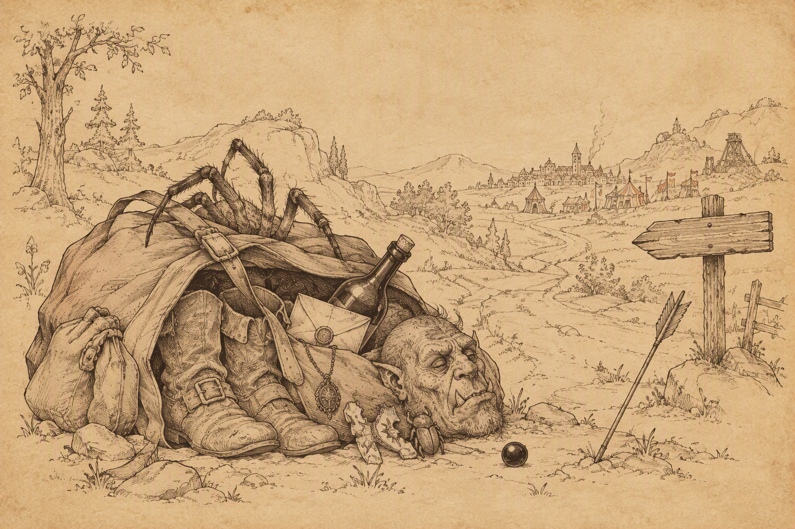

{ .center-img width="80%%" }

Ustronne Jezioro&nbsp;16

[{ .center-img width="40%" }](../maps/BG4200.webp)

Nad *Ustronnym Jeziorem* drużyna nie zaznała długo wyczekiwanego spokoju. Niemal od razu drogę zastąpiła jej banda dowodzona przez **Teyngana** 1. Towarzyszyli mu **Jemby** oraz **Zekar**, wspólnie przekonani, że wędrowcy powinni dobrowolnie rozstać się z kosztownościami. Negocjacje nie trwały długo. Cała trójka szybko utraciła zainteresowanie zarówno cudzym majątkiem, jak i dobrami doczesnymi w ogóle.

Na południowym brzegu jeziora 2 kompania natknęła się na **Drizzta Do’Urdena**, który właśnie walczył z kolejną grupą gnolli. Po zakończeniu starcia słynny drow podziękował za pomoc i zauważył, że bandytyzm na *Wybrzeżu Mieczy* przybrał rozmiary prawdziwej plagi. Sam zmierzał ku *Dolinie Lodowego Wichru*, dlatego nie zamierzał długo pozostawać w okolicy. **Kivan** powitał go z szacunkiem. Choć jako sługa **Shevarasha** zwykle nie ufał mrocznym elfom, uważał **Drizzta** za żywy dowód, że nie wszyscy drowowie poddali się naukom **Lolth**. Słynny wojownik odpowiedział, że jego własny ojciec również pozostał istotą honorową, i wyraził nadzieję, że któregoś dnia podzielone elfy będą mogły wspólnie przemierzać powierzchnię. Łucznik z *Shilmisty* uznał tę wizję za szlachetną, choć trudną do urzeczywistnienia po tysiącach lat wzajemnej nienawiści.

Zachwycona spotkaniem **Sandrah** zaproponowała drowowi dołączenie do wyprawy. **Drizzt** odmówił, wyjaśniając, że tropi go zbyt wielu potężnych przeciwników, aby narażać młodą kompanię. Poradził Leechowi kierować się własnym osądem, ostrożnie wybierać drogę i pamiętać, że umysł może być równie groźną bronią jak ostrze. Na pożegnanie służka **Mystry** spróbowała objąć legendarnego wojownika, lecz ten zręcznie uskoczył poza jej zasięg i poprosił, aby najpierw odłożyła młot. Rozbawiona kapłanka życzyła mu odnalezienia upragnionego pokoju, a **Drizzt** zasugerował, że być może ich drogi jeszcze kiedyś się skrzyżują. Drużyna ruszyła dalej, bogatsza o dobrą radę i świadomość, że nawet legenda potrafi rozsądnie unikać uścisków uzbrojonej wielbicielki.

Po północnej stronie jeziora 3 podróżnicy natknęli się na półogry. Wszystko wskazywało na to, że właśnie ta grupa wcześniej ciężko zraniła ([Half-Ogres near Beregost](../other/zadania.md#q30)). Po zakończonej walce **Sandrah** zauważyła z zadowoleniem, że jej pacjent będzie szczęśliwy na wieść o śmierci napastników. Dodała, że równie zadowolona będzie jego sumienna uzdrowicielka, gdy osobiście zda mu relację z sukcesu. Leech nie przepuścił okazji do drobnej złośliwości i zapytał, czy odrobina dodatkowego „uzdrawiania” przypadkiem nikomu nie szkodzi. Powierniczka młodego gnoma natychmiast rozpoznała ukłucie zazdrości. Z niewinną miną wskazała na drzazgę tkwiącą w jego palcu, delikatnie ujęła dłoń i obejrzała skaleczenie. Następnie uniosła palec do ust i powoli wysysała bolące miejsce, aż drzazga przestała dokuczać. Na koniec stwierdziła figlarnie, że szkoda, iż nie zranił sobie również kilku innych części ciała. Młody awanturnik natychmiast zapomniał o **Bjorninie**, półograch i własnej zazdrości. Coraz lepiej rozumiał natomiast, że metody lecznicze **Sandrah** bywają równie skuteczne, co niebezpieczne dla spokoju jego myśli.

Nad brzegiem jeziora drużyna poznała dwóch początkujących rybaków. **Torlo** 4, dawny górnik, przyznał, że dopiero uczy się nowego fachu. Kryzys żelaza pozbawił go pracy, dlatego dla utrzymania rodziny zamienił kilof na wędkę. Nie przepadał jednak za bezczynnym oczekiwaniem na branie i zdecydowanie lepiej czuł się podczas ciężkiej, konkretnej roboty. Prosił jedynie o ciszę, ponieważ hałaśliwi przybysze skutecznie płoszyli jego skromny połów. Towarzyszący mu z oddali **Chelan** 5 był całkowitym przeciwieństwem ponurego górnika. Utrata pracy nie odebrała mu pogody ducha. Uznał, że skoro kopalnia nie daje już zarobku, równie dobrze może spędzać czas nad wodą, śpiewać i cieszyć się słońcem. Ani bandyci, ani problemy w kopalniach, ani widmo wojny nie zamierzały psuć mu humoru. **Finch**, dotąd zasmucona złamanym piórem, poczuła się podniesiona na duchu jego podejściem. Leech natomiast szybko odkrył, że rybacy nie życzą sobie ani jego hałasu, ani kwaśnych komentarzy. **Torlo** polecił mu pluskać się gdzie indziej, a **Chelan** wrócił do śpiewania, najwyraźniej przekonany, że dobry nastrój jest równie skuteczną odpowiedzią na kryzys żelaza jak miecz, kilof czy pełna sieć ryb.

Tuż obok stanowiska **Chelana** 6 ponownie uaktywnił się pierścień otrzymany od **Mal’meta Bloomducka**. Przed drużyną otworzył się niebieski portal prowadzący do kolejnej ukrytej sfery. Gdy tylko zabrali spoczywający wewnątrz artefakt, z ciemności wypełzły pełzacze ścierwojady. Stworzenia zostały pokonane, a kompanię od ukończenia zadania dzieliło już o jedną sferę mniej ([Circles of Interest](../other/zadania.md#q16)).

W drodze powrotnej spotkali jeszcze hobgoblina 7, który próbował zastraszyć ich opowieściami o jakiejś groźnej bandzie Chłodu. Kiedy zobaczył szelmowskie uśmiechy i dłonie wędrowców wędrujące ku broni, natychmiast zmienił ton. Przeprosił za nieporozumienie i zniknął, zanim ktokolwiek zdążył zapytać, czym właściwie miała być ta straszliwa banda.

Drużyna miała do zamknięcia kilka spraw, dlatego bez dalszego ociągania ruszyła z powrotem do *Beregostu*.

:material-paw: **Bestiariusz:** *Gnoll, Półogr, Pełzacz ścierwojad, Ogrillion, Pies bojowy, Ghast*

Beregost&nbsp;17

[{ .center-img width="40%" }](../maps/BG3300.webp)

Po powrocie do miasta pierwsze kroki skierowali do *Wesołego Żonglera* 22, gdzie odnaleźli **Bjornina**. Wieść o śmierci półogrów dotarła do niego wcześniej niż drużyna, lecz wojownik i tak nie szczędził podziękowań. Okolica stała się bezpieczniejsza, a jego klęska została pomszczona ([Half-Ogres near Beregost](../other/zadania.md#q30)). :material-trending-up: **Reputacja +1**

**Bjornin** wyglądał znacznie lepiej, choć zapewnił, że poprzednia „kuracja” nie przywróciła mu jeszcze pełni sił. Poprosił więc **Sandrah** o kolejny zabieg. Uzdrowicielka z wyraźną przyjemnością zgodziła się pomóc doświadczonemu wojownikowi, upewniając się jedynie, czy nadal wynajmuje przytulny pokój na piętrze. Paladyn potwierdził i dodał, że tym razem przygotował butelkę wina z *Calimshanu*, mającą wspomóc działanie lekarstwa. Służka **Mystry** bez dalszych pytań poleciła mu prowadzić. Leech mógł jedynie patrzeć, jak jego coraz bliższa towarzyszka ponownie oddala się na prywatną sesję uzdrawiania. Najwyraźniej niektóre kuracje wymagały ciszy, wygodnego łóżka i odpowiednio dobranego rocznika.

W karczmie znalazła się też chwila na spokojniejsze rozmowy. **Kivan** kupił kilka jabłek i rozdał je towarzyszom, ostatnie wręczając **Sandrah**. Kapłanka wykorzystała ten gest, aby opowiedzieć mu o swoim ojcu, który podobnie jak elf utracił ukochaną. Choć przez lata nosił w sobie gniew i żal, wychowanie córki nadało jego życiu nowy sens i nie pozwoliło, by rozpacz całkowicie go pochłonęła. Łucznik przyznał, że po śmierci **Deheriany** zwrócił się ku **Shevarashowi**, Czarnemu Łucznikowi, a pragnienie zemsty stało się jedynym celem jego życia. Gdy zabije **Tazoka**, zamierza wrócić do *Shilmisty*, a stamtąd rozpocząć ostatnią podróż ku *Arvandorowi*. Postrzegał siebie jedynie jako czarną strzałę na łuku swego boga, przeznaczoną do ugodzenia winnych. **Sandrah** przypomniała mu jednak, że jej ojciec nigdy nie otrzymał szansy pomszczenia ukochanej, ponieważ zbrodnia **Bhaala** sięgała nawet zza grobu martwego boga. Mimo to odnalazł nowy cel, wychował córkę i pomógł wielu mieszkańcom *Faerûnu*. Być może również **Kivan** potrzebował czegoś więcej niż zemsty, aby ocalić samego siebie. Słowa kapłanki wyraźnie do niego trafiły. Po raz pierwszy od dołączenia do drużyny elf wyglądał na niemal spokojnego. Objął **Sandrah** ramieniem i przez dłuższą chwilę spacerował z nią w milczeniu, rzucając jej od czasu do czasu łagodne spojrzenie. Pozostali towarzysze zostali nieco z tyłu, pozwalając obojgu nacieszyć się chwilą, w której ciężar dawnych strat wydawał się choć trochę lżejszy.

Los **Kivana** zainteresował również **Imoen**. Dziewczyna zauważyła, że **Deheriana** musiała mieć wiele szczęścia, skoro była kochana przez kogoś tak oddanego. Elf odpowiedział gorzko, że ukochana miała raczej wielkiego pecha. Jako młody głupiec wyprowadził ją z bezpiecznej  *Shilmisty* i zaprowadził prosto ku śmierci. Jego miłość nie ocaliła jej przed oprawcami, lecz we własnych oczach pomogła ją zgubić. Początkująca czarodziejka przyznała, że sama chciałaby kiedyś spotkać kogoś gotowego zrobić dla niej wszystko i rozprawić się z każdym, kto wyrządziłby jej krzywdę. **Kivan** nie życzył jej jednak tak dramatycznego dowodu uczucia. Miał nadzieję, że zazna miłości wolnej od cierpienia, rozstań i ciągłych wątpliwości. **Imoen** zauważyła, że bez wyraźnych dowodów można czekać na czyjeś wyznanie niemal wiecznie. Elf odparł tajemniczo, że kiedy nadejdzie właściwa chwila, z pewnością rozpozna prawdę. Dodał, iż być może zna już osobę, której oddech zamiera na widok jej uśmiechu. Nie chciał jednak zdradzić imienia i poradził tylko, aby uważnie słuchała. Być może już teraz gdzieś obok biło serce odpowiadające rytmem jej własnemu. Tym razem zwykle wygadana siostrzyczka Leecha pozostała bez gotowej odpowiedzi, najwyraźniej próbując odgadnąć, kogo elf miał na myśli.

Drużyna nadal zamierzała dotrzymać słowa danego **Jaheirze** i **Khalidowi** oraz jak najszybciej dotrzeć do *Nashkel*. Przed wymarszem trzeba było jednak ponownie uporządkować skład kompanii. **Imoen** i **Kivan** zgodzili się pozostać na pewien czas w *Beregostcie*.

:material-account-group: **Pozostawieni NPC:** *Kivan, Imoen* (Beregost 22)

Następnie kompania odwiedziła kuźnię **Taeroma Fuiruima** 23, aby sprzedać część łupów. **Sandrah**, której ciekawość trudno było zaspokoić, poprosiła kowala o obejrzenie lekko zardzewiałego amuletu. Rzemieślnik uznał, że naprawa wymaga dokładniejszych oględzin i odpowiednich narzędzi, dlatego zaprosił kapłankę na zaplecze warsztatu. Po pewnym czasie oboje wrócili wyraźnie zadowoleni z wykonanej pracy. **Sandrah** pochwaliła zręczność kowala i zapowiedziała, że przy kolejnych podobnych problemach ponownie zwróci się właśnie do niego. **Taerom** zapewnił z uśmiechem, że zawsze będzie mile widziana.

W domu **Mirianne** 25 drużyna przekazała list odnaleziony przy ogrillonach. Kobieta była niezmiernie szczęśliwa, gdy dowiedziała się, że jej mąż bezpiecznie dotarł do *Amnu*. Wiadomość przyniosła kres tygodniom niepewności i zamknęła kolejną sprawę rozpoczętą podczas pierwszej wizyty w mieście ([Mirianne's Husband](../other/zadania.md#q32)).

W *Płonącym Czarodzieju* 12 Leech odnalazł **Zhurlonga** i zwrócił mu skradzione buty. Pozostawało mieć nadzieję, że odzyskane obuwie poprawi jego złodziejski fach, ale nie zachęci do ponownego ćwiczenia go na kieszeniach dobroczyńców ([Zhurlong's Missing Boots](../other/zadania.md#q26)).

Następnie drużyna odwiedziła dom **Colquette’a** 27. Leech pokazał zrozpaczonemu ojcu naszyjnik znaleziony przy zwłokach młodej rodziny na *Przełęczy Nashkel*. Mężczyzna natychmiast rozpoznał własność syna i zamiast poprosić o zwrot ostatniej pamiątki po bliskich stanowczo go zażądał. Ten ton rozdrażnił młodego awanturnika. Odpowiedział, że przebył z klejnotem długą drogę i może sprzedać go z niemałym zyskiem. **Colquette**, oburzony próbą wzbogacenia się na tragedii jego rodziny, kazał mu zatrzymać amulet i natychmiast opuścić dom. Nie tym tonem, panie **Colquette**. Zdecydowanie nie tym tonem ([Colquette Family](../other/zadania.md#q33)). :material-trending-down: **Reputacja -1**

W miejscu, gdzie wcześniej spotykali **Pontaga** 28, stała tym razem jego córka **Miji**. Przekazała smutną wiadomość o śmierci ojca. Starzec do końca próbował udowodnić istnienie wielowymiarowych żuków, lecz jego ostatni eksperyment nie przyniósł rozstrzygnięcia. Dziewczyna odnalazła go martwego z notatką dotyczącą umówionego spotkania i niewielką figurką owada w dłoni. Chociaż nadal nie wiedziała, czy niezwykłe wizje ojca były prawdziwe, podziękowała Leechowi za okazane zainteresowanie. W ostatnich dniach **Pontag** był wyraźnie szczęśliwszy, ponieważ wreszcie znalazł kogoś, kto potraktował jego opowieści poważnie i zgodził się uczestniczyć w poszukiwaniach.

Na pożegnanie **Miji** przekazała młodemu gnomowi pozostawioną przez ojca figurkę żuka. Tajemnica kha’samskich owadów pozostała nierozwiązana. Nie było wiadomo, czy **Pontag** naprawdę dostrzegał stworzenia wymykające się prawom czasu i przestrzeni, czy jedynie przez lata ścigał własne wyobrażenia. Pewne było tylko, że dzięki tej osobliwej przygodzie ostatnie dni starca stały się odrobinę jaśniejsze ([Beeetles, Dreams and an Old Man](../other/zadania.md#q22)).

Po załatwieniu spraw w mieście drużyna skierowała się do *Świątyni Lathandera*.

Świątynia Lathandera&nbsp;18

[{ .center-img width="40%" }](../maps/BG3400.webp)

Po powrocie do *Świątyni Pieśni Poranka* 2 kompania przekazała **Keldathowi Ormlyrowi** święty symbol znaleziony przy zwłokach **Bassilusa**. Kapłan nie krył uznania. Pokonanie tak potężnego sługi **Cyrika** musiało być trudnym zadaniem, a mieszkańcy okolicy długo nie zapomną ludzi, którzy położyli kres jego zbrodniom. **Keldath** wypłacił obiecaną nagrodę, a symbol szalonego mordercy trafił w ręce świątyni. Tym samym jeden z najgroźniejszych problemów nękających okolice *Beregostu* został ostatecznie rozwiązany ([Bassilus Murderer](../other/zadania.md#q24)).

Kapłan przypomniał, że wędrowcy zawsze mogą liczyć na pomoc sług **Lathandera**, o ile wesprą świątynię stosowną ofiarą. Leech zapytał więc o czarne perły potrzebne do budowy urządzenia mającego odnaleźć przeklęte karwasze. **Keldath** przyznał, że świątynia posiada kilka takich klejnotów, składanych czasem w ofierze Porannemu Władcy podczas szczególnych uroczystości. Początkowo nie zamierzał rozstawać się z konsekrowanym darem, lecz sugestia, że również złoto można ofiarować **Lathanderowi**, okazała się wystarczająco przekonująca. Za pięćset sztuk złota duchowny dyskretnie przekazał drużynie czarną perłę. Najwyraźniej nawet poświęcone przedmioty mogły zmienić przeznaczenie, jeżeli nowemu celowi towarzyszyła odpowiednio hojna dotacja ([Destroy the Cursed Bracers](../other/zadania.md#q56)).

Następnie kompania przekazała **Eloran** wiadomość o śmierci wyznawcy **Malara**. Kapłanka przyjęła raport z ulgą i wręczyła Leechowi miksturę jako nagrodę. Zwycięstwo nie przyniosło jednak młodemu przywódcy szczególnej satysfakcji. Nie potrafił rozstrzygnąć, czy powinien cieszyć się z dobrze wykonanej pracy, czy raczej odczuwać niepokój z powodu konieczności odebrania kolejnego życia. **Eloran** zauważyła, że sam **Malar** mógłby być zadowolony z takiego rozstrzygnięcia, ponieważ wynik starcia rozstrzygnęła siła. Poradziła wychowankowi **Goriona**, aby uporządkował własne myśli. Wewnętrzne rozdarcie czyniło go wprawdzie interesującym, lecz mogło również doprowadzić do zguby ([Hunting the Huntsman](../other/zadania.md#q51)).

Kapłanka miała już kolejne zlecenie, tym razem wymagające dyskrecji. W *Nashkel* zaginęło ciało pochowane przez kapłanów **Helma**. Zmarły był starszym człowiekiem, który odszedł z przyczyn naturalnych, a pogrzeb nie wyróżniał się niczym niezwykłym. Rodzina wpadła jednak w gniew, gdy duchowni zasugerowali, że nieboszczyk mógł sam opuścić grób jako nieumarły. Istniały więc dwie możliwości: zmarły rzeczywiście powstał i odszedł o własnych siłach albo ktoś wykradł ciało. Leech miał udać się do *Nashkel*, ustalić prawdę i rozwiązać problem, najlepiej bez pogarszania napiętej sytuacji w mieście. **Eloran** uznała, że doświadczenie kompanii w walce z nieumarłymi i nekromantami czyni ją odpowiednią do tego zadania. Dodała przy tym, że mieszkańcy *Nashkel* są podobno wyjątkowo urodziwi, gdyby sama misja nie stanowiła wystarczającej zachęty ([An Errant Funeral](../other/zadania.md#q60)).

Przed wyruszeniem na południe pozostało jeszcze zabrać z *Pomocnej Dłoni* **Jaheirę** i **Khalida**, którzy od początku nalegali na zbadanie problemów miejscowej kopalni.

Pomocna Dłoń&nbsp;19

[{ .center-img width="40%%" }](../maps/BG2300.webp)

Po dotarciu do zajazdu 3 drużyna udała się na najwyższe piętro. Tam odnalazła **Cartha**, na którego **Liedel** wystawiła kontrakt. Dłużnik błagał o litość, tłumacząc, że naprawdę zamierzał spłacić pożyczone trzysta sztuk złota, lecz tuż przed wyjazdem skusił go zapach maślanego jagnięcia i czosnkowego purée. Opamiętał się dopiero wtedy, gdy na stole pozostało dwanaście pustych talerzy, a w sakiewce ani jedna moneta. Zachwycony jego apetytem kucharz przekonał **Bentleya**, aby pozwolił nieszczęśnikowi pozostać w gospodzie do czasu poprawy sytuacji. Leech rozważył spłatę długu, ale uznał trzysta sztuk złota za cenę stanowczo zbyt wysoką. Przeprosił więc **Cartha**, zaznaczył, że nie ma w tym nic osobistego, i wykonał kontrakt jednym szybkim ruchem. Na *Wybrzeżu Mieczy* można było najwyraźniej stracić życie nie tylko przez magię, bandytów i potwory, lecz również przez nadmierne zamiłowanie do jagnięciny ([Liedel's Bounty: Carth](../other/zadania.md#q40)).:material-trending-down: **Reputacja -1**

Na tym samym piętrze drużyna zwróciła **Landrin** wszystkie przedmioty odzyskane z jej domu w *Beregostcie*. Kobieta odebrała znoszone buty męża, butelkę wina oraz ciało największego z pająków, stanowiące wystarczający dowód oczyszczenia budynku. Za wykonanie wszystkich próśb wypłaciła łącznie dwieście dziewięćdziesiąt pięć sztuk złota. Wolna od ośmionogich lokatorów i odzyskawszy pozostawiony dobytek, **Landrin** postanowiła zaryzykować powrót do domu. Zaprosiła pomocników na herbatę, gdyby ponownie znaleźli się w okolicy. Leech miał tylko nadzieję, że następnym razem poczęstunek nie będzie wymagał wcześniejszego oczyszczenia piwnicy ([Landrin's Possessions](../other/zadania.md#q14)).

Po zamknięciu ostatnich spraw drużyna ponownie przyłączyła **Jaheirę** i **Khalida**. Droga na południe stała otworem, a zgromadzone wieści coraz wyraźniej wskazywały, że kryzys żelaza, zaginieni górnicy i niepokoje na szlakach zbiegają się właśnie w *Nashkel*.

:material-account-group: **Przyłączeni NPC:** *Jaheira, Khalid*
