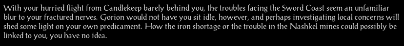
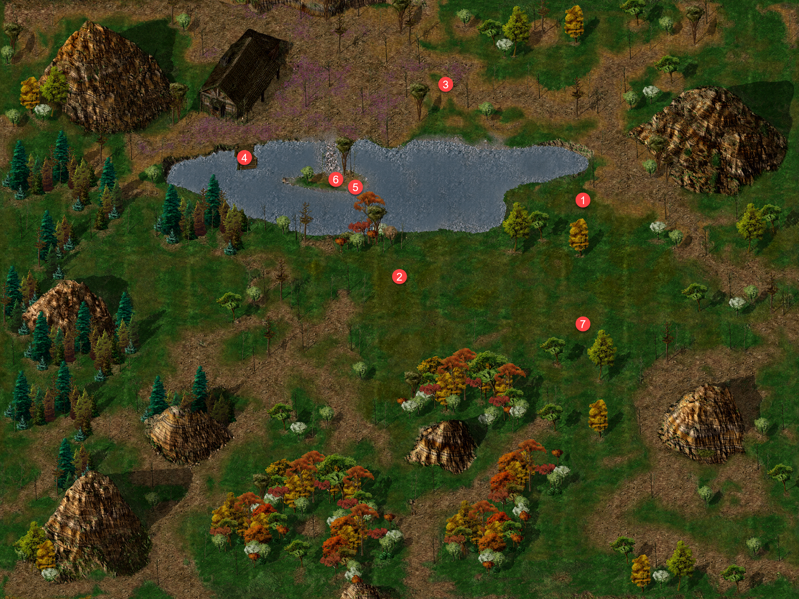

{ .center-img width="40%" }

*Po niedawnej, pospiesznej ucieczce z Candlekeep problemy nękające Wybrzeże Mieczy wciąż zlewały się w trudny do uporządkowania chaos. **Gorion** z pewnością nie chciałby jednak, aby jego wychowanek pozostawał bezczynny. Zbadanie miejscowych kłopotów mogło rzucić nieco światła zarówno na kryzys żelaza i wydarzenia w kopalniach Nashkel, jak i na niepewne położenie samego Leecha. Młody przywódca nie wiedział jeszcze, czy problemy regionu mają jakikolwiek związek z zasadzką, śmiercią przybranego ojca i kolejnymi kontraktami wystawianymi na jego głowę. Wkrótce miał się jednak przekonać, że na Wybrzeżu Mieczy przypadkowe zdarzenia wyjątkowo często okazują się fragmentami tej samej, znacznie większej układanki.*

Nashkel&nbsp;20

[{ .center-img width="40%" }](../maps/BG4200.webp)